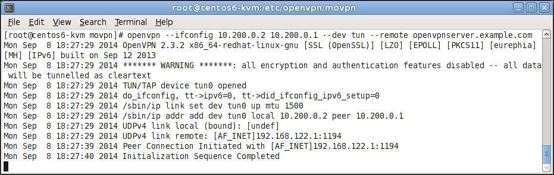
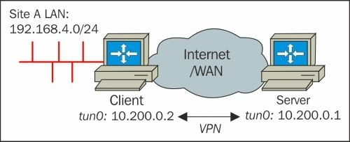
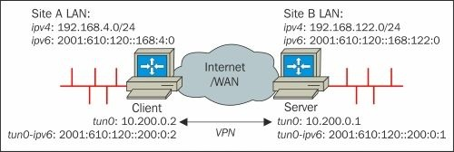
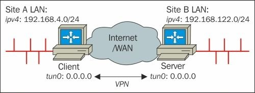
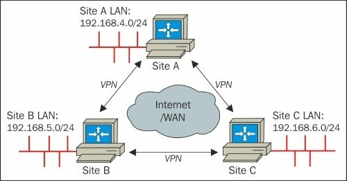
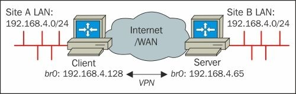

# Глава 2. Режим точка-точка

Сначала, режим «точка-точка» с использованием общих ключей был единственным доступным вариантом при использовании OpenVPN. В настоящее время существует несколько способов использования OpenVPN, но режим «точка-точка» все еще имеет свое применение. Термин _двухточечный режим с использованием предварительно установленных общих ключей_ часто сокращается до **предустановленных ключей**.

В режиме «точка-точка» OpenVPN настраивается с использованием предустановленных общих секретных ключей для предварительно определенных конечных точек, и только одна конечная точка может одновременно подключаться к экземпляру сервера. Термин сервер можно считать вводящим в заблуждение, поскольку обе конечные точки более или менее равны, когда речь заходит о функциональности. Конечная точка, инициирующая соединение, считается клиентом, а другая конечная точка рассматривается как сервер.

Мы начнем с демонстрации очень простого примера. После этого мы обсудим больше возможностей, которые предоставляет OpenVPN. Мы рассмотрим следующие темы:

* Протокол TCP и разные порты
* Режим TAP
* Секретные ключи OpenVPN
* Маршрутизация
* Полная настройка, включая IPv6
* Настройка без IP
* Трехсторонняя маршрутизация
* Мостовые адаптеры TAP на обоих концах
* Комбинированный двухточечный режим с сертификатами

## Плюсы и минусы ключевого режима

Основным вариантом использования режима предустановленного общего ключа является подключение двух удаленных сетей, например, главного офиса и удаленного офиса небольшой компании. Как только требуется более трех пользователей или конечных точек, гораздо проще использовать режим клиент/сервер, как описано в [Главе 4](chapter-04.md), _Режим клиент/сервер с настройкой устройств_. Пример того, как соединить три местоположения вместе с помощью общих ключей, приведен ниже в этой главе, и станет понятно, почему режим с предустановленным ключом не подходит для трех сторон или пользователей.

Основные преимущества использования режима предустановленного общего ключа:

* Его очень легко настроить
* Нет необходимости в **инфраструктуре открытого ключа (public key infrastructure - PKI)** или сертификатах X.509
* Может работать на ограниченном оборудовании, таком как коммутаторы или маршрутизаторы на основе Linux

Недостатками использования режима предустановленного ключа являются:

* Как указывает имя _точка-точка_, только две конечные точки могут использоваться одним соединением. Поэтому этот режим плохо масштабируется.
* Некоторые оболочки GUI для OpenVPN (например, GNOME NetworkManager) не поддерживают предустановленные общие ключи. То же самое относится к клиентам Android и iOS.
* Секретный ключ должен быть скопирован в удаленную конечную точку с использованием безопасного канала, например, с использованием SSH. Иногда это может быть угрозой безопасности.
* Невозможно зашифровать секретный ключ с помощью ключевой фразы, как это возможно при использовании открытых/закрытых ключей X.509.
* Он считается несколько менее безопасным, поскольку безопасность полностью зависит от безопасности и надежности предварительно общего секретного ключа. Кроме того, в этом режиме нет **идеальной секретности пересылки (perfect forwarding secrecy - PFS)**. Без PFS злоумышленник может записать весь зашифрованный трафик VPN. Если злоумышленнику удастся в какой-то момент нарушить шифрование, тогда _весь_ записанный трафик VPN может быть дешифрован. С PFS невозможно расшифровать _старые_ данные.

Важно понимать, что OpenVPN на самом деле работает по-разному при использовании предустановленных общих ключей по сравнению с использованием сертификатов и настройкой клиент/сервер. Пути кода, которые следуют в OpenVPN, на самом деле сильно отличаются, например, согласование канала управления не требуется. Среднестатистический конечный пользователь не увидит эти различия, но важно знать эти различия, когда необходимо устранить неполадки для соединения OpenVPN. Кроме того, при чтении В файле журнала OpenVPN с высокой детальностью вывода (т.е. что-либо выше 5), выходные данные подключения с предварительным общим ключом будут выглядеть совершенно иначе по сравнению с выходными данными подключения на основе сертификатов.

Если не указано иное, все примеры в этой главе основаны на конечных точках под управлением CentOS 6 64bit. Версия установленного программного обеспечения OpenVPN v2.3.2 взята из репозитория CentOS-EPEL.

### Первый пример

Давайте посмотрим на наш самый первый пример:

1.  Самый простой и краткий пример подключения двух компьютеров с использованием OpenVPN - это запуск первой конечной точки в режиме прослушивания с использованием фиксированных IP-адресов и сети в стиле tun:

```
    [root@server] # openvpn \
        --ifconfig 10.200.0.1 10.200.0.2 \
        --dev tun
```
* Затем запустите клиент OpenVPN:

```
[root@client] # openvpn \
--ifconfig 10.200.0.2 10.200.0.1 \
--dev tun \
--remote openvpnserver.example.com
```

* В другом окне терминала отобразите сетевое устройство:

```
[root@client] # ip addr show tun0
7: tun0: <POINTOPOINT,MULTICAST,NOARP,UP,LOWER_UP> mtu 1500
qdisc pfifo_fast state UNKNOWN group default
qlen 100 link/none
inet 10.200.0.2 peer 10.200.0.1/32 scope global tun0
valid_lft forever preferred_lft forever
```

На следующих снимках экрана показано, как устанавливается соединение:



* Теперь мы можем пропинговать конечные точки OpenVPN с любого конца, при условии, что правила брандмауэра и SELinux позволяют это.

Журнал подключения показывает некоторые интересные детали. Версия OpenVPN на стороне клиента: `2.3.2 x86_64-redhat-linux-gnu`. Это подтверждает, что мы запускаем v2.3.2 на 64-битной версии производной RedHat Linux.

Журнал подключения показывает предупреждение:

```
Mon Sep 8 18:27:29 2014 ******* WARNING *******: all encryption and
authentication features disabled -- all data will be tunnelled as
cleartext
```

Это предупреждение выводится, поскольку не был указан секретный ключ для шифрования соединения, что делает этот пример не очень безопасным.

*   Устройство Linux `tun0` открыто для подключения. Мы указали `--dev tun`, который сообщает OpenVPN открыть первый доступный адаптер `tun`. Если теперь запущено второе соединение OpenVPN, следующий экземпляр будет использовать `tun1`.
*   Команда Linux `iproute2 /sbin/ip` используется для настройки сетевого адаптера `tun0`. Указанный IP-адрес назначается вместе с **максимальной единицей передачи** по умолчанию **(maximum transfer unit - MTU)** 1500 байтов.
*   По умолчанию OpenVPN будет использовать UDP-порт 1194 для установления соединения. Если требуется протокол TCP, то аргументы командной строки на обоих концах немного различаются (это показано в следующем разделе).
*   Из временных меток, напечатанных в начале каждой строки, видно, что для установления начального соединения требуется 10 секунд.

Если распечатано следующее сообщение, то соединение было успешно установлено. Однако в следующих примерах мы увидим, что это не обязательно означает, что VPN работает нормально.

```
Mon Sep 8 18:27:40 2014 Initialization Sequence Completed
```

## Протокол TCP и разные порты

Протоколом по умолчанию, используемым OpenVPN, является UDP, так как он обычно больше подходит для VPN-подключений. Однако, если требуется протокол TCP, предыдущий пример необходимо изменить лишь незначительно: на конце прослушивания запустите экземпляр сервера OpenVPN:

```
[root@server] # openvpn \
--ifconfig 10.200.0.1 10.200.0.2 \
--dev tun \
--proto tcp-server
```

На стороне клиента код выглядит следующим образом:

```
[root@client] # openvpn \
--ifconfig 10.200.0.2 10.200.0.1 \
--dev tun \
--proto tcp-client \
--remote openvpnserver.example.com
```

OpenVPN теперь будет подключаться через TCP-порт 1194. Также возможно изменить номер порта, используя параметр `--port`, например `--port 5000`.

### Режим TAP

Если трафик не-TCP/IP необходимо передавать через VPN-туннель (например, устаревший трафик AppleTalk или IPX), то требуется _tap_-устройство. _tap_-устройство позволяет интерфейсу передавать полные кадры Ethernet через VPN туннель. Затраты при прохождении полных кадров Ethernet незначительны. Назначение IP для устройства _tap_ отличается от устройства tun, поскольку устройство _tap_ действует как _обычный_ сетевой адаптер, которому необходимо назначить один IP-адрес и сетевую маску.

Предыдущий пример теперь изменен. На конце прослушивания запустите процесс сервера OpenVPN:

```
[root@server] # openvpn \
--ifconfig 10.200.0.1 255.255.255.0 \
--dev tap
```

На стороне _клиента_ код выглядит следующим образом:

```
[root@client] # openvpn \
--ifconfig 10.200.0.2 255.255.255.0 \
--dev tap \
--remote openvpnserver.example.com
```

Опять же, мы перечислим конфигурацию сетевого устройства:

```
[root@client] # ip addr show tap0
8: tap0: <BROADCAST,MULTICAST,UP,LOWER_UP> mtu 1500
qdisc pfifo_fast state UNKNOWN group default qlen 100
link/ether 6e:ea:0e:47:a3:d8 brd ff:ff:ff:ff:ff:ff
inet 10.200.0.2/24 brd 10.200.0.255 scope global tap0
valid_lft forever preferred_lft forever
inet6 fe80::6cea:eff:fe47:a3d8/64 scope link
valid_lft forever preferred_lft forever
```

Сравните это с конфигурацией из самого первого примера.

### Топология подсети

OpenVPN 2.1 и более поздние версии поддерживают новую топологию, топологию подсети для назначения IP-адресов в сетях в стиле tun, которая очень похожа на IP-адреса, используемые в сетях в стиле tap. При использовании `--topology subnet` одному интерфейсу туннеля назначаются один IP-адрес и маска сети, а адрес партнера не указывается.

Хотя использовать этот режим топологии для выделенной двухточечной связи не имеет большого смысла, этот параметр топологии можно использовать, чтобы сделать настройку режима точка-точка стиля tun практически такой же, как соответствующая настройка tap-стиля. Чтобы использовать этот новый режим топологии, используйте настройку, описанную ниже.

На конце прослушивания начните:

```
[root@server] # openvpn \
--ifconfig 10.200.0.1 255.255.255.0 \
--dev tun \
--topology subnet
```

На стороне клиента код выглядит следующим образом:

```
[root@client] # openvpn \
--ifconfig 10.200.0.2 255.255.255.0 \
--dev tun \
--topology subnet \
--remote openvpnserver.example.com
```

Линия `--ifconfig` теперь такая же, как для примера tap. Единственное изменение - добавление `--topology subnet` на обоих концах.

### Туннель открытого текста

Предыдущий пример не использует шифры шифрования или ключи аутентификации; следовательно, вы получаете следующее предупреждение:

```
Mon Sep 8 18:27:29 2014 ******* WARNING *******: all encryption and authentication features disabled -- all data will be tunnelled as cleartext
```

Тем не менее, туннель открытого текста имеет свои применения. В доверенной среде, где безопасность обрабатывается на другом уровне (например, с использованием выделенного оптоволоконного кабеля), туннель с открытым текстом обеспечивает лучшую производительность по зашифрованному туннелю, и легче отслеживается поток трафика по туннелю.

Кроме того, если вы заранее знаете, что весь трафик, который будет проходить через туннель, зашифрован сам (например, весь трафик строго HTTPS), то можно использовать туннель открытого текста, чтобы избежать двойного шифрования, что иногда может привести к снижению производительности. Особенно при работе OpenVPN на небольшом или встроенном оборудовании (например, Raspberry Pi или даже на некоторых платах Arduino) шифрование наносит большой удар по производительности.

Туннель открытого текста может быть настроен с использованием примеров, приведенных в предыдущем разделе. Если секретный ключ не указан, шифрование и аутентификация (подпись HMAC) автоматически отключаются. Также возможно отключить их явно:

На конце прослушивания запустите:

```
[root@server] # openvpn \
--ifconfig 10.200.0.1 10.200.0.2 \
--dev tun \
--cipher none --auth none
```

На стороне клиента код выглядит следующим образом:

```
[root@client] # openvpn \
--ifconfig 10.200.0.2 10.200.0.1 \
--dev tun \
--cipher none --auth none \
--remote openvpnserver.example.com
```

После того, как соединение установлено, мы можем проверить что содержимое действительно отправлено в виде открытого текста, используя команду `tcpdump` (или эквивалентную, например, Wireshark):

1. Запустите соединение.
2. Запустите `tcpdump` и прослушивайте _обычный_ сетевой интерфейс, а не сам туннельный и отфильтруйте пакеты OpenVPN (`UDP port 1194`) с помощью следующей команды:

```
[root@server] # tcpdump -l -w - eth0 udp port 1194 | strings
```

3.  Теперь отправьте текст через туннель, например, `nc` (netcat):

   - На стороне сервера:

```
     $ nc -l -p 31000
```

  - На стороне клиента:

```
    $ nc 10.200.0.1 31000
    hello from openvpn client
    goodbye
```

4. Вывод `tcpdump` теперь должен показать что-то вроде этого:

```
tcpdump: listening on eth0, link-type EN10MB (Ethernet),
capture size 65535 bytes
V~hello from openvpn client
5goodbye
```

Символы, показанные в виде текстовых сообщений, являются артефактами инкапсуляции пакетов OpenVPN.

## Секретные ключи OpenVPN

Для защиты соединения OpenVPN необходим секретный ключ. Сначала мы сгенерируем такой ключ. Затем его необходимо скопировать в удаленную конечную точку с использованием безопасного канала (например, SCP):

```
$ openvpn --genkey --secret secret.key
```

Обратите внимание, что нет необходимости запускать эту команду от пользователя root (отсюда и приглашение `$`). Полученный файл секретного ключа имеет следующий формат:

```
##
2048 bit OpenVPN static key
#-
----BEGIN OpenVPN Static key V1-----
1393ae687606c1f7d465d70227bf63e8
8963e9d1401450002d073d6eab1bffde
b06d1a33cc5c45d4a667016339e921d3
3ac36b1a949eb52e9217e41e4b035a7b
987ddfa9d6766d3b5e4c952dc27f518d
12ccff6b2f0966284382ddc0f62b824a
f576f0982beec9d6a4728d0788499a75
0fd7055ef681404fd463d9862d3a40a9
31fca7d87997c70c07b8303a1b85f1ff
76aa7790e7c341353d2b4ea5049b11a2
51346e7dd39fc1f1e53ae57c46cf60c8
24db00a871262fee78050a9df6a57322
0bb0d980b6cf1be90a2f304f99fb9cde
7cdf72d20e7dee555c7c99950aa4d8e6
86a020c3a63125fb99d56181ff4ca20c
d6711eab15a4d6faf706f2601eb6 61b7
-----END OpenVPN Static key V1-----
```

После публикации ключа здесь, это уже не секрет.

Команда `openvpn --genkey` генерирует 2048-битный ключ или 256 байтов случайных данных. Эти 256 байтов перечислены в шестнадцатеричном формате в файле `secret.key`, но в настоящее время используются не все 256 байтов (как мы увидим позже).

Секретный ключ используется OpenVPN для шифрования и аутентификации(подписи) каждого пакета. Шифр шифрования по умолчанию - это шифр Blowfish (BF-CBC), а алгоритм HMAC по умолчанию - SHA1. Шифр Blowfish использовал 128-битное шифрование, тогда как ключ, используемый для алгоритма SHA1, составляет 160 бит.

Если OpenVPN запускается с увеличенным выходом отладки (`--verb 7` или выше), используемые ключи печатаются при запуске:

На слушающем конце (сервере) запустите демон OpenVPN:

```
[root@server] # openvpn \
--ifconfig 10.200.0.1 10.200.0.2 \
--dev tun \
--secret secret.key \
--verb 7
```

На стороне клиента команда выглядит следующим образом:

```
[root@client] # openvpn \
--ifconfig 10.200.0.2 10.200.0.1 \
--dev tun \
--secret secret.key \
--remote openvpnserver.example.com
```

Вывод журнала на стороне сервера будет содержать строки вида:

```
Static Encrypt: Cipher 'BF-CBC' initialized with 128 bit key
Static Encrypt: CIPHER KEY: 1393ae68 7606c1f7 d465d702 27bf63e8
Static Encrypt: CIPHER block_size=8 iv_size=8
Static Encrypt: Using 160 bit message hash 'SHA1' for
HMAC authentication
Static Encrypt: HMAC KEY: 987ddfa9 d6766d3b 5e4c952d c27f518d
12ccff6b
Static Encrypt: HMAC size=20 block_size=20
Static Decrypt: Cipher 'BF-CBC' initialized with 128 bit key
Static Decrypt: CIPHER KEY: 1393ae68 7606c1f7 d465d702 27bf63e8
Static Decrypt: CIPHER block_size=8 iv_size=8
Static Decrypt: Using 160 bit message hash 'SHA1' for
HMAC authentication
Static Decrypt: HMAC KEY: 987ddfa9 d6766d3b 5e4c952d c27f518d
12ccff6b
Static Decrypt: HMAC size=20 block_size=20
```

Ключ шифра `BF-CBC` - это `1393 ae68 7606 c1f7 d465 D702 27bf 63e8`, что точно соответствует первой строке файла секретного ключа OpenVPN.

`SHA1` ключом HMAC является `987d dfa9 d676 6d3b 5e4c 952d c27f 518d 12cc ff6b`, который также можно найти в файле секретного ключа, начиная с пятой строки.

Обратите внимание, что одни и те же ключи используются для шифрования и дешифрования данных, а также аутентификации данных. В следующем разделе мы увидим, как мы можем использовать разные ключи для шифрования, дешифрования и аутентификации.

### Использование нескольких ключей

OpenVPN поддерживает использование _направленных_ ключей, то есть различные ключи используются для входящих и исходящих данных. Это еще больше повышает безопасность. Добавив флаг _направления_ к параметру `--secret` мы можем указать, что будут использоваться различные ключи. Флаг _направления_ должен быть установлен в `0` на одном конце и в `1` на другом:

На прослушивающем конце (сервер), запустите:

```
[root@server] # openvpn \
--ifconfig 10.200.0.1 10.200.0.2 \
--dev tun \
--secret secret.key 0\
--verb 7
```

На стороне клиента код выглядит следующим образом:

```
[root@client] # openvpn \
--ifconfig 10.200.0.2 10.200.0.1 \
--dev tun \
--secret secret.key 1\
--remote openvpnserver.example.com \
--verb 7
```

Вывод журнала на стороне сервера теперь будет содержать строки вида:

```
Static Encrypt: CIPHER KEY: 1393ae68 7606c1f7 d465d702 27bf63e8
Static Encrypt: HMAC KEY: 987ddfa9 d6766d3b 5e4c952d c27f518d
12ccff6b
Static Decrypt: CIPHER KEY: 31fca7d8 7997c70c 07b8303a 1b85f1ff
Static Decrypt: HMAC KEY: 0bb0d980 b6cf1be9 0a2f304f 99fb9cde
7cdf72d2
```

Ключи шифрования `CIPHER` и `HMAC` теперь явно отличаются от ключей дешифрования `CIPHER` и `HMAC`. Кроме того, каждый из этих ключей можно найти в файле OpenVPN `secret.key`:

* Ключ шифрования `CIPHER KEY` начинается с 1 строки длиной 128 бит или 16 байт.
* Ключ шифрования `HMAC KEY` начинается с 5 строки длиной 160 бит или 20 байтов.
* Ключ дешифрования `CIPHER KEY` начинается с 9 строки длиной 128 бит или 16 байтов
* Ключ расшифровки `HMAC KEY` начинается с 13 строки длиной 160 бит или 20 байтов.

Кроме того, вывод журнала на стороне клиента показывает, что ключи поменялись местами:

```
Static Encrypt: CIPHER KEY: 31fca7d8 7997c70c 07b8303a 1b85f1ff
Static Encrypt: HMAC KEY: 0bb0d980 b6cf1be9 0a2f304f 99fb9cde 7cdf72d2
Static Decrypt: CIPHER KEY: 1393ae68 7606c1f7 d465d702 27bf63e8
Static Decrypt: HMAC KEY: 987ddfa9 d6766d3b 5e4c952d c27f518d 12ccff6b
```

Это необходимо для функционирования VPN-туннеля, так как ключи, которые необходимы на стороне сервера для _шифрования_ данных, необходимы на стороне клиента для _дешифрования_ данных и наоборот.

### Использование разных алгоритмов шифрования и аутентификации

OpenVPN поддерживает множество различных алгоритмов шифрования и аутентификации (подписи HMAC). Размер ключей, используемых в каждом шифре шифрования и алгоритме HMAC, варьируется, с максимальным текущим значением 256 бит для шифров (например, AES256) и 512 бит для ключа HMAC (например, SHA512). Статический ключ OpenVPN имеет длину 2048 бит, что достаточно для 512-битного шифра и 512-битного ключа HMAC.

Если мы укажем и AES256 в качестве шифровального шифра, и SHA512 в качестве алгоритма аутентификации, то мы увидим, что используемые ключи увеличиваются в размере: На слушающем конце (сервере) запустите:

```
[root@server] # openvpn \
--ifconfig 10.200.0.1 10.200.0.2 \
--dev tun \
--secret secret.key 0\
--cipher AES256 --auth SHA512 \
--verb 7
```

На стороне клиента код выглядит следующим образом:

```
[root@client] # openvpn \
--ifconfig 10.200.0.2 10.200.0.1 \
--dev tun \
--secret secret.key 1\
--cipher AES256 --auth SHA512 \
--remote openvpnserver.example.com \
--verb 7
```

Вывод журнала на стороне сервера теперь содержит следующие строки:

```
Static Encrypt: Cipher 'AES-256-CBC' initialized with 256 bit key
Static Encrypt: CIPHER KEY: 1393ae68 7606c1f7 d465d702 27bf63e8
8963e9d1 40145000 2d073d6e ab1bffde
Static Encrypt: CIPHER block_size=16 iv_size=16
Static Encrypt: Using 512 bit message hash 'SHA512' for
HMAC authentication
Static Encrypt: HMAC KEY: 987ddfa9 d6766d3b 5e4c952d c27f518d
12ccff6b 2f096628 4382ddc0 f62b824a
f576f098 2beec9d6 a4728d07 88499a75
0fd7055e f681404f d463d986 2d3a40a9
Static Encrypt: HMAC size=64 block_size=64
Static Decrypt: Cipher 'AES-256-CBC' initialized with 256 bit key
Static Decrypt: CIPHER KEY: 31fca7d8 7997c70c 07b8303a 1b85f1ff
76aa7790 e7c34135 3d2b4ea5 049b11a2
Static Decrypt: CIPHER block_size=16 iv_size=16
Static Decrypt: Using 512 bit message hash 'SHA512' for
HMAC authentication
Static Decrypt: HMAC KEY: 0bb0d980 b6cf1be9 0a2f304f 99fb9cde
7cdf72d2 0e7dee55 5c7c9995 0aa4d8e6
86a020c3 a63125fb 99d56181 ff4ca20c
d6711eab 15a4d6fa f706f260 1eb661b7
```

Этот журнал может быть сопоставлен с файлом `secret.key`:

*   Ключ шифрования `CIPHER KEY` теперь соответствует первым 2 строкам файла.
*   Ключ шифрования `HMAC KEY` теперь соответствует строкам 5-8 файла.

Аналогичным образом можно сопоставить ключи дешифрования.

---

**Заметка**

VPN-туннель работает так же, как и раньше, но теперь с более надежным шифрованием и аутентификацией на месте. Если в будущем будут введены еще более надежные алгоритмы шифрования или HMAC, формат статического ключа OpenVPN необходимо будет обновить.

---

## Маршрутизация

Как указывалось ранее, основной вариант использования сетей типа «точка-точка» заключается в соединении двух удаленных сетей через безопасный туннель. В предыдущем примере безопасный туннель был установлен, но не были добавлены сетевые маршруты.

В следующем примере рассмотрим следующую схему сети:



Клиентскую сеть **192.168.4.0/24** (с маской сети 255.255.255.0) необходимо направить через VPN-туннель к серверу.

На слушающем конце (сервере) мы запускаем:

```
[root@server] # openvpn \
--ifconfig 10.200.0.1 10.200.0.2 \
--dev tun \
--secret secret.key 0\
--route 192.168.4.0 255.255.255.0 \
--daemon --log /var/log/movpn-02-server.log
```

На стороне клиента код выглядит следующим образом:

```
[root@client] # openvpn \
--ifconfig 10.200.0.2 10.200.0.1 \
--dev tun \
--secret secret.key 1\
--remote openvpnserver.example.com \
--daemon --log /var/log/movpn-02-client.log
```

На стороне сервера был добавлен оператор _route_, чтобы сообщить OpenVPN, что сеть **192.168.4.0/24** находится на другом конце туннеля. OpenVPN сам по себе мало что с этим сделает, но выдаст соответствующую системную команду `/sbin/route` или `/sbin/ip route` для настройки таблиц системной маршрутизации. Вместо использования оператора OpenVPN `--route` мы также можем использовать следующую команду:

```
[root@server] # route add -net 192.168.4.0/24 gw 10.200.0.2
```

После того, как VPN-соединение было установлено, мы можем альтернативно использовать команду `iproute2`:

```
[root@server] # ip route add 192.168.4.0/24 via 10.200.0.2
```

Вторая строка операторов, добавленных в этом примере, инструктирует OpenVPN демонизировать себя (то есть запускать в фоновом режиме) и записывать все сообщения в файл `/var/log/movpn-02-server.log`.

Аналогично, тот же оператор `daemon+log` добавляется на стороне клиента.

---

**Заметка**

Оператор `--log` усекает файл журнала при каждом запуске OpenVPN. Если вы хотите добавить к предыдущему файлу журнала, используйте следующую команду:

```
--log-append /var/log/movpn-02-server.log
```

---

На данный момент пример еще не полностью функционален. Если мы пропингуем хост в локальной сети на стороне клиента с VPN-сервера, мы не получим никакого ответа. Это имеет мало общего с самим OpenVPN, а в основном с маршрутизацией TCP/IP. Большинство вопросов, задаваемых в списке рассылки пользователей OpenVPN и интернет-форуме OpenVPN, на самом деле являются вопросами маршрутизации.

Причина, по которой от клиентской локальной сети не получен ответ, двояка:

* Переадресация IP или маршрутизация должны быть включены на клиенте OpenVPN. Для каждой операционной системы это достигается по-разному. В Linux обычно достаточно добавить или изменить строку в файле `/etc/sysctl.cnf` и перезагрузиться. Следующая строка должна быть изменена:

```
net.ipv4.ip_forward = 1
```

* Можно избежать перезагрузки, выполнив следующую команду:

```
# sysctl -p
```

* Нам также необходимо убедиться, что существует маршрут обратно к серверу OpenVPN в клиентской локальной сети. Это можно сделать, добавив маршрут к шлюзу локальной сети или добавив статический маршрут к каждой машине в клиентской локальной сети. В этом примере мы добавляем маршрут на машине Linux, которая подключена к клиентской локальной сети:

```
# route add -net 10.200.0.0/24 gw 192.168.4.100
```

Здесь `192.168.4.100` - это локальный IP-адрес клиента OpenVPN.

---

**Заметка**

Маршруты, добавленные таким образом, не являются постоянными и исчезнут после перезагрузки.

---

Постоянное добавление маршрутов зависит от распределения.

Теперь пример работает, как и ожидалось. С сервера OpenVPN мы можем пинговать IP-адреса компьютеров в локальной сети на стороне клиента и наоборот:

```
$ ping -c 2 192.168.4.100
PING 192.168.4.100 (192.168.4.100) 56(84) bytes of data.
64 bytes from 192.168.4.100: icmp_seq=1 ttl=64 time=5.97 ms
64 bytes from 192.168.4.100: icmp_seq=2 ttl=64 time=4.22 ms
$ ping -c 2 192.168.4.10
PING 192.168.4.10 (192.168.4.10) 56(84) bytes of data.
64 bytes from 192.168.4.10: icmp_seq=1 ttl=63 time=7.37 ms
64 bytes from 192.168.4.10: icmp_seq=2 ttl=63 time=6.09 ms
```

### Конфигурационные файлы и командная строка

Как видно из предыдущего примера, аргументы командной строки для OpenVPN могут быстро стать длинными и сложными. Также возможно (и желательно) использовать файлы конфигурации для хранения часто используемых опций для OpenVPN. В общем, каждый параметр может быть указан в командной строке с помощью следующей команды:

```
--<некоторая опция> <аргументы-опции>
```

Его также можно указать в файле конфигурации с помощью `<некоторая опция> <аргументы-опции>`, то есть удалить две черточки перед аргументом командной строки.

Файл конфигурации указывается в командной строке с помощью параметра `--config <path>`. Почти все параметры, указанные в файле конфигурации, обрабатываются так, как если бы они были указаны в командной строке. Как мы увидим позже в этой книге, в файле конфигурации можно хранить встроенные сертификаты и файлы закрытого ключа. Нелегко сделать то же самое, используя аргументы командной строки.

Также возможно смешивать файлы конфигурации и аргументы командной строки. Это позволяет легко хранить часто используемые параметры в файле конфигурации, который можно переопределить с помощью аргументов командной строки.

---

**Заметка**

Не все параметры конфигурации могут быть переопределены. Некоторые параметры могут быть указаны несколько раз (в частности, `remote <remote-host>`). В этих случаях первое вхождение обычно пробуется первым.

Командная строка на стороне сервера из предыдущего примера может быть преобразована в следующий файл конфигурации:

```
ifconfig 10.200.0.1 10.200.0.2
dev tun
secret secret.key 0
route 192.168.4.0 255.255.255.0
daemon
log /var/log/movpn-02-server.log
```

Если этот файл конфигурации хранится как `movpn-02-01-server.conf`, то команда для запуска слушателя становится:

```
[root@server] # openvpn --config movpn-02-01-server.conf
```

Обратите внимание, что порядок аргументов командной строки важен. Все параметры, указанные перед параметром `--config <path>`, переопределяются параметрами, указанными в файле конфигурации. Все параметры, указанные после параметра `--config`, отменяют параметры в файле конфигурации (с некоторыми исключениями, как отмечалось ранее).

## Полная настройка

На основе предыдущих примеров мы теперь можем построить полную настройку производственного уровня, используя файлы конфигурации, включая маршрутизацию, ведение журнала, поддержку IPv6, а также некоторые другие производственные функции, которые предлагает OpenVPN.

Рассмотрим следующую схему сети:



Для сервера мы создаем следующий файл конфигурации `movpn-02-02-server.conf`:

```
dev tun
proto udp
local openvpnserver.example.com
lport 1234
remote openvpnclient.example.com
rport 4321

secret secret.key 0
ifconfig 10.200.0.1 10.200.0.2
route 192.168.4.0 255.255.255.0

tun-ipv6
ifconfig-ipv6 2001:610:120::200:0:1 2001:610:120::200:0:2

user nobody
groupnobody # используйте 'group nogroup' для Debian/Ubuntu
persist-tun
persist-key
keepalive 10 60
ping-timer-rem

verb 3
daemon
log-append /var/log/openvpn.log
```

Для клиента мы создаем файл `movpn-02-02-client.conf`:

```
dev tun
proto udp
local openvpnclient.example.com
lport 4321
remote openvpnserver.example.com
rport 1234

secret secret.key 1
ifconfig 10.200.0.2 10.200.0.1
route 192.168.122.0 255.255.255.0

tun-ipv6
ifconfig-ipv6 2001:610:120::200:0:2 2001:610:120::200:0:1

user nobody
group nobodygroup nobody # use 'group nogroup' on Debian/Ubuntu
persist-tun
persist-key
keepalive 10 60
ping-timer-rem

verb 3
daemon
log-append /var/log/openvpn.log
```

Файлы конфигурации клиента и сервера очень похожи, за исключением зеркальных адресов и направления зеркальных ключей.

В этих файлах конфигурации появилось несколько новых опций:

* Хотя `proto udp` является протоколом по умолчанию, разумно явно указать его в файле конфигурации, чтобы избежать путаницы.
* `local <IP>` - это локальный IPv4-адрес, на котором OpenVPN будет прослушивать входящие соединения. Если этот адрес не указан, OpenVPN будет прослушивать адрес 0.0.0.0, что означает все интерфейсы.
* `lport` - это локальный порт, который будет слушать OpenVPN. Значение по умолчанию - 1194, но можно использовать любой допустимый и доступный номер порта.
* `remote <IP>` - это удаленный IPv4-адрес, с которого процесс сервера OpenVPN будет принимать входящие соединения. Если этот адрес не указан, OpenVPN будет принимать входящие соединения со всех адресов.
* `rport` - это удаленный порт, к которому OpenVPN будет подключаться. Обычно это указывается с использованием порта, но когда используется другой локальный порт, удобнее явно указать `rport`.
* `tun-ipv6` инструктирует OpenVPN создать туннель, способный пропускать трафик IPv6.
* `ifconfig-ipv6` настраивает локальные и удаленные конечные точки IPv6. В этом примере последние три числа адреса IPv6 соответствуют конечным точкам IPv4.
* `user nobody` и `group nobody` дают указание OpenVPN пользователю UNIX `nobody` и сгруппировать его после того, как соединение возникло. Это еще больше повышает безопасность, так как атака на туннель с меньшей вероятностью приведет к root-эксплойту. Обратите внимание, что в Debian/Ubuntu используется группа `nogroup`.
* `persist-tun` и `persist-key` инструктируют OpenVPN не открывать устройство tun повторно или генерировать новый материал ключей при каждом перезапуске туннеля. Эти параметры особенно полезны в сочетании с `user nobody`, так как обычно у nobody нет прав доступа для открытия нового интерфейса tun.
* `keepalive 10 60` и `ping-timer-rem` являются полезными опциями, чтобы убедиться, что VPN-соединение остается работоспособным, даже если по туннелю нет трафика.

Вместо того, чтобы указывать очень длинную командную строку для запуска концов туннеля, теперь мы можем запустить оба конца, используя следующие команды:

```
[root@server] # openvpn --config movpn-02-02-server.conf
[root@client] # openvpn --config movpn-02-02-client.conf
```

Проверьте файлы `openvpn.log` на обоих концах для магического предложения:

```
Thu Sep 11 13:21:51 2014 Initialization Sequence Completed
```

Наконец, мы проверяем, что можем достичь другого конца туннеля, используя `ping` и `ping6`:

```
# remote IPv4 LAN address
$ ping -c 2 192.168.4.100
PING 192.168.4.100 (192.168.4.100) 56(84) bytes of data.
64 bytes from 192.168.4.100: icmp_seq=1 ttl=64 time=3 ms
64 bytes from 192.168.4.100: icmp_seq=2 ttl=64 time=5 ms
# remote IPv6 tunnel address
$ ping6 -c 2 2001:610:120::200:0:2
PING 2001:610:120::200:0:2(2001:610:120::200:0:2) 56 data bytes
64 bytes from 2001:610:120::200:0:2: icmp_seq=1 ttl=64 time=4 ms
64 bytes from 2001:610:120::200:0:2: icmp_seq=2 ttl=64 time=4 ms
# remote IPv6 LAN address
$ ping6 -c 2 2001:610:120::168:4:100
PING 2001:610:120::168:4:100(2001:610:120::168:4:100) 56 data byte
64 bytes from 2001:610:120::168:4:100: icmp_seq=1 ttl=64 time=6 ms
64 bytes from 2001:610:120::168:4:100: icmp_seq=2 ttl=64 time=3 ms
```

Обратите внимание, что для того, чтобы заставить работать маршрутизацию, нам теперь необходима переадресация IP на обоих концах, а также обратный маршрут для компьютеров в сегменте LAN. В клиентской локальной сети нам нужны маршруты, подобные следующим:

```
# route add -net 10.200.0.0/24 gw 192.168.4.100
# route add -net 192.168.122.0/24 gw 192.168.4.100
```

Здесь 192.168.4.100 - это локальный адрес клиента OpenVPN.

В локальной сети на стороне сервера нам нужно следующее:

```
# route add -net 10.200.0.0/24 gw 192.168.122.1
# route add -net 192.168.4.0/24 gw 192.168.122.1
```

Здесь 192.168.122.1 - локальный адрес сервера OpenVPN.

---

**Заметка**

В настоящее время требуется всегда указывать адрес IPv4 с помощью `ifconfig`, даже если туннель только для IPv6. Этот недостаток будет устранен в настройке OpenVPN 2.4+без-IP.

---

### Расширенная настройка без-IP

Возможность OpenVPN разрешать выполнение пользовательских сценариев при запуске VPN-подключения позволяет выполнять некоторые расширенные настройки. В этом примере мы будем использовать пользовательский сценарий up для создания туннеля OpenVPN без назначения IP-адресов конечным точкам туннеля. При настройке маршрутизируемой сети это гарантирует, что конечные точки туннеля никогда не будут достигнуты сами по себе, что добавляет некоторую безопасность, а также может сделать таблицы маршрутизации немного короче.

Этот сценарий был протестирован только в системах Linux, так как требует настройки сетевого интерфейса, недоступной на других платформах. Мы используем ту же схему сети, что и в предыдущем примере, но без адресации IPv6:



Для сервера мы создаем следующий файл конфигурации `movpn-02-03-server.conf`:

```
dev tun
secret secret.key
ifconfig-noexec

up /etc/openvpn/up.sh
script-security 2
verb 3

daemon
log-append /var/log/openvpn.log
```

Вот сопровождающий скрипт `up.sh`:

```
#!/bin/bash
/sbin/ifconfig $1 0.0.0.0 up
/sbin/ip route add 192.168.4.0/24 dev $1
```

Здесь сеть 192.168.4.0/24 - это клиентская локальная сеть, к которой мы хотим обратиться из серверной локальной сети. Для клиента мы создаем файл `movpn-02-03-client.conf`:

```
dev tun
secret secret.key
ifconfig-noexec
remote openvpnserver.example.com
up /etc/openvpn/up.sh
script-security 2
verb 3
daemon
log-append varlog/openvpn.log
```

Вот сопровождающий скрипт `up.sh`:

```
#!/bin/bash
/sbin/ifconfig $1 0.0.0.0 up
/sbin/ip route add 192.168.122.0/24 dev $1
```

Убедитесь, что сценарии `up.sh` являются исполняемыми (`chmod a+x up.sh`) перед началом VPN-подключения.

Запустите оба конца туннеля:

```
[root@server]# openvpn --config movpn-02-03-server.conf
[root@client]# openvpn --config movpn-02-03-client.conf
```

Проверьте файлы `openvpn.log` на обоих концах на наличие магического предложения:

```
Thu Sep 11 15:57:51 2014 Initialization Sequence Completed
```

Проверьте адреса, назначенные интерфейсу `tun0`:

```
$ ifconfig tun0
tun0      Link encap:UNSPEC HWaddr 00-00-00-00-00-00-00-00-00-00-00-00-00-00-00-00
          UP POINTOPOINT RUNNING NOARP MULTICAST MTU:1500 Metric:1
          RX packets:6 errors:0 dropped:0 overruns:0 frame:0
          TX packets:6 errors:0 dropped:0 overruns:0 carrier:0
          collisions:0 txqueuelen:100
          RX bytes:504 (504.0 b) TX bytes:504 (504.0 b)
```

В качестве альтернативы вы можете использовать более современную команду `iproute2`:

```
$ ip addr show dev tun0
```

Интерфейс работает, но не имеет IP-адреса. Далее мы хотим проверить таблицу маршрутизации:

```
$ /sbin/ip route show
[...]
192.168.4.0/24 dev tun0 scope link
[...]
```

Правильный маршрут присутствует, поэтому, наконец, мы проверяем, что можем пинговать хост в локальной сети на стороне клиента:

```
[root@centos6-kvm ~]# ping -c 2 192.168.4.10
PING 192.168.4.10 (192.168.4.10) 56(84) bytes of data.
64 bytes from 192.168.4.10: icmp_seq=1 ttl=62 time=5 ms
64 bytes from 192.168.4.10: icmp_seq=2 ttl=62 time=5 ms
```

## Трехсторонняя маршрутизация

Как указано во введении, двухточечные сети являются отличным выбором при подключении небольшого количества конечных точек. В этом примере мы покажем, как соединить три места вместе, используя двухточечные туннели. Это также покажет, как быстро конфигурация такой установки может стать очень сложной.

Рассмотрим следующую схему сети:



Мы создадим три туннеля между точками и создадим избыточные маршруты. Таким образом, если один из туннелей выйдет из строя, все они останутся видимыми друг для друга. Тем не менее, это за счет снижения производительности. Предположим, что связь между точкой A и B не работает. Маршрут резервного копирования идет от A к C к B, поэтому теперь трафик с точки A на точку B должен сделать дополнительный скачок.

Сначала мы создаем три секретных ключа:
```
$ openvpn –-genkey –-secret AtoB.key
$ openvpn –-genkey –-secret AtoC.key
$ openvpn –-genkey –-secret BtoC.key
```

Затем мы передаем эти ключи всем конечным точкам по защищенному каналу (например, используя `scp`).

Затем мы создаем шесть файлов конфигурации: три конфигурации слушающего или сервера и три конфигурации клиента.

Сначала создайте файл конфигурации сервера `BtoA.conf`:

```
dev tun
proto udp
port 1194
remote siteA
secret AtoB.key 0
ifconfig 10.200.0.1 10.200.0.2
route 192.168.4.0 255.255.255.0 vpn_gateway 5
route 192.168.6.0 255.255.255.0 vpn_gateway 10
route-delay
keepalive 10 60
verb 3
daemon
log-append /var/log/openvpn-BtoA.log
```

Затем создайте `CtoA.conf` следующим образом:

```
dev tun
proto udp
port 1195
remote siteAsecret AtoC.key 0
ifconfig 10.200.0.5 10.200.0.6
route 192.168.4.0 255.255.255.0 vpn_gateway 5
route 192.168.5.0 255.255.255.0 vpn_gateway 10
route-delay
keepalive 10 60
verb 3
daemon
log-append /var/log/openvpn-CtoA.log
```

Затем создайте последний файл конфигурации сервера `BtoC.confuse`:

```
dev tun
proto udp
port 1196
remote siteC
secret BtoC.key 0
ifconfig 10.200.0.9 10.200.0.10
route 192.168.4.0 255.255.255.0 vpn_gateway 10
route 192.168.6.0 255.255.255.0 vpn_gateway 5
route-delay
keepalive 10 60
verb 3
daemon
log-append /var/log/openvpn-BtoC.log

```

Теперь создадим конфигурационный файл клиента (коннектора) `AtoB.conf`:

```
dev tun
proto udp
port 1194
remote siteB
secret AtoB.key 1
ifconfig 10.200.0.2 10.200.0.1
route 192.168.5.0 255.255.255.0 vpn_gateway 5
route 192.168.6.0 255.255.255.0 vpn_gateway 10
route-delay
keepalive 10 60
verb 3
daemon
log-append /var/log/openvpn-AtoB.log
```

Далее мы создаем файл конфигурации клиента `AtoC.conf`:

```
dev tun
proto udp
port 1195
remote siteC
secret AtoC.key 1
ifconfig 10.200.0.6 10.200.0.5
route 192.168.5.0 255.255.255.0 vpn_gateway 10
route 192.168.6.0 255.255.255.0 vpn_gateway 5
route-delay
keepalive 10 60
verb 3
daemon
log-append /var/log/openvpn-AtoC.log
```

Наконец, мы создаем файл конфигурации клиента `CtoB.conf`:

```
dev tun
proto udp
port 1196
remote siteB
secret BtoC.key 1
ifconfig 10.200.0.10 10.200.0.9
route 192.168.4.0 255.255.255.0 vpn_gateway 10
route 192.168.5.0 255.255.255.0 vpn_gateway 5
route-delay
keepalive 10 60
verb 3
daemon
log-append /var/log/openvpn-CtoB.log
```

Запустите каждый сервер и подключите соответствующего клиента:

```
[siteB]# openvpn --config BtoA.conf
[siteA]# openvpn --config AtoB.conf
```

Проверьте файл журнала по обе стороны туннеля и убедитесь, что маршрутизация (частично) работает, прежде чем переходить к следующему узлу:

```
[siteB]$ openvpn --config BtoC.conf
[siteC]$ openvpn --config CtoB.conf
```

и наконец:

```
[siteC]$ openvpn --config CtoA.conf
[siteA]$ openvpn --config AtoC.conf
```

На этом этапе должны присутствовать все маршруты, включая избыточные. Например, узел A имеет два маршрута к узлу B (LAN 192.168.5.0/24), как видно из таблицы маршрутизации:

```
[siteA]$ ip route show
[…]
192.168.5.0/24 via 10.200.0.1 dev tun0 metric 5
192.168.5.0/24 via 10.200.0.5 dev tun1 metric 10
[…]
```

Мы можем наблюдать следующее из этой таблицы:

* Один _прямой_ туннель до узла B. Этот маршрут имеет самую низкую метрику.
* Один непрямой туннель: сначала на узел C, а затем на B. Этот маршрут имеет более высокую метрику и не выбирается до тех пор, пока не "упадет" первый маршрут.

Преимущество этой настройки заключается в том, что в случае сбоя одного туннеля через 60 секунд соединение и соответствующие ему маршруты сбрасываются. Затем резервный маршрут к другой сети автоматически вступает во владение, и все три узла могут снова связаться друг с другом. После возвращения исходного туннеля маршруты с более высокой метрикой снова имеют приоритет, и исходная ситуация восстанавливается.

Недостатком этой конфигурации является то, что в течение этих 60 секунд весь трафик теряется. Протокол маршрутизации, такой как RIPv2 или OSPF, могут помочь обнаружить сбой маршрутов намного быстрее, что приводит к меньшему времени простоя сети.

### Маршрут, net_gateway, vpn_gateway и метрики

Следующие операторы конфигурации имеют жизненно важное значение в этой настройке. Слово `vpn_gateway` - это специальное ключевое слово OpenVPN, которое указывает адрес удаленной конечной точки VPN. Обычно это ключевое слово указывать не нужно, кроме случаев, когда необходимо указать метрику для этого маршрута.

Синтаксис и параметры для директивы `route`:

```
route <network> <netmask> vpn_gateway <metric>
```

Здесь шлюз можно либо явно указать в качестве адреса IPv4, либо использовать специальные ключевые слова `vpn_gateway` или `net_gateway`. Если шлюз и метрика не указаны, используется `vpn_gateway`.

Ключевое слово `net_gateway` полезно для указания подсети, которая не должна явно маршрутизироваться через VPN. В [Главе 4](chapter-4.md), _Режим клиент/сервер с tun устройствами_ , будет дано более подробное объяснение вариантов маршрута.

Метрика имеет метрику по умолчанию, которую можно установить с помощью следующей команды:

```
route-metric m
```

Это относится ко всем маршрутам. Если кто-то хочет отменить метрику для определенного маршрута (как мы это сделали в этом примере), то необходимо указать шлюз (в нашем случае `vpn_gateway`), за которым следует метрика для этого конкретного маршрута.

Конфигурационная инструкция `route-delay` необходима здесь, чтобы гарантировать добавление маршрутов после того, как все соединения доступны. Без этого маршруты могут быть добавлены слишком рано, что приведет к невозможности добавить маршрут в одну из удаленных подсетей.

### Мостовой tap-переходник на обоих концах

Еще один сложный пример использования выделенной двухточечной VPN заключается в соединении двух удаленных сегментов сети. OpenVPN позволяет соединить два сегмента сети с одним и тем же диапазоном IP-адресов, чтобы сформировать один прозрачный сегмент сети. Как правило, делать это не рекомендуется, поскольку производительность такой соединенной сети не будет оптимальной. В некоторых случаях это неизбежно. Обычно было бы лучше назначить разные подсети обоим концам, но иногда специальное программное обеспечение привязано к определенному IP-адресу, и нет альтернативы, кроме как иметь одну подсеть на обоих концах.

Рассмотрим следующую схему сети:



На стороне клиента используется сеть **192.168.4.0/24**, а клиент OpenVPN находится по адресу **192.168.4.128**. На стороне сервера используется та же подсеть - сервер OpenVPN находится по адресу **192.168.4.65**. Цель состоит в том, чтобы соединить две сети вместе, чтобы все машины на обоих концах могли видеть друг друга прозрачно.

В режиме `dev tap` OpenVPN создаст новый или откроет существующий адаптер tap. В большинстве современных операционных систем адаптер ответвителя ведет себя так же, как обычный сетевой адаптер, и если операционная система поддерживает мостовое подключение адаптера, то адаптер ответвителя можно соединить с другим сетевым адаптером в системе. Известно, что это работает в Linux, Free/Open/NetBSD и Microsoft Windows. В Linux для работы этого примера необходимо установить пакет `bridge-utils`.

В этом примере tap-адаптер соединяется с интерфейсом локальной сети как клиента, так и сервера OpenVPN. Чтобы иметь возможность сделать это, tap-адаптер создается в постоянном состоянии _до_ инициализации VPN-подключения:

```
# openvpn --mktun --dev tap0
Thu Sep 11 16:57:30 2014 TUN/TAP device tap0 opened
Thu Sep 11 16:57:30 2014 Persist state set to: ON
```

Затем мост создается и инициализируется. На стороне клиента выполните следующие команды:

```
# brctl addbr br0
# brctl addif br0 eth0
# brctl addif br0 tap0
# ifconfig eth0 0.0.0.0 up
# ifconfig tap0 0.0.0.0 up
# ifconfig br0 192.168.4.128 netmask 255.255.255.0 up
```

Проверьте состояние моста и связанных с ним адаптеров, прежде чем продолжить.

Также убедитесь, что доступ к локальной сети все еще возможен:

```
# brctl show
bridge name bridge id STP enabled interfaces
br0 8000.5c260a307224 no eth0
tap0
# ifconfig -a
br0       Link encap:Ethernet HWaddr 5C:26:0A:30:72:24
          inet addr:192.168.4.128 Bcast:192.168.4.255 Mask:255.255.255.0
          UP BROADCAST RUNNING MULTICAST MTU:1500 Metric:1
          RX packets:4 errors:0 dropped:0 overruns:0 frame:0
          TX packets:10 errors:0 dropped:0 overruns:0 carrier:0
          collisions:0 txqueuelen:0
          RX bytes:244 (244.0 b) TX bytes:732 (732.0 b)

eth0      Link encap:Ethernet HWaddr 5C:26:0A:30:72:24
          UP BROADCAST RUNNING MULTICAST MTU:1500 Metric:1
          RX packets:2087 errors:0 dropped:0 overruns:0 frame:0
          TX packets:2427 errors:0 dropped:0 overruns:0 carrier:0
          collisions:0 txqueuelen:1000
          RX bytes:203516 (198.7 KiB) TX bytes:231571 (226.1 KiB)
          Interrupt:20 Memory:f5400000-f5420000
tap0      Link encap:Ethernet HWaddr CA:85:1E:AE:AF:59
          UP BROADCAST RUNNING MULTICAST MTU:1500 Metric:1
          RX packets:0 errors:0 dropped:0 overruns:0 frame:0
          TX packets:0 errors:0 dropped:11 overruns:0 carrier:0
          collisions:0 txqueuelen:100
          RX bytes:0 (0.0 b) TX bytes:0 (0.0 b)
# ping -c 2 192.168.4.10
```

Вывод должен быть одинаковым для серверной части; с IP-адресом моста **192.168.4.65**.

Далее мы создаем файл конфигурации `movpn-02-05.conf`, который может быть одинаковым с обеих сторон:
```
dev tap0
secret secret.key
verb 3
daemon
log-append /var/log/openvpn.log
```

---

**Заметка**

В файле конфигурации используется полное имя устройства `tap0`. Если значение `0` опущено, то OpenVPN откроет новый tap-адаптер и мост не будет работать.

---

Далее запускаем клиент и сервер:

```
[root@server] # openvpn --config movpn-02-05.conf \
    --remote openvpnclient.example.com
[root@client] # openvpn --config movpn-02-05.conf \
    --remote openvpnserver.example.com
```

После завершения последовательности инициализации сегменты сети соединяются мостом. Проверьте это, пропингуя хост на удаленном конце.

Также полезно наблюдать за трафиком, проходящим через туннель. Недостатком мостовой сети является то, что весь (широковещательный) трафик, генерируемый на одном конце, копируется на другой конец. Это может привести к снижению производительности сети. Если в сети много _фонового шума_, это отобразится в `tcpdump` на интерфейсе `tap0`:

```
17:19:57.280459 72:24:b4:f0:16:81 > 01:80:c2:00:00:00, 802.3,
length 52: LLC, dsap STP (0x42) Individual, ssap STP (0x42)
Command, ctrl 0x03: STP 802.1d, Config, Flags [none], bridge-id
8000.52:54:00:6e:cd:0b.8003, length 35

17:19:59.280486 72:24:b4:f0:16:81 > 01:80:c2:00:00:00, 802.3,
length 52: LLC, dsap STP (0x42) Individual, ssap STP (0x42)
Command, ctrl 0x03: STP 802.1d, Config, Flags [none], bridge-id
8000.52:54:00:6e:cd:0b.8003, length 35

17:20:00.112516 52:54:00:6e:cd:0b > 98:4f:ee:00:7d:e1, ethertype
ARP (0x0806), length 42: Request who-has 192.168.122.23 tell
192.168.122.1, length 28

17:20:01.112534 52:54:00:6e:cd:0b > 98:4f:ee:00:7d:e1, ethertype
ARP (0x0806), length 42: Request who-has 192.168.122.23 tell
192.168.122.1, length 28

17:20:01.280468 72:24:b4:f0:16:81 > 01:80:c2:00:00:00, 802.3,
length 52: LLC, dsap STP (0x42) Individual, ssap STP (0x42)
Command, ctrl 0x03: STP 802.1d, Config, Flags [none], bridge-id
8000.52:54:00:6e:cd:0b.8003, length 35

17:20:02.112524 52:54:00:6e:cd:0b > 98:4f:ee:00:7d:e1, ethertype
ARP (0x0806), length 42: Request who-has 192.168.122.23 tell
192.168.122.1, length 28

17:20:04.161591 98:4f:ee:00:7d:e1 > ff:ff:ff:ff:ff:ff, ethertype
ARP (0x0806), length 60: Request who-has 192.168.4.100 tell
192.168.4.10, length 46

17:20:05.153670 98:4f:ee:00:7d:e1 > ff:ff:ff:ff:ff:ff, ethertype
ARP (0x0806), length 60: Request who-has 192.168.4.100 tell
192.168.4.10, length 46
```

Выходные данные этого захвата `tcpdump` показали, что протокол Spanning Tree Protocol был включен на мосту на стороне сервера, выполнив следующую команду:

```
# brctl stp br0 off
```

Это движение было остановлено, что привело к гораздо меньшему _шуму_ на мосту.

---

**Заметка**

Отключайте STP на сетевом мосту, только если вы знаете, что делаете. В этом случае риск возникновения петель отсутствует, поскольку имеется только один мост и подключено только два устройства.

---

Запросы ARP, которые видны в захвате `tcpdump`, не могут быть легко подавлены. Однако эти запросы очень малы и не должны приводить к значительному снижению производительности. Однако на линии с высокой задержкой эти запросы станут узким местом.

### Удаление мостов

Если мост больше не нужен, лучше удалить сетевой мост и постоянные устройства `tap0`:

```
# ifconfig br0 down
# brctl delif br0 tap0
# brctl delif br0 eth0
# brctl delbr br0
# openvpn --rmtun --dev tap0
Thu Sep 11 18:55:22 2014 TUN/TAP device tap0 opened
Thu Sep 11 18:55:22 2014 Persist state set to: OFF
```

Не забудьте снова подключить сетевой интерфейс `eth0`.

## Комбинирование двухточечного режима с сертификатами

В следующем примере мы заимствуем некоторые части из [Главы 3](chapter-03.md), _PKI и сертификаты_. В режиме клиент/сервер OpenVPN настраивается с помощью **публичных ключей инфраструктуры (PKI)** с сертификатами X.509 и закрытыми ключами. Также можно использовать сертификаты X.509 и закрытые ключи для настройки туннеля точка-точка. Преимущество использования сертификатов X.509 перед предустановленными ключами состоит в том, что он обеспечивает **Perfect Forwarding Secrecy (PFS)**, что значительно повышает безопасность ваших данных VPN. Без PFS, если злоумышленнику удастся в какой-то момент нарушить шифрование, тогда весь ранее записанный трафик VPN может быть расшифрован. С PFS невозможно расшифровать _старые_ данные.

Чтобы настроить туннель точка-точка с использованием сертификатов, мы должны сначала скопировать сертификат CA и пару сертификат/секретный ключ для обеих конечных точек:

```
[root@server] # mkdir -p etcopenvpn/movpn
[root@server] # chmod 700 etcopenvpn/movpn
[root@server] # cd etcopenvpn/movpn
[root@server] # PKI=<PKI_DIR>/ssladmin/active
[root@server] # cp -a $PKI/ca.crt movpn-ca.crt
[root@server] # cp -a $PKI/Mastering_OpenVPN_Server.crt server.crt
[root@server] # cp -a $PKI/Mastering_OpenVPN_Server.key server.key
```

и

```
[root@client] # mkdir -p etcopenvpn/movpn
[root@client] # chmod 700 etcopenvpn/movpn
[root@client] # cd etcopenvpn/movpn
[root@client] # PKI=<PKI_DIR>/ssladmin/active
[root@client] # cp -a $PKI/ca.crt movpn-ca.crt
[root@client] # cp -a $PKI/client1.crt client1.crt
[root@client] # cp -a $PKI/client1.key client1.key
```

На стороне сервера нам также необходимо сгенерировать файл параметров Диффи-Хеллмана, который необходим для ключей сеанса VPN. Ключи сеанса являются временными или временными ключами и генерируются, когда сначала устанавливается соединение между клиентом и сервером.

Чтобы сгенерировать файл параметров Диффи-Хеллмана, выполните следующие команды:

```
[root@server] # cd /etc/openvpn/movpn
[root@server] # openssl dhparam -out dh2048.pem 2048
```

Теперь мы готовы настроить файлы конфигурации OpenVPN. На стороне сервера создайте следующий файл конфигурации и сохраните его как `movpn-02-06-server.conf`:

```
proto udp
port 1194
dev tun
tls-server
ifconfig 10.200.0.1 10.200.0.2
tls-auth  /etc/openvpn/movpn/ta.key 0
dh        /etc/openvpn/movpn/dh2048.pem
ca        /etc/openvpn/movpn/movpn-ca.crt
cert      /etc/openvpn/movpn/server.crt
key       /etc/openvpn/movpn/server.key
persist-key
persist-tun
keepalive 10 60
user nobody
group nobody
# use 'group nogroup' on Debian/Ubuntu
verb 3
daemon
log-append /var/log/openvpn.log
```

На стороне клиента создайте файл конфигурации `movpn-02-06-client.conf`:

```
port 1194
dev tun
tls-client
ifconfig 10.200.0.2 10.200.0.1
remote openvpnserver.example.com
remote-cert-tls server
tls-auth  /etc/openvpn/movpn/ta.key 1
ca        /etc/openvpn/movpn/movpn-ca.crt
cert      /etc/openvpn/movpn/client1.crt
key       /etc/openvpn/movpn/client1.key
persist-key
persist-tun
keepalive 10 60
user nobody
group nobody
# use 'group nogroup' on Debian/Ubuntu
verb 3
daemon
log-append /var/log/openvpn.log
```

Далее запускаем клиент и сервер:

```
[root@server] # openvpn --config movpn-02-06-server.conf
[root@client] # openvpn --config movpn-02-06-client.conf
```

После завершения последовательности инициализации мы увидим, что созданный туннель имеет те же свойства, что и туннель, созданный с помощью общих ключей.

## Резюме

Точка-точка была единственной поддерживаемой конфигурацией в начальных версиях OpenVPN. В этой главе мы начали с очень простого примера «точка-точка». Мы представили больше возможностей OpenVPN и увидели, что есть веские причины использовать этот режим в производственной среде. В последнем случае мостовые tap-адаптеры используются как на стороне клиента, так и на стороне сервера.

Это единственная глава, в которой объясняется режим «точка-точка». В следующей главе мы правильно настроим сертификаты, необходимые для использования другого режима OpenVPN, модель клиент/сервер.
