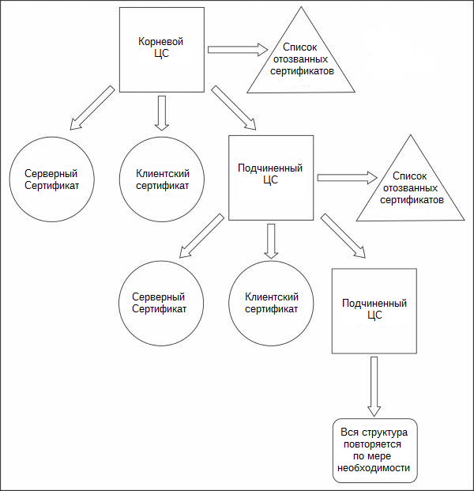
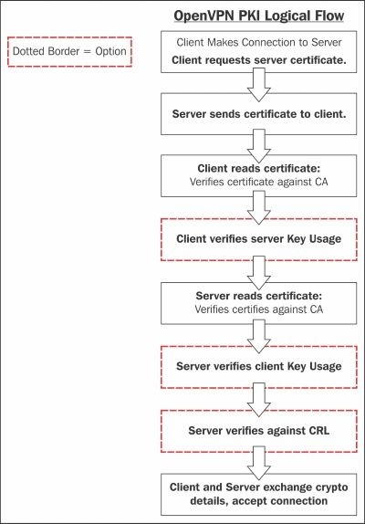
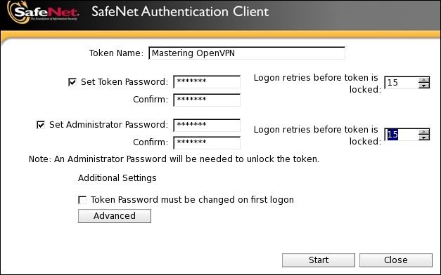

# Глава 3. PKI и сертификаты

В первую очередь OpenVPN использует сертификаты X.509 для аутентификации клиента и шифрования трафика VPN, хотя эту поддержку можно отключить. Просмотр списка рассылки и истории IRC-каналов, настройка и обслуживание **инфраструктуры приватного ключа (PKI)** для сертификатов X.509 является сложной концепцией и может быть трудоемкой задачей.

Двоичный файл OpenSSL содержит все инструменты, необходимые для ручного управления PKI, но параметры команд сложны и, если не автоматизированы, могут быть подвержены ошибкам. Организациям или частным лицам рекомендуется использовать скрипт или другой пакет для управления своей PKI. Это не только ограничивает количество ошибок, но также позволяет лучше соблюдать правила и другие общие критерии.

Существуют два проекта с открытым исходным кодом, которые специально написаны для хорошей работы с реализациями OpenVPN. EasyRSA - это давний проект, который всегда был тесно связан с проектом OpenVPN. Первоначально написанный вместе с OpenVPN, его первоначальная цель заключалась в создании **центра сертификации (Certificate Authority - CA)** и необходимых компонентов. Сегодня этот проект все еще поддерживается вместе с проектом OpenVPN, хотя они технически разделены.

Другой проект - ssl-admin, представляет собой Perl-скрипт, написанный для заполнения видимых пробелов в коде EasyRSA. Оба проекта по-разному подходят к задачам управления PKI и оба имеют уникальное решение. Проект ssl-admin - это интерактивный скрипт, предоставляющий меню и отзывы пользователей, в то время как EasyRSA - это, прежде всего, пакетная утилита.

На сегодняшний день Эрик Крист поддерживает проекты EasyRSA и ssl-admin. Джош Сепек присоединился и написал большую часть исходного кода EasyRSA v3.0. Цель состоит в том, чтобы в конечном итоге объединить два проекта и сохранить все функциональные возможности обоих.

## Обзор PKI

PKI - это, как правило, иерархическая организация сертификатов шифрования и пар ключей. Как правило, как и в большинстве веб-сайтов, вершиной иерархии является CA. Это _корень_ всего дерева, и доверие основано на этом уровне. Если корень является доверенным - все пары ключей, лежащие в основе, также будут доверенными. Из CA корневого уровня могут быть клиентские сертификаты, серверные сертификаты, подчиненные CA и **списки отзыва сертификатов (certificate revocation lists - CRL)**. Под каждым подчиненным CA этот список возможностей повторяется.



Чтобы использовать PKI в полной мере, пользователи и системы должны доверять корневому ЦС и любым промежуточным ЦС в цепочке. В большинстве современных веб-браузеров авторы или поставщики браузера по умолчанию проверяют и утверждают большой список центров сертификации корневого уровня, которым можно доверять. Этими органами обычно являются коммерческие поставщики, такие как VeriSign, Go Daddy, Comodo, Trend Micro, различные государственные структуры и многие другие.

Из-за этого предварительно одобренного списка для браузеров, подавляющее большинство пользователей Интернета совершенно не знают о том, как работает PKI. В результате, новые пользователи OpenVPN и любого программного обеспечения, требующего PKI, находят настройку и управление препятствием - как концептуально, так и технически. В случае общедоступных веб-сайтов требуется проверка стороннего сайта доверенным органом. Однако в контексте OpenVPN, как правило, в организации существует единый объект, которому неявно доверяют - отдел IT. OpenVPN обычно используется в одной организации, и доверие к нему является неотъемлемым. EasyRSA и ssl-admin были написаны в помочь как начинающим, так и опытным пользователям для управления своей PKI.

При использовании единственной двухточечной связи часто не имеет смысла включать сложность PKI для защиты туннеля; предустановленных общих ключей достаточно. Однако, когда в дело вовлечено много пользователей - существует гораздо больший потенциал для потерянных и украденных ключей и текучести кадров. При правильно настроенной PKI отозвать утерянный сертификат или увольняющегося сотрудника относительно просто. Новый также легко создается и перераспределяется.

Используя EasyRSA и ssl-admin - мы создадим простую PKI с CA, сертификатом сервера, некоторыми сертификатами клиента и списком отзыва сертификатов. Кроме того, мы будем использовать эти утилиты для генерации параметров **Диффи-Хеллмана (DH)**, которые будут использоваться и обсуждаться в последующих главах.

Поток OpenVPN PKI выглядит следующим образом:



### PKI с использованием EasyRSA

На момент написания этой главы EasyRSA 2.2.2 была официально последней версией наряду с v3.0.0-rc2. Поскольку серия v3.0 близится к выпуску - этот раздел будет посвящен ей. Релизы для EasyRSA можно найти по адресу https://github.com/OpenVPN/easyrsa/releases.

Это упражнение продемонстрирует как построить ЦС с нуля. Обновление с EasyRSA 2.2 здесь не рассматривается. После загрузки пакета EasyRSA распакуйте файлы, и вы должны найти каталог (в нашем случае `EasyRSA-3.0.0-rc2`):

```
ecrist@computer:~/Downloads-> tar -xzvf EasyRSA-3.0.0-rc2.tgz
x EasyRSA-3.0.0-rc2/
x EasyRSA-3.0.0-rc2/x509-types/
x EasyRSA-3.0.0-rc2/x509-types/server
x EasyRSA-3.0.0-rc2/x509-types/ca
x EasyRSA-3.0.0-rc2/x509-types/COMMON
x EasyRSA-3.0.0-rc2/x509-types/client
x EasyRSA-3.0.0-rc2/openssl-1.0.cnf
x EasyRSA-3.0.0-rc2/ChangeLog
x EasyRSA-3.0.0-rc2/Licensing/
x EasyRSA-3.0.0-rc2/Licensing/gpl-2.0.txt
x EasyRSA-3.0.0-rc2/COPYING
x EasyRSA-3.0.0-rc2/KNOWN_ISSUES
x EasyRSA-3.0.0-rc2/doc/
x EasyRSA-3.0.0-rc2/doc/Hacking.md
x EasyRSA-3.0.0-rc2/doc/EasyRSA-Upgrade-Notes.md
x EasyRSA-3.0.0-rc2/doc/EasyRSA-Readme.md
x EasyRSA-3.0.0-rc2/doc/EasyRSA-Advanced.md
x EasyRSA-3.0.0-rc2/doc/Intro-To-PKI.md
x EasyRSA-3.0.0-rc2/README.quickstart.md
x EasyRSA-3.0.0-rc2/vars.example
x EasyRSA-3.0.0-rc2/easyrsa
```

После извлечения, скопируйте файл `vars.example` как `vars`. Рекомендуется установить рабочий каталог EasyRSA. Строка 45 из `vars` определяет `EASYRSA` в `$PWD` (текущий рабочий каталог) по умолчанию. Это может оказаться проблемой, особенно если вы используете EasyRSA для управления несколькими центрами сертификации. Раскомментируйте эту строку и измените ее на что-то подходящее для вашей среды, например, `/usr/local/etc/easyrsa`.

---

**Подсказка**

При инициализации EasyRSA все содержимое каталога `EASYRSA` будет удалено. Будьте осторожны с тем, что вы определяете здесь. В каталоге `EASYRSA` находится хранилище сертификатов. Это _не_ местонахождение исполняемых файлов и переменных.

---

Вы, вероятно, захотите установить организационные поля, которые являются следующими переменными:

* `EASYRSA_REQ_COUNTRY`
* `EASYRSA_REQ_PROVICE`
* `EASYRSA_REQ_CITY`
* `EASYRSA_REQ_ORG`
* `EASYRSA_REQ_EMAIL`
* `EASYRSA_REQ_OU`

Значения используются в качестве значений по умолчанию для всех сгенерированных запросов на сертификат, включая корневой CA. Убедитесь, что эти строки не закомментированы в файле. Никаких других изменений в `vars` не требуется.

Если определенный вами каталог `EASYRSA` не существует, создайте его сейчас и скопируйте файл `openssl-1.0.cnf` из пакета дистрибутива в ваш новый каталог. Для наших примеров мы поместили хранилище сертификатов `EASYRSA` в `/usr/local/etc/easyrsa`:

```
ecrist@computer:~/Downloads/EasyRSA-3.0.0-rc2-> mkdir -p /usr/local/etc/easyrsa
ecrist@computer:~/Downloads/EasyRSA-3.0.0-rc2-> cp openssl-1.0.cnf /usr/local/etc/easyrsa
ecrist@computer:~/Downloads/EasyRSA-3.0.0-rc2-> cp –R x509-types /usr/local/etc/easyrsa/
```

Далее мы готовы инициализировать EasyRSA PKI:

```
ecrist@computer:~/Downloads/EasyRSA-3.0.0-rc2-> ./easyrsa init-pki
```

Обратите внимание, что мы используем конфигурацию EasyRSA из `./vars`.

```
init-pki complete; you may now create a CA or requests.
Your newly created PKI dir is: /usr/local/etc/easyrsa/pki
```

В этом случае процесс инициализации очищает содержимое - в нашем случае - каталог `pki` и создает подкаталоги `private` и `reqs`.

Вы можете иметь несколько файлов `vars` для управления несколькими ЦС, и все они могут быть вложены в один корневой каталог `EASYRSA`. Чтобы сделать это, вы должны изменить переменную `EASYRSA_PKI` для каждого ЦС.

### Создание CA

Подкоманда `build-ca` сначала генерирует **запрос на подпись сертификата (Certificate Signing Request - CSR)**, а затем самостоятельно подписывает этот запрос.

Чтобы создать пару сертификат/ключ корневого центра сертификации, выполните команду `build-ca`:

```
ecrist@computer:~/Downloads/EasyRSA-3.0.0-rc2-> ./easyrsa build-ca
Note: using EasyRSA configuration from: ./vars
Generating a 2048 bit RSA private key
.......+++
............+++
writing new private key to '/usr/local/etceasyrsa/pki/private/ca.key'
Enter PEM pass phrase:
Verifying - Enter PEM pass phrase:
-----
```

Вас попросят ввести информацию, которая будет включена в ваш запрос на сертификат. То, что вы собираетесь ввести, называется уникальным именем или DN. Есть довольно много полей, но некоторые вы можете оставить пустыми; в некоторых полях будет определено значение по умолчанию; если вы введете '.' - поле останется пустым.

```
-----
Common Name (eg: your user, host, or server name) [EasyRSA CA]:Mastering OpenVPN
```

---

**Подсказка**

Пробелы не должны использоваться в поле Common Name. Это вызовет проблемы в EasyRSA, а также, возможно, с CCD, общим именем в качестве имени пользователя и другими случаями. Убедитесь, что после пути есть косая черта (`/`) или некоторые подкоманды (`gen-crl` и другие) не будут работать.

---

**CA creation complete and you may now import and sign cert requests.
Your new CA certificate file for publishing is at:
/usr/local/etc/easyrsa/pki/ca.crt**

**Создание CA завершено, и теперь вы можете импортировать и подписывать сертификаты. Ваш новый файл сертификата CA для публикации находится по адресу: /usr/local/etc/easyrsa/pki/ca.crt**

При самоподписании для ограничения CA устанавливается значение true и определяются параметры использования ключа, что позволяет этому новому сертификату подписывать другие сертификаты, включая список отзыва сертификатов (CRL). Эта информация может быть проверена с помощью утилиты командной строки openssl:

```
ecrist@computer:~/Downloads/EasyRSA-3.0.0-rc2-> openssl x509 -in /usr/local/etc/easyrsa/pki/ca.crt -text -noout
Certificate:
    Data:
        Version: 3 (0x2)
        Serial Number:
            89:39:42:bb:f3:6b:a9:f6
        Signature Algorithm: sha256WithRSAEncryption
        Issuer: CN=Mastering OpenVPN
        Validity
            Not Before: Oct 1 15:02:44 2014 GMT
            Not After : Sep 28 15:02:44 2024 GMT
        Subject: CN=Mastering OpenVPN
        Subject Public Key Info:
            Public Key Algorithm: rsaEncryption
            RSA Public Key: (2048 bit)
                Modulus (2048 bit):
                    ...
                Exponent: 65537 (0x10001)
        X509v3 extensions:
            X509v3 Subject Key Identifier:

69:6C:A3:85:63:61:09:DE:8F:7D:38:F7:A2:CB:1C:31:75:90:34:93
            X509v3 Authority Key Identifier:

keyid:69:6C:A3:85:63:61:09:DE:8F:7D:38:F7:A2:CB:1C:31:75:90:34:93
                DirName:/CN=Mastering OpenVPN
                serial:89:39:42:BB:F3:6B:A9:F6

            X509v3 Basic Constraints:
                CA:TRUE
            X509v3 Key Usage:
                Certificate Sign, CRL Sign
    Signature Algorithm: sha256WithRSAEncryption
        ...
```

В выводе openssl мы видим основные ограничения x509v3, а также параметры использования ключа x509v3. Теперь ваш ЦС готов начать подписывать сертификаты клиента и сервера.

### Список отзыва сертификатов

Субкоманда `gen-crl` генерирует список отзыва сертификатов. Хотя на данный момент у нас есть только сертификат ЦС, рекомендуется создать пустой CRL. Это позволит вам создавать конфигурацию OpenVPN с файлом и не требует перезагрузки позже. OpenVPN будет регистрировать ошибки, если в его конфигурации указан несуществующий CRL, но файл можно заменить на лету, так как он перечитывается при каждом клиентском подключении.

```
ecrist@computer:~/Downloads/EasyRSA-3.0.0-rc2-> ./easyrsa gen-crl

Note: using EasyRSA configuration from: ./vars
Using configuration from /usr/local/etc/easyrsa/openssl-1.0.cnf
Enter pass phrase for /usr/local/etc/easyrsa/pki/private/ca.key:

An updated CRL has been created.
CRL file: /usr/local/etc/easyrsa/pki/crl.pem
```

Мы можем проверить CRL, используя команду `openssl crl`:

```
ecrist@computer:~/Downloads/EasyRSA-3.0.0-rc2-> openssl crl -noout -text -in /usr/local/etc/easyrsa/pki/crl.pem
Certificate Revocation List (CRL):
        Version 2 (0x1)
        Signature Algorithm: sha256WithRSAEncryption
        Issuer: /CN=Mastering OpenVPN
        Last Update: Oct 1 15:50:46 2014 GMT
        Next Update: Mar 30 15:50:46 2015 GMT
        CRL extensions:
            X509v3 Authority Key Identifier:

keyid:69:6C:A3:85:63:61:09:DE:8F:7D:38:F7:A2:CB:1C:31:75:90:34:93
                DirName:/CN=Mastering OpenVPN
                serial:89:39:42:BB:F3:6B:A9:F6

No Revoked Certificates.
    Signature Algorithm: sha256WithRSAEncryption
        ...
```

### Серверные сертификаты

OpenVPN может использовать параметры использования ключа x509, гарантируя, что клиенты соединяются с действительными клиентскими сертификатами, и клиенты могут гарантировать, что сервер авторизован как сервер. Это предотвращает использование одного из ваших клиентских сертификатов в качестве сервера при атаке **Man-In-The-Middle (MITM)**. Без этого ограничения любой сертификат, подписанный ЦС VPN, может использоваться для подмены клиента или сервера. Поскольку поддельный сертификат находится в той же PKI - сам сертификат все еще действителен и будет проходить общие проверки PKI.

EasyRSA поддерживает подписывание сертификатов с помощью параметра использования ключа сервера с использованием встроенной подкоманды `build-server-full`.

```
ecrist@computer:~/EasyRSA-3.0.0-rc2-> ./easyrsa build-server-full movpn-server

Note: using EasyRSA configuration from: ./vars
Generating a 2048 bit RSA private key
............+++
..............................+++
writing new private key to '/usr/local/etc/easyrsa/pki/private/movpnserver.key'
Enter PEM pass phrase:
Verifying - Enter PEM pass phrase:
-----
Using configuration from /usr/local/etc/easyrsa/openssl-1.0.cnf
Enter pass phrase for /usr/local/etc/easyrsa/pki/private/ca.key:
Check that the request matches the signature
Signature ok
The Subject's Distinguished Name is as follows
commonName            :PRINTABLE:'movpn-server'
Certificate is to be certified until Oct 18 19:15:31 2024 GMT (3650
days)

Write out database with 1 new entries
Data Base Updated
```

Мы можем проверить сертификат сервера с помощью команды `openssl`:

```
ecrist@computer:~/EasyRSA-3.0.0-rc2-> openssl x509 -noout -text -in /usr/local/etc/easyrsa/pki/issued/movpn-server.crt
Certificate:
    Data:
        Version: 3 (0x2)
        Serial Number: 1 (0x1)
    Signature Algorithm: sha256WithRSAEncryption
        Issuer: CN=Mastering OpenVPN
        Validity
            Not Before: Oct 21 19:15:31 2014 GMT
            Not After : Oct 18 19:15:31 2024 GMT
        Subject: CN=movpn-server
        Subject Public Key Info:
            Public Key Algorithm: rsaEncryption
                Public-Key: (2048 bit)
                Modulus:
                    ...
                Exponent: 65537 (0x10001)
        X509v3 extensions:
            X509v3 Basic Constraints:
                CA:FALSE
            X509v3 Subject Key Identifier:

11:AD:47:E2:1C:87:91:3B:C0:A1:53:F5:77:A7:2F:9F:0B:0F:5D:9E
            X509v3 Authority Key Identifier:

keyid:F0:AF:20:ED:6F:A7:47:0F:C7:F2:B0:EC:CF:8B:30:09:02:E4:81:A0
                DirName:/CN=Mastering OpenVPN
                serial:84:9E:B9:14:2B:62:B4:50

            X509v3 Extended Key Usage:
                TLS Web Server Authentication
            X509v3 Key Usage:
                Digital Signature, Key Encipherment
    Signature Algorithm: sha256WithRSAEncryption
        ...
```

Обратите внимание на раздел использования ключа x509v3 и его идентификацию `TLS Web Server Authentication`. Это то, что ищут текущие версии OpenVPN, когда указаны типы удаленных сертификатов.

### Клиентские сертификаты

Как и сертификаты сервера, клиенты могут проходить аутентификацию с использованием клиентских сертификатов. При использовании этого метода каждому клиенту потребуется уникальный сертификат. **Общее имя сертификата (Common Name - CN)** можно использовать для определения других параметров, которые должны передаваться в данном соединении с помощью сценариев `client-connect` или опции `client-config-dir`. Начиная с OpenVPN 2.3.7, все еще поддерживается `-client-cert-not-required`. Говорили об удалении этой поддержки из будущего выпуска. `client-cert-not-required` позволяет клиенту подключаться без уникального (или какого-либо) предварительно определенного сертификата, так же как веб-браузер будет подключаться к веб-серверу.

Команда `easyrsa` используется для создания сертификата клиента почти так же, как мы создали сертификат сервера:

```
ecrist@computer:~/EasyRSA-3.0.0-rc2-> ./easyrsa build-client-full
client1
Note: using EasyRSA configuration from: ./vars
Generating a 2048 bit RSA private key
...............+++
...................................................................
.......................................................+++
writing new private key to 'homeecrist/EasyRSA-3.0.0-rc2/pki/private/client1.key'
Enter PEM pass phrase:
Verifying - Enter PEM pass phrase:
-----
Using configuration from homeecrist/EasyRSA-3.0.0-rc2/openssl-1.0.cnf
Enter pass phrase for homeecrist/EasyRSA-3.0.0-rc2/pki/private/ca.key:
Check that the request matches the signature
Signature ok
The Subject's Distinguished Name is as follows
commonName :PRINTABLE:'client1'
Certificate is to be certified until Oct 18 19:37:40 2024 GMT (3650 days)

Write out database with 1 new entries
Data Base Updated
```

Мы можем использовать команду `openssl` для проверки параметров использования ключа:

```
ecrist@computer:~/EasyRSA-3.0.0-rc2-> openssl x509 -noout -text -in /usr/local/etc/easyrsa/pki/issued/client1.crt
Certificate:
    Data:
        Version: 3 (0x2)
        Serial Number: 2 (0x2)
    Signature Algorithm: sha256WithRSAEncryption
        Issuer: CN=Mastering OpenVPN
        Validity
            Not Before: Oct 21 19:37:40 2014 GMT
            Not After : Oct 18 19:37:40 2024 GMT
        Subject: CN=client1
        Subject Public Key Info:
            Public Key Algorithm: rsaEncryption
                Public-Key: (2048 bit)
                Modulus:
                    ...
                Exponent: 65537 (0x10001)
        X509v3 extensions:
            X509v3 Basic Constraints:
                CA:FALSE
            X509v3 Subject Key Identifier:

47:80:59:8D:5F:63:4B:1C:21:C6:DE:C6:C0:7B:DE:6A:5D:53:F9:37
            X509v3 Authority Key Identifier:

keyid:F0:AF:20:ED:6F:A7:47:0F:C7:F2:B0:EC:CF:8B:30:09:02:E4:81:A0
                DirName:/CN=Mastering OpenVPN
                serial:84:9E:B9:14:2B:62:B4:50
            X509v3 Extended Key Usage:
                TLS Web Client Authentication
            X509v3 Key Usage:
                Digital Signature
    Signature Algorithm: sha256WithRSAEncryption
...
```

Как отмечено в разделе о сервере, мы рассмотрим `x509v3 Extended Key Usage`. В случае клиента мы ищем `TLS Web Client Authentication`. Опять же, это используется при проверке типа сертификата удаленного клиента.

### PKI с использованием ssl-admin

Проект ssl-admin был запущен в то время, когда EasyRSA считался заброшенным и сломанным. Это интерактивная утилита на основе меню, написанная на Perl. Как и EasyRSA, ssl-admin - это оболочка для утилит командной строки OpenSSL.

Чтобы установить ssl-admin во FreeBSD, установите порт `security/ssl-admin`. Для всех других Unix-систем, включая OS X, самым простым методом является экспорт svn. Следующие примеры выполняются на Mac OS X, но будут аналогичны для других операционных систем.

Чтобы получить ssl-admin в ОС, отличной от FreeBSD, используйте утилиту командной строки SVN для экспорта текущей версии:

```
ftp://ftp.secure-computing.net/pub/ssl-admin/

ecrist@computer:~-> curl -o ssa.tgz ftp://ftp.secure-computing.net//pub/ssl-admin/ssl-admin-1.2.1.tar.gz
  % Total % Received % Xferd Average Speed Time Time Time
Current
                            Dload Upload Total Spent Left
Speed
100 11196 100 11196  0     0 17568   0 --:--:-- --:--:-- --:--:--
17548
```

---

**Подсказка**

Сервер `ftp2.secure-computing.net` может быть использован в качестве альтернативы, если основной `ftp.secure-computing.net` недоступен.

---

```
ecrist@computer:~-> tar -xzvf ssa.tgz
x ssl-admin-1.2.1/
x ssl-admin-1.2.1/man5/
x ssl-admin-1.2.1/man1/
x ssl-admin-1.2.1/ssl-admin
x ssl-admin-1.2.1/ssl-admin.conf
x ssl-admin-1.2.1/Makefile
x ssl-admin-1.2.1/configure
x ssl-admin-1.2.1/openssl.conf
x ssl-admin-1.2.1/ssl-admin-e
x ssl-admin-1.2.1/man1/ssl-admin.1
x ssl-admin-1.2.1/man1/ssl-admin.1-e
x ssl-admin-1.2.1/man5/ssl-admin.conf.5
x ssl-admin-1.2.1/man5/ssl-admin.conf.5-e
```

Чтобы установить после экспорта, измените директорию на ваше экспортируемое дерево и запустите `./configure`, а затем `make install`:

```
ecrist@computer:~/ssl-admin-1.2.1-> ./configure
```

---

**Подсказка**

Bourne Shell является единственным требованием для настройки. Это не типичный набор правил настройки - он просто имитирует его поведение.

---

```
ecrist@computer:~/ssl-admin-1.2.1-> sudo make install
```

После установки при запуске команды `ssl-admin` сначала отобразится ошибка:

```
ecrist@computer:~/ssl-admin-> ssl-admin
Libraryssl-admin/ssl-admin.conf doesn't exist. Did you copy the
sample from Libraryssl-admin/ssl-admin.conf.sample? at
/usr/local/bin/ssl-admin line 40.
```

---

**Подсказка**

Некоторые версии ssl-admin ссылаются на следующий файл: `ssl-admin.conf.default`.

---

Чтобы начать использовать программное обеспечение - необходимо скопировать файл по умолчанию в место, указанное в сообщении об ошибке. Это зависит от операционной системы в зависимости от стандартной иерархии файловой системы. Здесь мы скопируем `ssl-admin.conf.sample` в `ssl-admin.conf` и исправим разрешения для нового файла.

---

**Заметка**

`ssl-admin` требует чтобы все операции выполнялись от имени пользователя root. Это известная плохая практика и она будет исправлена ​​в следующем выпуске.

---

Команды для этого следующие:

```
ecrist@computer:~/ssl-admin-> sudo csh
Password:
```

Нет особой причины использовать csh, это просто предпочтение автора (лучшее или худшее).

```
root@computer:~/ssl-admin-> cd Libraryssl-admin/
root@computer:Libraryssl-admin-> cp ssl-admin.conf.sample ssl-admin.conf
root@computer:Libraryssl-admin-> chmod ug+rw ssl-admin.conf
root@computer:Libraryssl-admin-> ls -l
total 12
-r--r--r-- 1 root wheel 2511 Oct 1 12:02 openssl.conf.sample
-rw-rw-r-- 1 root wheel 531 Oct 1 12:11 ssl-admin.conf
-r--r--r-- 1 root wheel 531 Oct 1 12:02 ssl-admin.conf.sample
```

Отсюда мы можем редактировать файл конфигурации. Как правило, необходимо изменить только нижние переменные:

* `$ENV{'KEY_COUNTRY'}`
* `$ENV{'KEY_PROVINCE'}`
* `$ENV{'KEY_CITY'}`
* `$ENV{'KEY_ORG'}`
* `$ENV{'KEY_EMAIL'}`
* `$ENV{'KEY_COUNTRY'}`

Переменная `KEY_COUNTRY` должна состоять из двух букв. Это ограничение/запрет стандарта, а не `ssl-admin`. Эти значения совпадают с одноименными переменными в EasyRSA. Они не должны быть изменены после создания ЦС, так как `openssl` будет выдавать ошибки для несовпадающих значений.

---

**Подсказка**

`$ENV{'KEY_CRL_LOC'}` следует оставить в покое, если в вашей организации нет действующего URL-адреса для распространения CRL. Пустое значение приведет к ошибкам с `openssl`.

---

Как только файл конфигурации был отредактирован - мы можем запустить программу. При первом запуске ssl-admin проверит хранилище сертификатов. Если в нем нет действующего ЦС и структуры - пользователь может импортировать существующую PKI или создать новую. Как и в случае с EasyRSA, мы создаем новый центр сертификации. В некоторых операционных системах файл `/etc/openssl.cnf` необходимо скопировать вручную в корень хранилища сертификатов. Эта ошибка не встречалась в Mac OS X. В системах Linux просто скопируйте файл `/etc/openssl.cnf` в файл `/etc/ssl-admin/openssl.cnf`. Это будет исправлено в более позднем выпуске ssl-admin.

```
root@computer:/Library/ssl-admin-> ssl-admin
This program will walk you through requesting, signing,
organizing and revoking SSL certificates.

Looks like this is a new install, installing...
You will first need to edit the /Library/ssl-admin/ssl-admin.conf
default variables. Have you done this? (y/n): y
I need the CA credentials. Would you like to create a new CA key
and certificate now? (y/n): y
Please enter certificate owner's name or ID.
Usual format is first initial-last name (jdoe) or
hostname of server which will use this certificate.
All lower case, numbers OK.
Owner []: Mastering OpenVPN


File names will use Mastering_OpenVPN.


===> Creating private key with 2048 bits and generating request.
Do you want to password protect your CA private key? (y/n): y
Generating RSA private key, 2048 bit long modulus
.....................................+++
............+++
e is 65537 (0x10001)
Enter pass phrase for Mastering_OpenVPN.key:
Verifying - Enter pass phrase for Mastering_OpenVPN.key:
===> Self-Signing request.
Enter pass phrase for /Library/ssl-admin/Mastering_OpenVPN.key:
===> Moving certficate and key to appropriate directory.
===> Creating initial CRL.Using configuration from /Library/ssl-admin/openssl.conf
Enter pass phrase for /Library/ssl-admin/active/ca.key:
ssl-admin installed Wed Oct 1 12:28:23 CDT 2014
OPTIONAL: I can't find your OpenVPN client config. Please copy
your config to
Libraryssl-admin/packages/client.ovpn

=====================================================
# SSL-ADMIN v1.2.1 #
=====================================================
Please enter the menu option from the following list:
1) Update run-time options:
     Key Duration (days): 3650
     Current Serial #: 01
     Key Size (bits): 2048
     Intermediate CA Signing: NO
2) Create new Certificate Request
3) Sign a Certificate Request
4) Perform a one-step request/sign
5) Revoke a Certificate
6) Renew/Re-sign a past Certificate Request
7) View current Certificate Revokation List
8) View index information for certificate.
i) Generate a user config with in-line certifcates and keys.
z) Zip files for end user.
dh) Generate Diffie Hellman parameters.
CA) Create new Self-Signed CA certificate.
S) Create new Signed Server certificate.
q) Quit ssl-admin

Menu Item:
```

Как видите, ssl-admin значительно более многословен и интерактивен, чем EasyRSA. Кроме того, ssl-admin автоматически генерирует начальный CRL для вас.

Перед отображением меню было предупреждение `OPTIONAL` о конфигурации OpenVPN. Если вы предоставляете свою конфигурацию `client.ovpn` - ssl-admin может автоматически упаковывать конфигурационные файлы со встроенными сертификатами в ZIP-файл. Строки сертификата файла конфигурации должны быть универсальными:

```
ca ca.crt

cert client.crt

key client.key
```

Эти значения будут автоматически заменены встроенными ключами или файлы будут переименованы в соответствии с тем, как распространяются сертификаты, ключи и конфигурации OpenVPN. Теперь, когда мы инициализировали PKI путем создания пары ключей корневого центра сертификации, мы можем приступить к созданию сертификатов нашего сервера и клиента.

## Серверные сертификаты OpenVPN

Сначала мы создадим сертификат для использования на сервере OpenVPN. Опция меню `S` сгенерирует CSR, ключ и предложит подписать сертификат центром сертификации:

```
Menu Item: S
Please enter certificate owner's name or ID.
Usual format is first initial-last name (jdoe) or
hostname of server which will use this certificate.
All lower case, numbers OK.
Owner []: Mastering OpenVPN Server


File names will use Mastering_OpenVPN_Server.
Please enter certificate owner's name or ID.
Usual format is first initial-last name (jdoe) or
hostname of server which will use this certificate.
All lower case, numbers OK.
Owner [Mastering_OpenVPN_Server]:
Would you like to password protect the private key (y/n): y
Generating a 2048 bit RSA private key
..................+++
.........+++
writing new private key to 'Mastering_OpenVPN_Server.key'
Enter PEM pass phrase:
Verifying - Enter PEM pass phrase:
-----
===> Serial Number = 01
Using configuration from /Library/ssl-admin/openssl.conf
Enter pass phrase for /Library/ssl-admin/active/ca.key:
Check that the request matches the signature
Signature ok
The Subject's Distinguished Name is as follows
countryName :PRINTABLE:'ZA'
stateOrProvinceName :PRINTABLE:'Enlightenment'
localityName :PRINTABLE:'Overall'
organizationName :PRINTABLE:'Mastering OpenVPN'
commonName :PRINTABLE:'Mastering OpenVPN Server'
emailAddress :IA5STRING:'root@example.org'
Certificate is to be certified until Sep 28 17:48:20 2024 GMT (3650
days)
Write out database with 1 new entries
Data Base Updated
=========> Moving certificates and keys to /Library/ssl-admin/active
for production.
Can I move signing request (Mastering_OpenVPN_Server.csr) to the
csr directory for archiving? (y/n): y
===> Mastering_OpenVPN_Server.csr moved.
MENU
```

---

**Подсказка**

Чтобы сэкономить место, меню, напечатанное `ssl-admin`, будет опущено, вместо этого оно будет заменено словом `MENU`.

В предыдущем коде мы использовали сертификат CN с пробелами для демонстрации поведения ssl-admin. Здесь он предупредил, что пробелы будут заменены символом подчеркивания и дал пользователю возможность изменить CN, если это необходимо. Далее мы решили защитить приватный ключ парольной фразой. Наконец, пользователя спросили, можно ли заархивировать CSR.

Чтобы показать добавленные токены сервера - мы снова запускаем команду `openssl` для вывода сведений о сертификате. Следующий вывод опускает некоторые ключевые детали для краткости:

```
root@computer:/Library/ssl-admin-> openssl x509 -noout -text -in active/Mastering_OpenVPN_Server.crt
Certificate:
    Data:
        Version: 3 (0x2)
        Serial Number: 1 (0x1)
        Signature Algorithm: sha1WithRSAEncryption
        Issuer: C=ZA, ST=Enlightenment, L=Overall, O=Mastering
OpenVPN, CN=Mastering OpenVPN/emailAddress=root@example.org
        Validity
            Not Before: Oct 1 17:48:20 2014 GMT
            Not After : Sep 28 17:48:20 2024 GMT
        Subject: C=ZA, ST=Enlightenment, O=Mastering OpenVPN,
CN=Mastering OpenVPN Server/emailAddress=root@example.org
        Subject Public Key Info:
            Public Key Algorithm: rsaEncryption
            RSA Public Key: (2048 bit)
                Modulus (2048 bit):
                    ...
                Exponent: 65537 (0x10001)
        X509v3 extensions:
            X509v3 Basic Constraints:
                CA:FALSE
            Netscape Cert Type:
                SSL Server
            Netscape Comment:
                ssl-admin (OpenSSL) Generated Server Certificate
            X509v3 Subject Key Identifier:

FB:A8:91:01:E3:51:5D:A7:29:8C:54:63:9F:22:7F:F8:DE:AB:5A:39
            X509v3 Authority Key Identifier:

keyid:1F:85:DF:90:5C:3F:73:A9:03:B9:F4:E6:C2:2C:A3:27:CF:5B:44:95

DirName:/C=ZA/ST=Enlightenment/L=Overall/O=Mastering
OpenVPN/CN=Mastering OpenVPN/emailAddress=root@example.org
                serial:D2:93:32:F0:8E:BC:58:EE

            X509v3 Extended Key Usage:
                TLS Web Server Authentication
            X509v3 Key Usage:
                Digital Signature, Key Encipherment
    Signature Algorithm: sha1WithRSAEncryption
```

Обратите внимание, что `x509v3 Extended Key Usage` включает `TLS Web Server Authentication`. Более старый стандарт `nsCertType`, известный как `Netscape Cert Type`, также включенный для обратной совместимости. Это не столько уместно для OpenVPN, сколько ssl-admin был написан как общая утилита управления CA x509.

## Клиентские сертификаты OpenVPN

Клиентские сертификаты генерируются так же, как сертификат сервера. Опция `4` в меню создаст запрос на подпись сертификата (CSR) и впоследствии подпишет CSR:

```
Menu Item: 4
Please enter certificate owner's name or ID.
Usual format is first initial-last name (jdoe) or
hostname of server which will use this certificate.
All lower case, numbers OK.
Owner []: client1

File names will use client1.
Please enter certificate owner's name or ID.
Usual format is first initial-last name (jdoe) or
hostname of server which will use this certificate.
All lower case, numbers OK.
Owner [client1]:
Would you like to password protect the private key (y/n): n
Generating a 2048 bit RSA private key
...................................................................
..................................................................+
++
.........+++
writing new private key to 'client1.key'
-----
===> Serial Number = 02
=========> Signing request for client1
Using configuration from /Library/ssl-admin/openssl.conf
Enter pass phrase for /Library/ssl-admin/active/ca.key:
Check that the request matches the signature
Signature ok
The Subject's Distinguished Name is as follows
countryName             :PRINTABLE:'ZA'
stateOrProvinceName     :PRINTABLE:'Enlightenment'
localityName            :PRINTABLE:'Overall'
organizationName        :PRINTABLE:'Mastering OpenVPN'
commonName              :PRINTABLE:'client1'
emailAddress            :IA5STRING:'root@example.org'
Certificate is to be certified until Sep 28 18:05:14 2024 GMT (3650 days)

Write out database with 1 new entries
Data Base Updated
=========> Moving certificates and keys to Libraryssl-admin/active
for production.
Can I move signing request (client1.csr) to the csr directory for
archiving? (y/n): ===> client1.csr moved.
MENU
```

---

**Подсказка**

В последующих упражнениях будет использоваться до трех клиентских сертификатов, поэтому рекомендуется повторить предыдущие шаги для `client2` и `client3`.

---

Используя двоичный файл `openssl` для проверки сертификата, мы видим, что в сертификате `client1` отсутствуют расширения использования ключей сервера, которые присутствовали в сертификате сервера, который мы создали ранее.

```
root@computer:Libraryssl-admin-> openssl x509 -noout -text -in active/client1.crt
Certificate:
    Data:
        Version: 1 (0x0)
        Serial Number: 2 (0x2)
        Signature Algorithm: sha1WithRSAEncryption
        Issuer: C=ZA, ST=Enlightenment, L=Overall, O=Mastering
OpenVPN, CN=Mastering OpenVPN/emailAddress=root@example.org
        Validity
            Not Before: Oct 1 18:05:14 2014 GMT
            Not After : Sep 28 18:05:14 2024 GMT
        Subject: C=ZA, ST=Enlightenment, O=Mastering OpenVPN,
CN=client1/emailAddress=root@example.org
        Subject Public Key Info:
            Public Key Algorithm: rsaEncryption
            RSA Public Key: (2048 bit)
                Modulus (2048 bit):
          ...
                Exponent: 65537 (0x10001)
    Signature Algorithm: sha1WithRSAEncryption
        ...
```

Этот сертификат, очевидно, имеет более простую структуру, чем сертификат сервера, и параметры использования ключа сервера отсутствуют.

После создания нашего ЦС, сервера и трех клиентских сертификатов у нас остается следующая структура каталогов:

```
root@computer:Libraryssl-admin-> ls -lrth
total 16
-rw-rw-r-- 1 root wheel 541B Oct 1 12:22 ssl-admin.conf
drwxr-x--- 2 root wheel 68B Oct 1 12:24 revoked
-rw-rw---- 1 root wheel 2.5K Oct 1 12:27 openssl.conf
drwxr-x--- 2 root wheel 102B Oct 1 12:28 packages
-r--r--r-- 1 root wheel 531B Oct 1 12:43 ssl-admin.conf.sample
-r--r--r-- 1 root wheel 2.5K Oct 1 12:43 openssl.conf.sample
drwxr-x--- 2 root wheel 340B Oct 1 13:05 prog
drwxr-x--- 2 root wheel 340B Oct 1 13:05 csr
drwxr-x--- 2 root wheel 544B Oct 1 13:05 active
```

Активный (`active`) каталог содержит все сертификаты и ключи, которые не были отозваны, включая сертификат и ключ ЦС. Когда сертификаты отозваны, они перемещаются из активного в `revoked` (аннулированные). Чтобы использовать утилиты OpenSSL для отзыва сертификата - он должен присутствовать. Без сертификата возможно проблематичное редактирование индексов вручную в файле `index.txt`. Как следует из его названия, каталог `csr` содержит все CSR. Как правило, их можно безопасно удалить и они хранятся только для устранения неполадок или для восстановления сертификата.

Администратору предлагается оставить управление содержимым хранилища сертификатов утилите. Это относится как к ssl-admin, так и к Easy-RSA.

Каталог `prog` содержит рабочие файлы OpenSSL и последний CRL. Не рекомендуется, чтобы эти файлы были повреждены, так как есть вероятность сделать вашу PKI непригодной для использования в случае допуска ошибок.

Наконец, каталог `packages` будет содержать все файлы, которые вы можете распространять среди своих конечных пользователей: не только клиентов OpenVPN, но и администраторов веб-серверов и так далее. Упаковка сертификатов и ключей гарантирует, что конечный пользователь получит все необходимые файлы и они будут в правильном формате.

## Другие преимущества

Утилита ssl-admin имеет некоторые другие функции, которые могут заинтересовать кого-то, кто управляет PKI. Индекс доступный для поиска (опция `8`), который показывает статус данного сертификата. Также возможно отображение текущего CRL (опция `7`). ssl-admin способен упаковывать файлы конфигурации OpenVPN с сертификатами для пользователей как во встроенном формате (опция `i`), так и в отдельные файлы - все они содержатся в zip-файле (опция `z`). Эти два последних варианта будут обсуждаться далее в этой книге, поскольку мы генерируем конфигурации сервера и клиента.

## Несколько CA и CRL

Easy-RSA 3.0 довольно легко поддерживает несколько корневых ЦС. Создав отдельный каталог CA в корневом каталоге `EASYRSA` и имея разные файлы `vars` для каждого, можно управлять каждым отдельным ЦС с помощью Easy-RSA.

В настоящее время ssl-admin не поддерживает несколько корневых ЦС, но поддерживается создание промежуточных CA.

В OpenVPN один экземпляр сервера может поддерживать несколько корневых ЦС, при этом принимаются клиентские подключения, подписанные любым ЦС. Чтобы включить такую ​​поддержку, сертификат ЦС для каждого авторизованного ЦС должен быть объединен в один файл, который можно вызвать с помощью опции OpenVPN `--ca`. То же самое можно сделать со списком отзыва сертификатов.

Как правило, не рекомендуется использовать несколько сертификатов ЦС для одного экземпляра OpenVPN; исключениями могут оказаться миграция сервера или центра сертификации, приобретение компании или организации и т.д.

Ни при каких обстоятельствах не стоит использовать корневой центр сертификации веб-браузера для цепочки сертификатов OpenVPN. Невозможно определить у кого есть сертификат, и любой, кто попадает в эту иерархию CA, сможет подключиться к вашему экземпляру VPN.

В дальнейшем планируется объединить проекты ssl-admin и Easy-RSA в единый полностью функциональный пакет управления PKI. Для Easy-RSA 4.0 необходимо реализовать эти миграции, используя лучшие функции обеих утилит.

## Дополнительная безопасность - аппаратные токены, смарт-карты и PKCS #11

В этом разделе мы предоставим некоторую справочную информацию о криптографических аппаратных устройствах. Вы узнаете как сгенерировать приватный ключ на аппаратном токене и как скопировать связанный сертификат X.509 в токен.

После этого мы обсудим, как OpenVPN может найти и использовать эту пару сертификат/приватный ключ для установления VPN-соединения.

### Исходная информация

Начиная с версии 2.1, OpenVPN поддерживает двухфакторную аутентификацию, предоставляя поддержку **PKCS#11**. Двухфакторная аутентификация основана на идее, что для использования системы (например, VPN) необходимо предоставить две вещи:

* Что-то, что Вы **знаете**, например, пароль
* Что-то, чем Вы **владеете**, например, смарт-карта или аппаратный токен

PKCS#11 является отраслевым стандартом для связи со смарт-картами или аппаратными токенами, и здесь доступны как открытые, так и коммерческие драйверы. Стандарт PKCS#11 был первоначально опубликован RSA Laboratories и иногда также упоминается как стандарт **cryptoki**, что обозначает **CRYPtographic TOKen Interface**.

Помимо терминов аппаратный токен и смарт-карта, термин **аппаратный модуль безопасности (Hardware Security Module - HSM)** также часто используется для двухфакторной аутентификации. В этом разделе мы в основном будем использовать термин аппаратный токен. Основное различие между аппаратными токенами и смарт-картами заключается в форм-факторе: аппаратный токен обычно поставляется как устройство USB, тогда как смарт-карта выглядит как карта банкомата или кредитная карта. Для использования смарт-карты требуется специальный картридер, который иногда интегрируется в ноутбуки и даже некоторые настольные компьютеры. В некоторых странах выпускаются национальные электронные удостоверения личности, которые обычно классифицируются как смарт-карты.

Чаще всего HSM - это устройство, которое может безопасно хранить криптографические ключи и управлять ими, часто обеспечивая аппаратное ускорение, а также ускоряет шифрование и дешифрование.

Аппаратный токен, смарт-карта или HSM, обычно представляют собой небольшое устройство со встроенным чипом. Этот встроенный чип работает под управлением миниатюрной операционной системы (часто называемой Card OS), которая отвечает за безопасное создание, хранение и управление закрытыми ключами SSL. Большинство аппаратных токенов также способны хранить другую информацию, такую ​​как сертификаты SSL, так что действительная пара сертификат/приватный ключ может надежно храниться на одном устройстве.

### Поддерживаемые платформы

Основная сложность при использовании двухфакторной аутентификации заключается в поддержке программного обеспечения на разных платформах. Хотя большинство поставщиков аппаратных токенов и смарт-карт предоставляют драйверы операционной системы для Microsoft Windows, в Linux или даже Mac OS X поддерживается гораздо меньше плат и токенов. Обратите внимание, что это не связано с самим OpenVPN: если определенный аппаратный токен поддерживается используемой операционной системой и драйвером PKCS#11, то, как правило, OpenVPN может использовать этот аппаратный токен или смарт-карту.

Для этой книги мы использовали аппаратный токен Aladdin eToken Pro 72K USB. (Aladdin Systems была куплена SafeNet (http://www.safenet.com). Однако, только недавно SafeNet объединилась с Gemalto.) Этот аппаратный токен поддерживается только с использованием клиента аутентификации SafeNet с закрытым исходным кодом, который доступен для Microsoft Windows, Mac OS X и Linux.

Более ранние версии этих токенов имели то преимущество, что могли использовать либо платный драйвер с закрытым исходным кодом от SafeNet, либо бесплатный драйвер с открытым исходным кодом из проекта OpenSC (в настоящее время можно найти по адресу https://github.com/OpenSC/OpenSC/wiki). К сожалению, эти старые токены больше не могут быть приобретены и текущие токены от SafeNet используют другую Card ОС, которая не поддерживается OpenSC.

Общий процесс и концепция применимы к большинству аппаратных токенов, которые вы можете использовать. Эти старые устройства использовались просто для тестирования и демонстрации. Многие поставщики используют мобильное приложение на смартфоне пользователя в качестве аппаратного токена. SafeNet также имеет такой продукт: MobilePASS.

Кроме того, драйверы и инструменты из проекта OpenSC не так зрелы, как программное обеспечение от коммерческих поставщиков программного обеспечения.

Другие производители смарт-карт и аппаратных токенов - Aktiv Co и Feitian (с поддержкой открытого исходного кода).

Обратите внимание, что OpenVPN зависит исключительно от работающего драйвера PKCS#11. При выборе аппаратного токена будет важно проверить - поддерживается ли устройство на необходимых платформах, а не будет ли оно работать с самим OpenVPN. Кроме того - обратите внимание что не требуется (или даже не рекомендуется!) использовать аппаратный токен на сервере OpenVPN.

### Инициализация аппаратного токена

Предполагается, что пакет Aladdin `pkiclient` или SafeNet `AuthenticationClient` установлен и аппаратный токен распознается программным обеспечением драйвера. Если eToken уже был инициализирован - пропустите этот шаг.

Сначала откройте окно свойств клиента eToken и нажмите **Initialize eToken**. Это вызовет следующее диалоговое окно:



Введите пароль токена и пароль администратора, снимите флажок **Token Password must be changed on first logon** и нажмите **Start**.

Все содержимое токена теперь будет уничтожено, а eToken будет инициализирован с использованием нового токена и пароля администратора.

### Генерация пары сертификат/приватный ключ

При использовании аппаратного токена процесс генерации пары сертификата и приватного ключа немного отличается от использования инструментов ssl-admin или Easy-RSA. С помощью ssl-admin или Easy-tools приватный ключ, запрос сертификата и сертификат X.509 генерируются за один шаг. С аппаратным токеном нам сначала нужно сгенерировать приватный ключ на токене.

Используя этот приватный ключ, нам нужно создать CSR. Этот CSR затем подписывается ЦС что приводит к сертификату X.509. Этот сертификат затем записывается обратно в токен. Инструменты ssl-admin и Easy-RSA фактически следуют одному и тому же процессу, но они скрывают файл CSR от пользователя.

### Генерация приватного ключа на токене

Чтобы сгенерировать приватный ключ на eToken, нам нужна команда `pkcs11-tool`, которая является частью пакета OpenSC. Пакет OpenSC доступен для Microsoft Windows, Mac OS X и Linux. Команда `pkcs11-tool` предоставляет интерфейс для аппаратных токенов с использованием драйвера PKCS#11. Драйвером PKCS#11, включенным в программное обеспечение драйвера Aladdin/SafeNet, является `libeTPkcs11.so` (Linux и Mac OS X) или `eTPkcs11.dll` (Windows). Следующая команда была применена на 64-битной Linux машине и генерирует 2048-битный ключ RSA, идентифицированный с помощью метки `movpn` и ID `20141001`. Поскольку мы генерируем приватный ключ - необходимо войти в систему токена:

```
# pkcs11-tool --module libeTPkcs11.so \
  --keypairgen --key-type rsa:2048 \
  --label "movpn" --id 20141001 --login
Using slot 0 with a present token (0x0)
Logging in to "Mastering OpenVPN".
Please enter User PIN: [enter Token password]
Key pair generated:
Private Key Object; RSA
  label:      movpn
  ID:         20141001
  Usage:      decrypt, sign, unwrap
Public Key Object; RSA 2048 bits
  label:      movpn
  ID:         20141001
  Usage:      encrypt, verify, wrap
```

Для генерации 2048-битного ключа на аппаратном токене потребуется некоторое время, в течение которого красный индикатор на аппаратном токене выключен. После этого индикатор снова включится.

Выходные данные вышеприведенной команды сообщают нам что сгенерирован приватный ключ RSA вместе с публичным 2048-битным открытым ключом RSA. Это _не_ то же самое, что сертификат SSL. Чтобы сгенерировать сертификат SSL или X.509, сначала нам нужно сгенерировать запрос сертификата.

### Генерация запроса на сертификат

Нам необходимо использовать движок OpenSSL `engine_pkcs11` для генерации запроса сертификата с использованием приватного ключа из аппаратного токена. Механизм `engine_pkcs11` лучше всего использовать с пользовательским файлом `openssl.cnf`. Сначала мы создаем этот файл:

```
openssl_conf = openssl_def

[ openssl_def ]
engines = engine_section

[ engine_section ]
pkcs11 = pkcs11_section

[ pkcs11_section ]
engine_id = pkcs11
dynamic_path = /usr/lib64/openssl/engines/engine_pkcs11.so
MODULE_PATH = /usr/lib64/libeTPkcs11.so
init = 0

[ req ]
distinguished_name = req_distinguished_name

[ req_distinguished_name ]
```

Этот файл был сгенерирован для 64-битной системы CentOS Linux. В других системах пути и имена драйверов будут другими. Обратите внимание - операторы в файле `openssl.cnf` чувствительны к регистру!

Теперь мы генерируем запрос сертификата с субъектом `/CN=movpn`, используя следующую команду `openssl`:

```
$ openssl req -engine pkcs11 -keyform engine -key 20141001 \
  -new -text -out movpn.csr -config openssl.cnf \
  -subj "/CN=movpn"
engine "pkcs11" set.
PKCS#11 token PIN: [enter Token password]
```

Команда не производит дальнейших выходных данных в случае успеха. Теперь должен появиться файл `movpn.csr`, который должен быть подписан центром сертификации, созданным ранее в этой главе. Предполагается, что подписанный сертификат будет называться `movpn.crt`.

### Запись сертификата X.509 в токен

OpenVPN ожидает что сертификат X.509 будет присутствовать на аппаратном токене. Поэтому сперва мы должны записать сертификат X.509 из предыдущего шага в eToken.

Сначала преобразуйте подписанный сертификат в формат DER:

```
$ openssl x509 -in movpn.crt -outform der -out movpn.der
```

Далее мы записываем файл DER в токен:

```
$ pkcs11-tool --module libeTPkcs11.so \
  --write-object movpn.der --type cert \
  --label movpn --id 20141001 --login
Using slot 0 with a present token (0x0)
Logging in to "Mastering OpenVPN".
Please enter User PIN: [enter Token password]
Created certificate:
Certificate Object, type = X.509 cert
  label:      movpn
  ID:         20141001
```

Нам необходимо убедиться что идентификаторы приватного ключа и сертификата совпадают:

```
$ pkcs11-tool --module libeTPkcs11.so --login -O
Using slot 0 with a present token (0x0)
Logging in to "Mastering OpenVPN".
Please enter User PIN: [enter Token password]
Private Key Object; RSA
label:        movpn
ID:           20141001
Usage:        decrypt, sign, unwrap
Public Key Object; RSA 2048 bits
label:        movpn
ID:           20141001
Usage:        encrypt, verify, wrap
Certificate Object, type = X.509 cert
label:        movpn
ID:           20141001
```

Теперь токен готов к использованию с OpenVPN.

### Получение идентификатора аппаратного токена

Чтобы использовать сертификат и приватный ключ от аппаратного токена - вы должны сначала узнать идентификатор аппаратного токена, ожидаемый OpenVPN. Это делается с помощью опции `--show-pkcs11-id`:

```
$ openvpn --show-pkcs11-ids usrlib64/libeTPkcs11.so
The following objects are available for use.
Each object shown below may be used as parameter to
--pkcs11-id option please remember to use single quote mark.

Certificate
       DN:              CN=movpn
       Serial:          01
       Serialized id:
SafeNet\x20Inc\x2E/eToken/00a3659e/Mastering\x20OpenVPN/20141001
```

Серийный идентификатор состоит из следующего:

* Имя драйвера PKCS#11 (`SafeNet Inc`)
* Название продукта (`eToken`)
* Серийный номер токена (`00a3659e`)
* Имя токена (`Mastering OpenVPN`)
* Идентификатор сертификата и приватный ключ на токене (`20141001`)

Метка сертификата или приватного ключа не используется, но рекомендуется также синхронизировать их друг с другом.

### Использование аппаратного токена с OpenVPN

Теперь мы наконец готовы использовать аппаратный токен в OpenVPN. Чтобы использовать его - мы заменим строки в файле конфигурации OpenVPN:

```
cert myclient.crt

key myclient.key
```

Параметрами `pkcs11-provider` и `pkcs11-id`:

```
pkcs11-providers usrlib64/libeTPkcs11.so
pkcs11-id
'SafeNet\x20Inc\x2E/eToken/00a3659e/Mastering\x20OpenVPN/20141001'
```

## Резюме

В этой главе мы обсудили инструменты и методы для создания корневого центра сертификации, а также базовых сертификатов сервера и клиента. Кроме того, была рассмотрена концепция PKCS#11, хотя базовая технология постоянно развивается. Теперь у вас должна быть полная PKI и инструменты для ее расширения.

В следующей главе будет представлена ​​настройка маршрутизируемого VPN. Также будет обсуждаться использование сетевого устройства tun и требования уровня 3 для работающего соединения.
