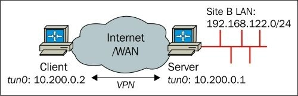
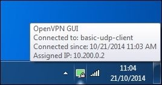
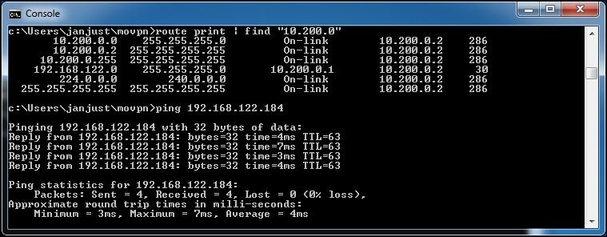

# Глава 4. Режим клиент/сервер с tun-устройствами

Наиболее часто используемая модель развертывания для OpenVPN - это один сервер с несколькими удаленными клиентами, способными маршрутизировать IP-трафик. Мы называем эту модель развертывания _режимом клиент/сервер с устройствами tun_.

В этой главе мы начнем с базовой настройки клиент/сервер. По мере продвижения мы добавим больше возможностей и некоторые продвинутые примеры того, как настроить OpenVPN в режиме клиент/сервер, приведены в конце этой главы. В следующей главе мы объясним, как интегрировать настройку клиент/сервер на основе tun в существующую настройку сети, включая такие темы, как общий доступ к файлам Windows и маршрутизация на основе политик.

В этой главе будут рассмотрены следующие темы:

* Настройка инфраструктуры публичных ключей
* Начальная настройка режима клиент/сервер
* Добавление дополнительной безопасности с помощью файлов конфигурации уровня производства
* Маршрутизация и маршрутизация на стороне сервера
* Специфичная для клиента конфигурация с использованием файлов CCD
* Клиентская маршрутизация
* Перенаправление шлюза по умолчанию
* Файл статуса OpenVPN
* Интерфейс управления OpenVPN
* Пересмотр ключа сеанса
* Использование IPv6
* Прокси ARP
* Раздача публичных IP-адресов

## Понимание режима клиент/сервер

Режим клиент/сервер был впервые представлен в OpenVPN 2.0. В этом режиме сервер представляет собой один процесс OpenVPN, к которому могут подключаться несколько клиентов. Каждому аутентифицированному и авторизованному клиенту назначается IP-адрес из пула адресов, которым управляет сервер OpenVPN. Клиенты не могут общаться напрямую друг с другом. Весь трафик проходит через сервер, что имеет как преимущества, так и недостатки.

Преимущества заключаются в следующем:

* Контроль. Администратор VPN-сервера может контролировать, какой трафик может передаваться между клиентами. По умолчанию трафик между клиентами не разрешен. Однако, используя либо опцию `client-to-client` OpenVPN, либо используя умный брандмауэр и правила маршрутизации, можно разрешить клиентам обмениваться данными друг с другом.
* Простота развертывания: гораздо проще настроить один сервер, к которому могут обращаться несколько разных клиентов, чем обеспечить связь между множеством клиентов, каждый из которых имеет собственную сеть и конфигурации брандмауэра.

Недостатки заключаются в следующем:

* Масштабируемость. Поскольку весь трафик передается от клиента к серверу (и наоборот), сервер может быстро стать узким местом в крупномасштабных установках VPN.
* Производительность: поскольку весь трафик между двумя клиентами (клиентами A и B) должен проходить от клиента A к серверу, а затем от сервера к клиенту B, производительность этого типа VPN всегда будет ниже по сравнению с прямым соединением клиент-клиент.

Наиболее распространенным сценарием развертывания для этого режима является корпоративный сервер OpenVPN, к которому подключаются различные клиенты VPN. Клиентами могут быть спутниковые службы, дорожные воины, люди, работающие дома, а также пользователи смартфонов и планшетов.

Эта модель развертывания покрывает 95 процентов типичных требований для VPN и предпочтительнее, чем более сложные установки с использованием расширенных функций, таких как мостовое соединение. Только если существуют конкретные требования для маршрутизации трафика, не относящегося к IP (например, устаревший трафик IPX), или если необходимо сформировать единый сетевой широковещательный домен, такой модели развертывания будет недостаточно.

## Настройка инфраструктуры открытых ключей

В режиме клиент/сервер OpenVPN настраивается с помощью открытых ключей инфраструктуры (PKI) с сертификатами X.509 и закрытых ключей. Прежде чем мы сможем настроить VPN клиент/сервер, нам нужно сначала настроить этот PKI. PKI состоит из CA, закрытых ключей и сертификатов (открытых ключей) как для клиента, так и для сервера. В [Главе 3](chapter-03.md), _PKI и сертификаты_, мы подробно обсудим, как настроить такую ​​PKI. Эта глава основана на сертификатах и ​​ключах, сгенерированных в той главе.

Сначала мы копируем сертификат и ключи в отдельное место. Как правило, рекомендуется хранить файлы PKI в отдельном месте, а если возможно даже на отдельном компьютере. Особое внимание следует уделить защите файла `ca.key`, поскольку вся безопасность вашей PKI зависит от этого файла. Если файл `ca.key` скомпрометирован каким-либо образом, вся PKI становится небезопасной и должна быть удалена. В следующих командах предполагается, что файлы PKI генерируются с использованием `ssladmin` и хранятся в каталоге `<PKI_DIR>`, где `<PKI_DIR>` представляет реальный каталог в системе. Выполните следующие команды, чтобы скопировать необходимые файлы PKI для сервера:

```
[root@server] # mkdir -p /etc/openvpn/movpn
[root@server] # chmod 700 /etc/openvpn/movpn
[root@server] # cd /etc/openvpn/movpn
[root@server] # PKI=<PKI_DIR>/ssladmin/active
[root@server] # cp -a $PKI/ca.crt movpn-ca.crt
[root@server] # cp -a $PKI/Mastering_OpenVPN_Server.crt server.crt
[root@server] # cp -a $PKI/Mastering_OpenVPN_Server.key server.key
```

Нам также необходимо создать файл параметров **Диффи-Хеллмана (DH)**, который необходим для ключей сеанса VPN. Ключи сеанса являются эфемерными или временными ключами и генерируются при первой настройке соединения между клиентом и сервером. Для обеспечения оптимальной безопасности эфемерные ключи регенерируются во время сеанса через фиксированные интервалы. Интервал ключей по умолчанию для OpenVPN составляет один час, но его можно настроить с помощью различных опций OpenVPN. Это будет объяснено позже в этой главе в разделе _Пересогласование ключей сеанса_.

Чтобы создать файл параметров DH, выполните следующие команды:

```
[root@server] # cd /etc/openvpn/movpn
[root@server] # openssl dhparam -out dh2048.pem 2048
Generating DH parameters, 2048 bit long safe prime, generator 2
This is going to take a long time
........+..........................................................
......
..................................................................+
......
```

В этом примере мы выбираем размер ключа DH в 2048 бит, что является рекомендуемым. Вы также можете использовать ключи DH большего размера, но это замедлит начальный процесс подключения для каждого клиента OpenVPN. Теперь мы готовы установить и запустить сервер OpenVPN.

## Начальная настройка режима клиент/сервер

Чтобы настроить базовый сервер OpenVPN, мы сначала создаем файл конфигурации сервера, используя следующие шаги:

1. Создайте следующий файл

```
proto udp
port 1194
dev tun
server 10.200.0.0 255.255.255.0
topology subnet
persist-key
persist-tun
keepalive 10 60

dh /etc/openvpn/movpn/dh2048.pem
ca /etc/openvpn/movpn/movpn-ca.crt
cert /etc/openvpn/movpn/server.crt
key /etc/openvpn/movpn/server.key

user nobody
group nobody # use ‘group nogroup’ on Debian/Ubuntu
verb 3
daemon
log-append /ar/log/openvpn.log
```

2.  Затем сохраните его как `movpn-04-01-server.conf`. Подробное объяснение каждой из строк конфигурации будет дано позже.
3. Запустите сервер OpenVPN:

```
[root@server]# openvpn --config movpn-04-01-server.conf
```

4.  Команда не выдаст никакого вывода в командной строке, так как весь вывод перенаправляется в файл журнала `/var/log/openvpn.log`. Проверьте этот файл для подробностей сообщения запуска OpenVPN:

```
OpenVPN 2.3.2 x86_64-redhat-linux-gnu [SSL (OpenSSL)] [LZO]
[EPOLL] [PKCS11] [eurephia] [MH] [IPv6] built on Sep 12 2013
Enter Private Key Password:
WARNING: this configuration may cache passwords in memory --
use the auth-nocache option to prevent this
TUN/TAP device tun0 opened
do_ifconfig, tt->ipv6=0, tt->did_ifconfig_ipv6_setup=0
/sbin/ip link set dev tun0 up mtu 1500
/sbin/ip addr add dev tun0 10.200.0.1/24 broadcast 10.200.0.255
GID set to nobody
UID set to nobody
UDPv4 link local (bound): [undef]
UDPv4 link remote: [undef]
Initialization Sequence Completed
```

5.  Обратите внимание, что обычно каждая запись в файле журнала начинается с отметки времени. Для ясности эта временная метка была удалена.
6. Затем создайте файл конфигурации клиента:

```
client
proto udp
remote openvpnserver.example.com
port 1194
dev tun
nobind
ca /etc/openvpn/movpn/movpn-ca.crt
cert /etc/openvpn/movpn/client1.crt
key /etc/openvpn/movpn/client1.key
```

Сохраните его как `movpn-04-01-client.conf`.

7.  Передайте файлы PKI клиенту, используя безопасный канал, например с помощью команды `scp`:

```
[root@client]# mkdir -p /etc/openvpn/movpn
[root@client]# chmod 700 /etc/openvpn/movpn
[root@client]# cd /etc/openvpn/movpn
[root@client]# PKI_HOST=openvpnserver.example.com
[root@client]# PKI=<PKI_DIR>/ssladmin/active
[root@client]# scp root@$PKI_HOST:$PKI/ca.crt movpn-ca.crt
[root@client]# scp root@$PKI_HOST:$PKI/client1.crt client1.crt
[root@client]# scp root@$PKI_HOST:$PKI/client1.key client1.key
```

8. Запустите клиент OpenVPN:

```
[root@client]# openvpn --config movpn-04-01-client.conf --
suppress-timestamps
OpenVPN 2.3.2 x86_64-redhat-linux-gnu [SSL (OpenSSL)] [LZO]
[EPOLL] [PKCS11] [eurephia] [MH] [IPv6] built on Sep 12 2013
WARNING: No server certificate verification method has been
enabled. See http://openvpn.net/howto.html#mitm for more info.
UDPv4 link local: [undef]
UDPv4 link remote: [AF_INET]openvpnserver:1194
[Mastering OpenVPN Server] Peer Connection Initiated with
[AF_INET]openvpnserver:1194
TUN/TAP device tun0 opened
do_ifconfig, tt->ipv6=0, tt->did_ifconfig_ipv6_setup=0
/sbin/ip link set dev tun0 up mtu 1500
/sbin/ip addr add dev tun0 10.200.0.2/24 broadcast 10.200.0.255
Initialization Sequence Completed
```

9.  Временные метки снова отсутствуют, но на этот раз они подавляются с помощью опции OpenVPN `suppress-timestamps`, как указано в командной строке.
10. После установления соединения проверьте следующее сообщение:

```
Initialization Sequence Completed
```

11.  Вы можете убедиться, что соединение работает правильно, проверив VPN-адрес сервера:


### Подробное объяснение файлов конфигурации

Так как это первый пример клиент/сервер, приведено подробное объяснение файлов конфигурации сервера и клиента. Файл конфигурации сервера содержит следующие строки:

* `proto udp`: хотя это протокол по умолчанию, разумно явно указать его в файле конфигурации чтобы избежать путаницы.
* `port 1194`: это локальный порт, который будет прослушивать OpenVPN. Значение по умолчанию - 1194, но можно использовать любой допустимый и доступный номер порта.
* `dev tun`: указывает имя устройства tun, которое будет использоваться для сервера. Не добавляя номер позади tun, мы инструктируем OpenVPN открыть новое устройство tun. Этому новому устройству будет присвоен первый доступный номер в ядре системы, начиная с 0 (tun0, tun1, tun2 и т.д.). Для серверов Windows желательно сохранить эту строку как есть. Если необходимо использовать определенное устройство Windows, тогда требуется опция `dev-node`.
* `server 10.200.0.0 255.255.255.0`: оператор сервера переводит OpenVPN в режим сервера. IP-подсеть и маска подсети определяют подсеть и маску, которые будут использоваться для VPN-сервера и клиентов. Серверу VPN назначается первый адрес, который в данном случае равен `10.200.0.1`. Первому клиенту будет назначен адрес `10.200.0.2` (потому что мы используем `topology subnet`). Оператор `server` для этой конфигурации внутренне расширяется следующим образом:

```
mode server
tls-server
push “topology subnet”

ifconfig 10.200.0.1 255.255.255.0
ifconfig-pool 10.200.0.2 10.200.0.254 255.255.255.0
push “route-gateway 10.200.0.1”
```

Это взято со страницы руководства OpenVPN по адресу https://community.openvpn.net/openvpn/wiki/Openvpn23ManPage. Если эти строки конфигурации используются вместо макро-сервера, используется та же конфигурация.

---

Заметка

Расширение включает `push “topology subnet”`, потому что мы также указали `topology subnet` в файле конфигурации. Без этой строки расширение не произошло бы.

---

* `topology subnet`: определяет топологию для VPN. Текущей топологией по умолчанию является net30, в которой серверу и каждому клиенту назначено отдельное миниатюрное пространство подсети `/30`. Более подробная информация об использовании _topology subnet против topology net30_ приведена в следующем разделе.
* `persist-tun` и `persist-key`: дает указание OpenVPN не открывать повторно устройство tun и не генерировать новый материал ключа при каждом перезапуске туннеля. Эти параметры особенно полезны в сочетании с `user nobody` так как обычно у `nobody` нет прав доступа для открытия нового интерфейса tun.
* `keepalive 10 60`: используется чтобы убедиться, что VPN-соединение остается работоспособным, даже если по туннелю нет трафика. Оператор `keepalive` - это макрос для команд `ping` и `ping-restart`. Оператор `keepalive 10 60` в конфигурации на стороне сервера расширяется до:

```
ping 10
ping-restart 120
push “ping 10”
push “ping-restart 60”
```

Предыдущий код означает:
  - Отправка пинг-сообщений каждому клиенту каждые 10 секунд.
  - Перезапуск соединения, если клиент не отвечает в течение 120 секунд _(2 * 60 = 120)_
  - Передача инструкций `ping 10` и `ping-restart 60` каждому клиенту

 * `dh <путь к файлу Диффи-Хеллмана>`: указывает путь к файлу DH, который требуется для сервера OpenVPN. Без этого файла сервер не может установить безопасное соединение TLS с клиентами. Рекомендуется использовать абсолютный путь для этого файла (а также к другим сертификатам и секретным ключам).
 * `ca <путь к файлу CA>`: указывает путь к файлу CA. Файл CA должен содержать сертификат CA (или даже набор сертификатов), который использовался для подписи **клиентских сертификатов**. Это необязательно должен быть тот же CA, который использовался для подписи сертификата сервера, хотя в нашей настройке PKI мы использовали тот же CA. Рекомендуется использовать абсолютный путь для этого файла (а также к другим сертификатам и секретным ключам).
 * `cert <путь к файлу сертификата X.509>`: указывает путь к файлу открытого сертификата X.509 сервера. Этот сертификат необходим серверу OpenVPN, даже если клиенты подключаются без использования сертификатов. Рекомендуется использовать абсолютный путь для этого файла (а также к другим сертификатам и секретным ключам).
 * `key <путь к файлу приватного ключа>`: указывает путь к файлу приватного ключа сервера. Этот файл приватного ключа необходим серверу OpenVPN, даже если клиенты подключаются без использования сертификатов или приватных ключей. Этот файл должен быть доступен для чтения только пользователю root (или администратору), так как любой пользователь, имеющий доступ на чтение приватных ключей, может расшифровать трафик OpenVPN. Обратите внимание, что OpenVPN прочтет этот файл перед удалением пользовательских привилегий. Рекомендуется использовать абсолютный путь для этого файла (а также пути к другим сертификатам и приватным ключам).
 * `user nobody` и `group nobody`: дает указание OpenVPN перейти на пользователя Unix `nobody` и группе `nobody` после установления соединения. Это дополнительно повышает безопасность, так как атака на туннель с меньшей вероятностью приведет к эксплойту root. Обратите внимание, что в Debian/Ubuntu используется группа `nogroup`.
 * `verb 3` : устанавливает уровень детализации в значение по умолчанию 3. Увеличьте это число, чтобы просмотреть более подробный вывод процесса OpenVPN. Если детальность установлена в 0, то вряд ли будет выдаваться какой-либо результат регистрации. Однако это не рекомендуется.
 * `daemon`: указывает OpenVPN _демонизировать_ себя, что означает, что процесс OpenVPN будет продолжать работать даже после закрытия окна терминала, в котором был запущен OpenVPN.
 * `log-append <путь к файлу журнала>`: указывает путь к файлу журнала сервера. Используя `log-append` вместо `log <путь к файлу>`, мы запрещаем OpenVPN обрезать файл журнала при каждом запуске. Для этого файла также рекомендуется использовать абсолютный путь.

Файл конфигурации клиента содержит:

* client: переводит OpenVPN в режим клиента. Он инструктирует OpenVPN подключаться к удаленному серверу и получать и обрабатывать параметры конфигурации с сервера после успешного установления соединения. Оператор `client` внутренне расширен следующим образом:

```
tls-client
pull
```

* `proto udp`: указывает протокол для использования. Хотя это протокол по умолчанию, разумно явно указать его в файле конфигурации для избежания путаницы.
* `remote openvpnserver.example.com`: здесь указывается имя VPN-сервера для подключения. Имя может быть либо **полным именем домена (FQDN)**, либо адресом IPv4. Далее в этой главе мы увидим, как подключиться к VPN-серверу на основе IPv6.
* `port 1194`: порт, который клиент OpenVPN будет использовать для подключения к серверу. Значение по умолчанию - 1194, но можно использовать любой допустимый и доступный номер порта.

---

**Заметка**

Существует несколько способов указать удаленный адрес и порт для VPN-сервера. Например, также можно использовать `remote openvpnserver.example.com:1194`.

---

* `dev tun`: указывает имя устройства tun, которое будет использоваться для сервера. Не добавляя номер позади tun, мы инструктируем OpenVPN открыть новое устройство. Этому новому устройству будет присвоен первый доступный номер в ядре системы, начиная с 0 (tun0, tun1, tun2 и т.д.). Для серверов Windows желательно сохранить эту строку как есть. Если необходимо использовать определенное устройство Windows, тогда требуется опция `dev-node`.
* `nobind`: указывает клиенту OpenVPN не связывать (и не прослушивать) порт, указанный с использованием `port`. Вместо этого клиент OpenVPN будет использовать порт в диапазоне анонимных портов, который обычно составляет 1024-65335.
* `ca <путь к файлу CA>`: указывает путь к файлу CA. Этот файл CA должен содержать сертификат CA (или даже набор сертификатов), который использовался для подписи сертификата сервера. Это не обязательно должен быть тот же CA, который использовался для подписи сертификата клиента, хотя мы использовали тот же CA в нашей настройке PKI. В Linux/Unix рекомендуется использовать абсолютный путь для этого файла (а также пути к другим сертификатам и секретным ключам).
* `cert <путь к файлу сертификата X.509>`: указывает путь к файлу публичного сертификата клиента X.509. Можно настроить OpenVPN для использования аутентификации по имени пользователя/паролю вместо сертификатов, но это считается менее безопасным. В Linux/Unix рекомендуется использовать абсолютный путь для этого файла (а также пути к другим сертификатам и приватным ключам).
*  `key <путь к файлу закрытого ключа>`: указывает путь к файлу приватного ключа клиента. Этот файл должен быть доступен для чтения только пользователю root (или администратору), так как OpenVPN прочитает этот файл перед удалением пользовательских привилегий. В Linux рекомендуется использовать абсолютный путь для этого файла (а также пути к другим сертификатам и секретным ключам).

Обратите внимание, что мы не указали `daemon` или `log-append` для конфигурации клиента, так как в большинстве случаев приложение-оболочка запускает процесс `openvpn`. Это приложение будет затем управлять журналом OpenVPN. Наиболее часто используемые приложения-оболочки:

| Операционная система | Wrapper applications |
| :------------------- | :------------------- |
| Windows              | OpenVPN-GUI.exe (часть пакета установки OpenVPN) |
| Mac OS X             | Tunnelblick или Viscosity |
| Linux                | NetworkManager (с плагином OpenVPN) |

## Topology subnets против topology net30

OpenVPN поддерживает несколько топологий в режиме настройки:

* net30 (по умолчанию, может измениться с v2.4)
* подсеть
* p2p

Начнем с последней, топология p2p почти никогда не использовалась и была первым методом назначения одного IP-адреса VPN-клиенту. Однако она работает только на производных от Linux и Unix и, следовательно, никогда не использовалась очень широко.

Топология net30 является текущим значением по умолчанию. В этом режиме OpenVPN устанавливает сетевой интерфейс «точка-точка» для каждого клиента (и для сервера) и назначает подсеть `/30` каждому. Это означает, что серверу и каждому клиенту назначен блок из четырех IP-адресов. В файле конфигурации сервера будет указано `server 10.200.0.0 255.255.255.0`. С топологией `net30` это заставляет OpenVPN назначать следующие IP-блоки:

* Сервер OpenVPN назначается с 10.200.0.0 по 10.200.0.3.
* Первый клиент назначен с 10.200.0.4 по 10.200.0.7.
* Второй клиент назначается с 10.200.0.8 по 10.200.0.11 и так далее.

  Каждая подсеть `/30` состоит из четырех адресов; для первого клиента эти адреса следующие:
  - 10.200.0.4: Это сетевой адрес подсети `/30`. Каждая подсеть должна иметь такой адрес, связанный с ней.
  - 10.200.0.5: Это адрес виртуальной конечной точки. Этот адрес необходим для функционирования OpenVPN, но на самом деле его нельзя использовать, и он даже не может быть проверен.
  - 10.200.0.6: это IP-адрес VPN клиента.
  - 10.200.0.7: Это широковещательный адрес подсети `/30`. Каждая подсеть должна иметь такой широковещательный адрес, связанный с ней.

Как видите, это не очень эффективный метод назначения IP-адресов - для каждого VPN-клиента назначается четыре IP-адреса. Для небольших настроек VPN этот метод работает нормально, но этот метод не масштабируется для сервера с более чем 100 подключенными клиентами.

Чтобы преодолеть эту проблему, был введен режим `topology subnet`. Он позволяет OpenVPN назначать один IP-адрес всем клиентам, что значительно упрощает управление крупномасштабным VPN. Существуют некоторые проблемы с маршрутизацией на стороне сервера (подробнее см. раздел «_Маршрутизация и маршрутизация на стороне сервера_» далее в этой главе), из-за которых этот режим топологии не стал стандартным, но ожидается, что начиная с версии 2.4 он может стать режимом топологии по умолчанию.

## Добавление повышенной безопасности

Начальный набор файлов конфигурации является хорошей отправной точкой для развертывания клиент/сервер. Однако для системы производственного уровня мы хотим добавить больше безопасности. Безопасность можно повысить двумя способами:

* Добавляя ключи `tls-auth`
* Путем проверки расширенных ключей использования атрибутов используемых сертификатов

### Использование ключей tls-auth

В режиме клиент/сервер OpenVPN будет пытаться установить канал управления TLS для каждого клиента, который пытается подключиться. Настройка канала управления TLS требует много ресурсов, что делает OpenVPN подверженным атакам типа «отказ в обслуживании»: злоумышленник может запустить множество неправильно настроенных клиентов, которые одновременно пытаются подключиться к серверу OpenVPN. Для каждого из них сервер OpenVPN будет пытаться установить соединение TLS, что фактически приведет к отказу в обслуживании для хорошо настроенных клиентов. Это особенно верно, когда OpenVPN работает с использованием `proto udp` (рекомендуется по умолчанию). UDP-трафик без установления соединения, что означает, что для каждого нового UDP-пакета, который получает сервер, он должен проверить, является ли он действительным пакетом OpenVPN.

Чтобы устранить эту возможную уязвимость, OpenVPN ввел дополнительный уровень аутентификации в канал управления TLS, используя опцию `tls-auth`. Эта проверка подлинности TLS должна выполняться с использованием предварительного общего ключа, поскольку сервер еще не знает, пытается ли подключиться действительный клиент. Предварительно установленные ключи, используемые здесь, являются теми же самыми ключами, используемыми в режиме точка-точка, как описано в [Главе 2](chapter-02.md), _Режим точка-точка_.

#### Генерация ключа tls-auth

Чтобы сгенерировать ключ `tls-auth`, мы используем ту же команду, которая описана в [Главе 2](chapter-02.md), _Режим точка-точка_:

```
[root@server]# openvpn --genkey --secret /etc/openvpn/movpn/ta.key
```

Точно так же как файл приватного ключа клиента, этот файл должен быть скопирован каждому клиенту, используя безопасный канал, или он должен быть включен в пакет конфигурации безопасного клиента:

```
[root@client]# cd /etc/openvpn/movpn
[root@client]# scp root@openvpnserver:/etc/openvpn/movpn/ta.key
```

#### Проверка атрибутов использования ключа сертификата

Когда сгенерированы сертификаты X.509, к сертификату могут быть добавлены специальные атрибуты **расширенного использования ключа (EKU)**. Это позволяет нам указать назначение сертификата, например, сертификат _только для сервера_ или сертификат _только для клиента_. Сертификаты, используемые на защищенных веб-сайтах, используют те же атрибуты EKU.

Сценарии `easy-rsa` и инструмент `ssladmin` устанавливают атрибуты EKU по умолчанию при создании сертификата сервера или несерверного (клиентского) сертификата. Чтобы проверить атрибуты EKU сертификата, используйте следующие команды:

```
$ openssl x509 -text -noout -in server.crt | \
     grep -C 1 “Key Usage”

            X509v3 Extended Key Usage:
                TLS Web Server Authentication
            X509v3 Key Usage:
                Digital Signature, Key Encipherment
```

Это говорит нам о том, что сертификат `server.crt` может использоваться только для аутентификации сервера.

В старых сертификатах эти атрибуты EKU могут быть не заданы, а вместо этого используется (не рекомендуется) атрибут `Netscape Cert Type`. Сценарии `easy-rsa` и инструмент `ssladmin` также устанавливают этот атрибут:

```
$ openssl x509 -text -noout -in server.crt | \
     grep -C 1 “Netscape Cert”

            Netscape Cert Type:
               SSL Server
```

Однако этот сертификат может быть установлен только для серверных сертификатов.

Безопасность OpenVPN может быть повышена путем проверки этих атрибутов. Для этого мы используем опцию `remote-cert-tls`.

Опция `remote-cert-tls client` предписывает серверу OpenVPN разрешать подключения только от VPN-клиентов, у которых есть сертификат с атрибутом EKU X.509, установленным как `TLS Web Client Authentication`.

Это не позволяет хакеру настроить мошеннический сервер OpenVPN с помощью клиентского сертификата.

Аналогично, для клиента опция `remote-cert-tls server` дает указание клиенту OpenVPN разрешать подключения только к VPN-серверу, у которого есть сертификат с атрибутом EKU X.509, установленным в значение `TLS Web Server Authentication`.

Это не позволяет злонамеренному клиенту настроить мошеннический сервер OpenVPN для привлечения подключений от других пользователей VPN.

Также можно проверить наличие атрибута `Netscape Cert Type`. Поскольку это атрибут сертификата сервера, клиент OpenVPN должен проверить этот атрибут при подключении. Для этого можно использовать опцию `ns-cert-type server`. Предпочтительно использовать параметр `remote-cert-tls`.

## Основные конфигурационные файлы производственного уровня

Мы расширим предыдущие файлы конфигурации клиента и сервера, чтобы использовать только что созданный ключ `tls-auth`. Мы сделаем это, добавив строку в файл конфигурации `movpn-04-01-server.conf`, а также второй параметр повышения безопасности:

```
proto udp
port 1194
dev tun
server 10.200.0.0 255.255.255.0
topology subnet
persist-key
persist-tun
keepalive 10 60

remote-cert-tls client
tls-auth /etc/openvpn/movpn/ta.key 0
dh /etc/openvpn/movpn/dh2048.pem
ca /etc/openvpn/movpn/movpn-ca.crt
cert /etc/openvpn/movpn/server.crt
key /etc/openvpn/movpn/server.key

user nobody
group nobody

verb 3
daemon
log-append /var/log/openvpn.log
```

---

**Заметка**

Обратите внимание, что порядок операторов в этом файле конфигурации является случайным. Строки `remote-cert-tls` и `tls-auth` могут быть добавлены в любом месте файла.

---

Этот файл конфигурации сервера является основным файлом конфигурации сервера, который мы будем использовать в этой и других главах. Сохраните его как `basic-udp-server.conf`, чтобы мы могли использовать его позже.

Мы добавляем две одинаковые строки в файл конфигурации клиента `movpn-04-01-client.conf`:

```
client

proto udp
remote openvpnserver.example.com
port 1194
dev tun
nobind

remote-cert-tls server
tls-auth /etc/openvpn/movpn/ta.key 1
ca /etc/openvpn/movpn/movpn-ca.crt
cert /etc/openvpn/movpn/client1.crt
key /etc/openvpn/movpn/client1.key
```

Сохраните его как `basic-udp-client.conf`.

Второй параметр опции `tls-auth` - это так называемое направление ключа. OpenVPN поддерживает использование ключа _направления_, то есть разные ключи используются для входящих и исходящих данных. Это еще больше повышает безопасность. Флаг `direction` должен быть установлен в `0` на одном конце и `1` на другом. В режиме клиент/сервер это означает, что сервер имеет параметр `0` для направления, а для всех клиентов параметр направления установлен в `1`.

Когда мы запускаем сервер OpenVPN, мы видим, что канал управления TLS теперь защищен статическим ключом:

```
[root@server]# openvpn --config basic-udp-server.conf --suppresstimestamps
OpenVPN 2.3.2 x86_64-redhat-linux-gnu [SSL (OpenSSL)] [LZO] [EPOLL]
[PKCS11] [eurephia] [MH] [IPv6] built on Sep 12 2013
Enter Private Key Password:
WARNING: this configuration may cache passwords in memory -- use
the auth-nocache option to prevent this
Control Channel Authentication: using ‘/etc/openvpn/movpn/ta.key’ as
a OpenVPN static key file
TUN/TAP device tun0 opened
do_ifconfig, tt->ipv6=0, tt->did_ifconfig_ipv6_setup=0
sbinip link set dev tun0 up mtu 1500
sbinip addr add dev tun0 10.200.0.1/24 broadcast 10.200.0.255
GID set to nobody
UID set to nobody
UDPv4 link local (bound): [undef]
UDPv4 link remote: [undef]
Initialization Sequence Completed
```

Аналогично, когда мы запускаем клиент OpenVPN, мы видим:

```
[root@client]# openvpn --config basic-udp-client.conf --suppresstimestamps
OpenVPN 2.3.2 x86_64-redhat-linux-gnu [SSL (OpenSSL)] [LZO] [EPOLL]
[PKCS11] [eurephia] [MH] [IPv6] built on Sep 12 2013
Control Channel Authentication: using ‘/etc/openvpn/movpn/ta.key’ as
a OpenVPN static key file
UDPv4 link local: [undef]
UDPv4 link remote: [AF_INET]openvpnserver:1194
[Mastering OpenVPN Server] Peer Connection Initiated with
[AF_INET]openvpnserver:1194
TUN/TAP device tun0 opened
do_ifconfig, tt->ipv6=0, tt->did_ifconfig_ipv6_setup=0
sbinip link set dev tun0 up mtu 1500
sbinip addr add dev tun0 10.200.0.2/24 broadcast 10.200.0.255
Initialization Sequence Completed
```

## Конфигурация на основе TCP

Протокол по умолчанию, используемый OpenVPN, является протоколом UDP. Создание версий на основе TCP на основе созданных ранее файлов конфигурации очень простое. В файлах конфигурации клиента и сервера измените строку `proto udp` на `proto tcp`. Весь файл конфигурации сервера на основе TCP указан здесь:

```
proto tcp
port 1194
dev tun
server 10.200.0.0 255.255.255.0
topology subnet
persist-key
persist-tun
keepalive 10 60

remote-cert-tls client
tls-auth /etc/openvpn/movpn/ta.key 0
dh /etc/openvpn/movpn/dh2048.pem
ca /etc/openvpn/movpn/movpn-ca.crt
cert /etc/openvpn/movpn/server.crt
key /etc/openvpn/movpn/server.key

user nobody
group nobody

verb 3
daemon
log-append /var/log/openvpn.log
```

Сохраните этот файл конфигурации как `basic-tcp-server.conf`.

Аналогично, для файла конфигурации клиента:

```
client
proto tcp
remote openvpnserver.example.com
port 1194
dev tun
nobind

remote-cert-tls server
tls-auth /etc/openvpn/movpn/ta.key 1
ca /etc/openvpn/movpn/movpn-ca.crt
cert /etc/openvpn/movpn/client1.crt
key /etc/openvpn/movpn/client1.key
```

Сохраните его как `basic-tcp-client.conf`.

## Конфигурационные файлы для Windows

Базовые файлы конфигурации для платформы Windows немного отличаются от файлов для платформ Linux/Unix или Mac OS. На платформе Windows используется оболочка `Openvpn-GUI.exe`, которая предполагает, что все файлы конфигурации хранятся в каталоге `C:\Program Files\OpenVPN\config` или его подкаталогах. Название каталога `Program Files` может отличаться для других языков. На всех языках переменная среды Windows `%PROGRAMFILES%` будет указывать на правильное расположение.

Таким образом, базовые файлы конфигурации UDP и TCP на самом деле немного короче. Создайте файл конфигурации клиента UDP:

```
client
proto udp
remote openvpnserver.example.com
port 1194
dev tun
nobind

remote-cert-tls server
tls-auth  ta.key 1
ca        movpn-ca.crt
cert      client1.crt
key       client1.key
```

Сохраните его как `basic-udp-client.ovpn`, чтобы мы могли использовать его позже в этой книге.

Аналогичным образом создайте конфигурацию клиента:

```
client
proto tcp
remote openvpnserver.example.com
port 1194
dev tun
nobind
remote-cert-tls server
tls-auth  ta.key 1
ca        movpn-ca.crt
cert      client1.crt
key       client1.key
```

Сохраните его как `basic-tcp-client.ovpn`.

## Маршрутизация и маршрутизация на стороне сервера

VPN действительно полезен только тогда, когда клиенты VPN имеют доступ к ресурсам на стороне сервера. Для доступа к этим ресурсам в большинстве случаев необходима маршрутизация. OpenVPN имеет много опций для автоматической настройки и удаления дополнительных маршрутов, когда клиент подключается или отключается.

Следует отметить, что большинство проблем с устранением неполадок OpenVPN связано с маршрутизацией. Настройка VPN-соединения - это одно, а правильная передача сетевого трафика - это другое. Это часто имеет мало общего с самим OpenVPN, но больше связано с таблицами маршрутизации и правилами брандмауэра на стороне клиента и сервера.

Наиболее распространенная схема доступа к ресурсам в серверной сети изображена здесь:



Локальная сеть на стороне сервера: **192.168.122.0/24**. Ресурсы, к которым VPN-клиенты должны получить доступ, находятся в этой подсети. Таким образом, сервер должен проинструктировать VPN-клиентов, что необходимо установить дополнительный маршрут. Это делается с помощью опции `push`, где конфигурация маршрута передается клиенту. Этого также можно достичь, добавив маршрут к самому файлу конфигурации клиента, но это плохо масштабируется. Это связано с тем, что для каждого нового сетевого маршрута на стороне сервера необходимо обновить все файлы конфигурации клиента.

Мы начнем с файла `basic-udp-server.conf` и добавим одну строку:

```
proto udp
port 1194
dev tun
server 10.200.0.0 255.255.255.0
topology subnet
persist-key
persist-tun
keepalive 10 60

remote-cert-tls client
tls-auth /etc/openvpn/movpn/ta.key 0
dh /etc/openvpn/movpn/dh2048.pem
ca /etc/openvpn/movpn/movpn-ca.crt
cert /etc/openvpn/movpn/server.crt
key /etc/openvpn/movpn/server.key

user nobody
group nobody

verb 3
daemon
log-append /var/log/openvpn.log

push “route 192.168.122.0 255.255.255.0”
```

Мы сохраняем его как `movpn-04-03-server.conf` и запускаем сервер OpenVPN, используя этот файл конфигурации. На этот раз мы используем Windows 7 64-разрядную версию Professional в качестве клиента OpenVPN, на котором установлена ​​версия OpenVPN 2.3.4-I004 для X86_64. Скопируйте следующие файлы на компьютер с Windows:
* basic-udp-client.ovpn
* movpn-ca.crt
* client1.crt
* client1.key

Возьмите и поместите их в `C:\Program Files\OpenVPN\config` (или `%PROGRAMFILES%\config`).

Запустите приложение OpenVPN GUI, выберите конфигурацию `basic-udp-client` и нажмите **Connect**:


Как только соединение успешно установлено - значок OpenVPN GUI становится зеленым и информация о соединении отображается при наведении курсора на значок:



Теперь мы можем проверить, работает ли VPN-соединение с сервером, открыв командную оболочку и выполнив команду `ping` на сервере:


После того, как мы проверим что сервера OpenVPN доступен, мы должны убедиться, что сервер OpenVPN пересылает IP-трафик и нам необходимо добавить дополнительный маршрут на шлюзе на стороне сервера, чтобы гарантировать правильное перенаправление VPN-трафика обратно через сервер VPN. Без этого маршрута машины в серверной сети теперь будут знать, откуда поступает трафик VPN с IP-адресами `10.200.0.0/24` и, скорее всего, неправильно маршрутизируют или отбрасывают пакеты:

```
[root@server]# sysctl -w net.ipv4.ip_forward=1
[router]# ip route add 10.200.0.0/24 via 192.168.122.1
```

Теперь мы проверим таблицу маршрутизации на стороне клиента и проверим можем ли мы подключиться к компьютеру в локальной сети на стороне сервера:



Первая часть выходных данных показывает, что несколько маршрутов для подсети VPN `10.200.0.0/24` были добавлены к таблицам маршрутизации, включая маршрут для `pushed` подсети `192.168.122.0/24`. Обратите внимание на последний столбец в выходных данных, который показывает метрику маршрута. Windows вычисляет метрику (в данном случае 286), но она может быть отменена с помощью правильных операторов маршрута. Маршрут, добавленный с помощью `push route 192.168.122.0 255.255.255.0`, имеет более низкую метрику, поскольку была указана метрика OpenVPN по умолчанию 30.
