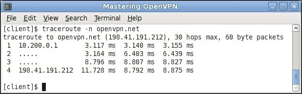
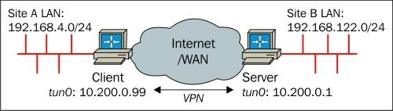
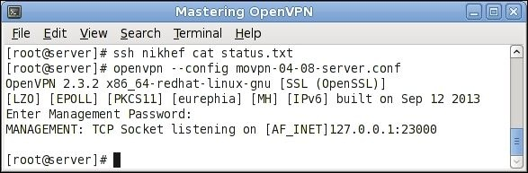
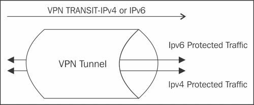
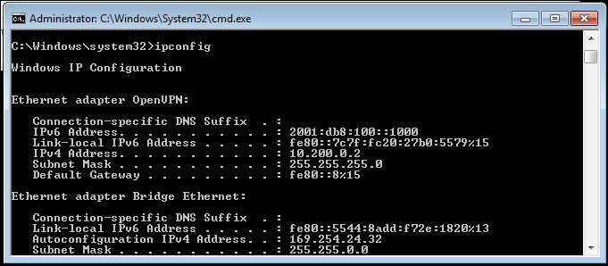
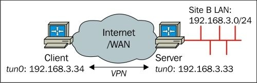

# Глава 4. Режим клиент-сервер с tun-устройствами

Наиболее часто используемая модель развертывания для OpenVPN - это один сервер с несколькими удаленными клиентами, способными маршрутизировать IP-трафик. Мы называем эту модель развертывания _режимом клиент-сервер с устройствами tun_.

В этой главе мы начнем с базовой настройки клиент-сервер. По мере продвижения мы добавим больше возможностей и в конце этой главы приведены некоторые продвинутые примеры того, как настроить OpenVPN в режиме клиент-сервер. В следующей главе мы объясним, как интегрировать настройку клиент-серверном режиме на основе tun в существующую настройку сети, включая такие темы, как общий доступ к файлам Windows и маршрутизация на основе политик.

В этой главе будут рассмотрены следующие темы:

* Настройка инфраструктуры публичных ключей
* Начальная настройка режима клиент-сервер
* Добавление усиленной безопасности с помощью файлов конфигурации продакшен-уровня
* Маршрутизация и маршрутизация на стороне сервера
* Специфичная для клиента конфигурация с использованием файлов CCD
* Клиентская маршрутизация
* Перенаправление шлюза по умолчанию
* Файл статуса OpenVPN
* Интерфейс управления OpenVPN
* Пересогласование ключей сеанса
* Использование IPv6
* Прокси ARP
* Раздача публичных IP-адресов

## Понимание режима клиент-сервер

Клиент-серверный режим был впервые представлен в OpenVPN 2.0. В этом режиме сервер представляет собой один процесс OpenVPN, к которому могут подключаться несколько клиентов. Каждому аутентифицированному и авторизованному клиенту назначается IP-адрес из пула адресов, управляемого сервером OpenVPN. Клиенты не могут общаться напрямую друг с другом. Весь трафик проходит через сервер - что имеет как преимущества, так и недостатки.

Преимущества заключаются в следующем:

* Контроль. Администратор VPN-сервера может контролировать, какой трафик может передаваться между клиентами. По умолчанию трафик между клиентами не разрешен. Однако, используя либо опцию `client-to-client` OpenVPN, либо используя умный брандмауэр и правила маршрутизации, можно разрешить клиентам обмениваться данными друг с другом.
* Простота развертывания: гораздо проще настроить один сервер, к которому могут обращаться несколько разных клиентов, чем обеспечить связь между множеством клиентов, каждый из которых имеет собственную сеть и конфигурации брандмауэра.

Недостатки заключаются в следующем:

* Масштабируемость. Поскольку весь трафик передается от клиента к серверу (и наоборот) - сервер может быстро стать узким местом в крупномасштабных установках VPN.
* Производительность: поскольку весь трафик между двумя клиентами (клиентами A и B) должен проходить от клиента A к серверу, а затем от сервера к клиенту B - производительность этого типа VPN всегда будет ниже по сравнению с прямым соединением клиент-клиент.

Наиболее распространенным сценарием развертывания для этого режима является корпоративный сервер OpenVPN, к которому подключаются различные VPN-клиенты. Клиентами могут быть филиалы, работники на выезде, работающие из дома, а также пользователи смартфонов и планшетов.

Эта модель развертывания покрывает 95 процентов типичных требований для VPN и предпочтительнее сложных установок с использованием расширенных функций, таких как мостовое соединение. Только если существуют конкретные требования для маршрутизации трафика, не относящегося к IP (например, устаревший трафик IPX), или если необходимо сформировать единый сетевой широковещательный домен, такой модели развертывания будет недостаточно.

## Настройка инфраструктуры открытых ключей

В режиме клиент-сервер OpenVPN настраивается с помощью инфраструктуры открытых ключей (PKI) с сертификатами X.509 и приватных ключей. Прежде чем мы сможем настроить клиент-сервер VPN - нам необходимо сначала настроить эту PKI. PKI состоит из CA, приватных ключей и сертификатов (публичных ключей) как для клиента, так и для сервера. В [Главе 3](chapter-03.md), _PKI и сертификаты_ мы подробно обсудили как настроить такую ​​PKI. Эта глава основана на сертификатах и ​​ключах, сгенерированных в той главе.

Сначала мы копируем сертификат и ключи в отдельное место. Как правило, рекомендуется хранить файлы PKI в отдельном месте, а если возможно даже на отдельном компьютере. Особое внимание следует уделить защите файла `ca.key`, поскольку вся безопасность вашей PKI зависит от этого файла. Если файл `ca.key` скомпрометирован каким-либо образом - вся PKI становится небезопасной и должна быть удалена. В следующих командах предполагается, что файлы PKI генерируются с использованием `ssladmin` и хранятся в каталоге `<PKI_DIR>`, где `<PKI_DIR>` представляет реальный каталог в системе. Выполните следующие команды, чтобы скопировать необходимые файлы PKI для сервера:

```
[root@server] # mkdir -p /etc/openvpn/movpn
[root@server] # chmod 700 /etc/openvpn/movpn
[root@server] # cd /etc/openvpn/movpn
[root@server] # PKI=<PKI_DIR>/ssladmin/active
[root@server] # cp -a $PKI/ca.crt movpn-ca.crt
[root@server] # cp -a $PKI/Mastering_OpenVPN_Server.crt server.crt
[root@server] # cp -a $PKI/Mastering_OpenVPN_Server.key server.key
```

Нам также необходимо создать файл параметров **Диффи-Хеллмана (DH)**, который необходим для ключей сеанса VPN. Ключи сеанса являются эфемерными или временными и генерируются при первой настройке соединения между клиентом и сервером. Для обеспечения оптимальной безопасности эфемерные ключи регенерируются во время сеанса через фиксированные интервалы. Интервал регенерации ключей по умолчанию для OpenVPN составляет один час, но его можно настроить с помощью различных опций OpenVPN. Это будет объяснено позже в этой главе в разделе _Пересогласование ключей сеанса_.

Чтобы создать файл параметров DH, выполните следующие команды:

```
[root@server] # cd /etc/openvpn/movpn
[root@server] # openssl dhparam -out dh2048.pem 2048
Generating DH parameters, 2048 bit long safe prime, generator 2
This is going to take a long time
........+..........................................................
......
..................................................................+
......
```

В этом примере мы выбираем размер ключа DH в 2048 бит, что является рекомендуемым. Вы также можете использовать ключи DH большего размера, но это замедлит начальный процесс подключения для каждого клиента OpenVPN. Теперь мы готовы установить и запустить сервер OpenVPN.

## Начальная настройка режима клиент-сервер

Чтобы настроить базовый сервер OpenVPN, мы сначала создаем файл конфигурации сервера, используя следующие шаги:

1. Создайте следующий файл

```
proto udp
port 1194
dev tun
server 10.200.0.0 255.255.255.0
topology subnet
persist-key
persist-tun
keepalive 10 60

dh    /etc/openvpn/movpn/dh2048.pem
ca    /etc/openvpn/movpn/movpn-ca.crt
cert  /etc/openvpn/movpn/server.crt
key   /etc/openvpn/movpn/server.key

user nobody
group nobody # используйте ‘group nogroup’ для Debian/Ubuntu
verb 3
daemon
log-append /var/log/openvpn.log
```

2.  Затем сохраните его как `movpn-04-01-server.conf`. Подробное объяснение каждой из строк конфигурации будет дано позже.
3. Запустите сервер OpenVPN:

```
[root@server]# openvpn --config movpn-04-01-server.conf
```

4.  Команда не даст никакого вывода в командной строке, так как весь вывод перенаправляется в файл журнала `/var/log/openvpn.log`. Проверьте этот файл для просмотра журнала запуска OpenVPN:

```
OpenVPN 2.3.2 x86_64-redhat-linux-gnu [SSL (OpenSSL)] [LZO]
[EPOLL] [PKCS11] [eurephia] [MH] [IPv6] built on Sep 12 2013
Enter Private Key Password:
WARNING: this configuration may cache passwords in memory --
use the auth-nocache option to prevent this
TUN/TAP device tun0 opened
do_ifconfig, tt->ipv6=0, tt->did_ifconfig_ipv6_setup=0
/sbin/ip link set dev tun0 up mtu 1500
/sbin/ip addr add dev tun0 10.200.0.1/24 broadcast 10.200.0.255
GID set to nobody
UID set to nobody
UDPv4 link local (bound): [undef]
UDPv4 link remote: [undef]
Initialization Sequence Completed
```

5.  Обратите внимание, что обычно каждая запись в файле журнала начинается с отметки времени. Для ясности эта временная метка была удалена.
6. Затем создайте файл конфигурации клиента:

```
client
proto udp
remote openvpnserver.example.com
port 1194
dev tun
nobind
ca    /etc/openvpn/movpn/movpn-ca.crt
cert  /etc/openvpn/movpn/client1.crt
key   /etc/openvpn/movpn/client1.key
```

Сохраните его как `movpn-04-01-client.conf`.

7.  Передайте файлы PKI клиенту, используя безопасный канал, например с помощью команды `scp`:

```
[root@client]# mkdir -p /etc/openvpn/movpn
[root@client]# chmod 700 /etc/openvpn/movpn
[root@client]# cd /etc/openvpn/movpn
[root@client]# PKI_HOST=openvpnserver.example.com
[root@client]# PKI=<PKI_DIR>/ssladmin/active
[root@client]# scp root@$PKI_HOST:$PKI/ca.crt movpn-ca.crt
[root@client]# scp root@$PKI_HOST:$PKI/client1.crt client1.crt
[root@client]# scp root@$PKI_HOST:$PKI/client1.key client1.key
```

8. Запустите клиент OpenVPN:

```
[root@client]# openvpn --config movpn-04-01-client.conf --
suppress-timestamps
OpenVPN 2.3.2 x86_64-redhat-linux-gnu [SSL (OpenSSL)] [LZO]
[EPOLL] [PKCS11] [eurephia] [MH] [IPv6] built on Sep 12 2013
WARNING: No server certificate verification method has been
enabled. See http://openvpn.net/howto.html#mitm for more info.
UDPv4 link local: [undef]
UDPv4 link remote: [AF_INET]openvpnserver:1194
[Mastering OpenVPN Server] Peer Connection Initiated with
[AF_INET]openvpnserver:1194
TUN/TAP device tun0 opened
do_ifconfig, tt->ipv6=0, tt->did_ifconfig_ipv6_setup=0
/sbin/ip link set dev tun0 up mtu 1500
/sbin/ip addr add dev tun0 10.200.0.2/24 broadcast 10.200.0.255
Initialization Sequence Completed
```

9.  Временные метки снова отсутствуют, но на этот раз они подавляются с помощью опции OpenVPN `suppress-timestamps`, как указано в командной строке.
10. После установления соединения проверьте следующее сообщение:

```
Initialization Sequence Completed
```

11.  Вы можете убедиться, что соединение работает правильно, проверив VPN-адрес сервера:


### Подробное объяснение файлов конфигурации

Так как это первый пример клиент-серверной конфигурации - приведено подробное объяснение файлов конфигурации как сервера, так и клиента. Файл конфигурации сервера содержит следующие строки:

* `proto udp`: хотя это протокол по умолчанию, разумно явно указать его в файле конфигурации во избежание путаницы.
* `port 1194`: локальный порт, который будет прослушивать OpenVPN. Значение по умолчанию - `1194`, но можно использовать любой допустимый и доступный номер порта.
* `dev tun`: указывает имя устройства tun, которое будет использоваться для сервера. Не добавляя номер позади tun, мы инструктируем OpenVPN открыть новое устройство tun. Этому новому устройству будет присвоен первый доступный номер в ядре системы, начиная с 0 (tun0, tun1, tun2 и т.д.). Для серверов Windows желательно сохранить эту строку как есть. Если необходимо использовать определенное устройство Windows, то потребуется опция `dev-node`.
* `server 10.200.0.0 255.255.255.0`: оператор `server` переводит OpenVPN в режим сервера. Адрес подсети и маска определяют подсеть и маску, которые будут использоваться для VPN-сервера и клиентов. Серверу VPN назначается первый адрес, который в данном случае равен `10.200.0.1`. Первому клиенту будет назначен адрес `10.200.0.2` (потому что мы используем `topology subnet`). Оператор `server` для этой конфигурации внутренне расширяется следующим образом:

```
mode server
tls-server
push “topology subnet”

ifconfig 10.200.0.1 255.255.255.0
ifconfig-pool 10.200.0.2 10.200.0.254 255.255.255.0
push “route-gateway 10.200.0.1”
```

Это взято со страницы руководства OpenVPN по адресу https://community.openvpn.net/openvpn/wiki/Openvpn23ManPage. Если эти строки конфигурации используются вместо макроса сервера - используется та же конфигурация.

---

**Заметка**

Расширение включает `push “topology subnet”`, потому что мы также указали `topology subnet` в файле конфигурации. Без этой строки расширение не произошло бы.

---

* `topology subnet`: определяет топологию для VPN. Текущей топологией по умолчанию является `net30`, в которой серверу и каждому клиенту назначено отдельное миниатюрное пространство подсети `/30`. Более подробная информация об использовании _topology subnet против topology net30_ приведена в следующем разделе.
* `persist-tun` и `persist-key`: дает указание OpenVPN не открывать повторно устройство tun и не генерировать новый ключ при каждом перезапуске туннеля. Эти параметры особенно полезны в сочетании с `user nobody` так как обычно у `nobody` нет прав доступа для открытия нового интерфейса tun.
* `keepalive 10 60`: используется для проверки работоспособности VPN-соединения, даже если по туннелю нет трафика. Оператор `keepalive` - это макрос для команд `ping` и `ping-restart`. Оператор `keepalive 10 60` в конфигурации на стороне сервера расширяется до:

```
ping 10
ping-restart 120
push “ping 10”
push “ping-restart 60”
```

Предыдущий код означает:
  - Отправка пинг-сообщений каждому клиенту каждые 10 секунд.
  - Перезапуск соединения, если клиент не отвечает в течение 120 секунд _(2 * 60 = 120)_
  - Передача инструкций `ping 10` и `ping-restart 60` каждому клиенту

 * `dh <путь к файлу Диффи-Хеллмана>`: указывает путь к файлу DH, который требуется для сервера OpenVPN. Без этого файла сервер не может установить безопасное соединение TLS с клиентами. Рекомендуется использовать абсолютный путь для этого файла (а также к другим сертификатам и секретным ключам).
 * `ca <путь к файлу CA>`: указывает путь к файлу CA. Файл CA должен содержать сертификат CA (или даже набор сертификатов), который использовался для подписи **клиентских сертификатов**. Это необязательно должен быть тот же CA, который использовался для подписи сертификата сервера, хотя в нашей настройке PKI мы использовали тот же CA. Рекомендуется использовать абсолютный путь для этого файла (а также к другим сертификатам и секретным ключам).
 * `cert <путь к файлу сертификата X.509>`: указывает путь к файлу публичного сертификата X.509 сервера. Этот сертификат необходим серверу OpenVPN даже если клиенты подключаются без использования сертификатов. Рекомендуется использовать абсолютный путь для этого файла (а также к другим сертификатам и секретным ключам).
 * `key <путь к файлу приватного ключа>`: указывает путь к файлу приватного ключа сервера. Этот файл приватного ключа необходим серверу OpenVPN, даже если клиенты подключаются без использования сертификатов или приватных ключей. Этот файл должен быть доступен для чтения только пользователю root (или администратору), так как любой пользователь, имеющий доступ на чтение приватных ключей, может расшифровать трафик OpenVPN. Обратите внимание - OpenVPN прочтет этот файл перед удалением пользовательских привилегий. Рекомендуется использовать абсолютный путь для этого файла (а также пути к другим сертификатам и приватным ключам).
 * `user nobody` и `group nobody`: дает указание OpenVPN перейти на пользователя Unix `nobody` и группу `nobody` после установления соединения. Это дополнительно повышает безопасность, так как атака на туннель с меньшей вероятностью приведет к эксплойту root. Обратите внимание, что в Debian/Ubuntu используется группа `nogroup`.
 * `verb 3` : устанавливает уровень детализации в значение по умолчанию 3. Увеличьте это число для просмотра более подробного вывода процесса OpenVPN. Если детализация установлена в 0, то вряд ли будет выдаваться какой-либо результат регистрации. Однако это не рекомендуется.
 * `daemon`: указывает OpenVPN _демонизировать_ себя - что означает продолжение работы процесса OpenVPN даже после закрытия окна терминала, в котором был запущен OpenVPN.
 * `log-append <путь к файлу журнала>`: указывает путь к файлу журнала сервера. Используя `log-append` вместо `log <путь к файлу>`, мы запрещаем OpenVPN обрезать файл журнала при каждом запуске. Для этого файла также рекомендуется использовать абсолютный путь.

Файл конфигурации клиента содержит:

* `client`: переводит OpenVPN в режим клиента. Он инструктирует OpenVPN подключаться к удаленному серверу и получать и обрабатывать параметры конфигурации с сервера после успешного установления соединения. Оператор `client` внутренне расширен следующим образом:

```
tls-client
pull
```

* `proto udp`: указывает протокол для использования. Хотя это протокол по умолчанию, разумно явно указать его в файле конфигурации для избежания путаницы.
* `remote openvpnserver.example.com`: здесь указывается имя VPN-сервера для подключения. Имя может быть либо **полным именем домена (FQDN)**, либо адресом IPv4. Далее в этой главе мы увидим, как подключиться к VPN-серверу на основе IPv6.
* `port 1194`: порт, который клиент OpenVPN будет использовать для подключения к серверу. Значение по умолчанию - `1194`, но можно использовать любой допустимый и доступный номер порта.

---

**Заметка**

Существует несколько способов указать удаленный адрес и порт для VPN-сервера. Например, также можно использовать `remote openvpnserver.example.com:1194`.

---

* `dev tun`: указывает имя устройства tun, которое будет использоваться для сервера. Не добавляя номер позади tun, мы инструктируем OpenVPN открыть новое устройство. Этому новому устройству будет присвоен первый доступный номер в ядре системы, начиная с 0 (tun0, tun1, tun2 и т.д.). Для Windows-клиентов желательно сохранить эту строку как есть. Если необходимо использовать определенное устройство Windows, то потребуется опция `dev-node`.
* `nobind`: указывает клиенту OpenVPN не связывать (и не прослушивать) порт, указанный с использованием `port`. Вместо этого клиент OpenVPN будет использовать порт в диапазоне анонимных портов, который обычно составляет 1024-65335.
* `ca <путь к файлу CA>`: указывает путь к файлу CA. Этот файл CA должен содержать сертификат CA (или даже набор сертификатов), который использовался для подписи сертификата сервера. Это необязательно должен быть тот же CA, который использовался для подписи сертификата клиента, хотя в нашей настройке PKI мы использовали тот же CA. В Linux/Unix рекомендуется использовать абсолютный путь для этого файла (а также пути к другим сертификатам и секретным ключам).
* `cert <путь к файлу сертификата X.509>`: указывает путь к файлу публичного сертификата клиента X.509. Можно настроить OpenVPN для использования аутентификации по имени пользователя/паролю вместо сертификатов, но это считается менее безопасным. В Linux/Unix рекомендуется использовать абсолютный путь для этого файла (а также пути к другим сертификатам и приватным ключам).
*  `key <путь к файлу закрытого ключа>`: указывает путь к файлу приватного ключа клиента. Этот файл должен быть доступен для чтения только пользователю root (или администратору), так как OpenVPN прочтёт этот файл перед удалением пользовательских привилегий. В Linux рекомендуется использовать абсолютный путь для этого файла (а также пути к другим сертификатам и секретным ключам).

Обратите внимание, что мы не указали `daemon` или `log-append` для конфигурации клиента, так как в большинстве случаев приложение-оболочка запускает процесс `openvpn`. Это приложение будет затем управлять журналом OpenVPN. Наиболее часто используемые приложения-оболочки:

| Операционная система | Приложения-оболочки  |
| :------------------- | :------------------- |
| Windows              | OpenVPN-GUI.exe (часть пакета установки OpenVPN) |
| Mac OS X             | Tunnelblick или Viscosity |
| Linux                | NetworkManager (с плагином OpenVPN) |

## Topology subnets против topology net30

OpenVPN поддерживает несколько топологий в режиме tun:

* net30 (по умолчанию, может измениться с v2.4)
* подсеть
* p2p

Начнем с последней, топология p2p почти никогда не использовалась и была первым методом назначения одного IP-адреса VPN-клиенту. Однако она работает только на производных от Linux и Unix и, следовательно, никогда не использовалась очень широко.

Топология net30 является текущим значением по умолчанию. В этом режиме OpenVPN устанавливает сетевой интерфейс «точка-точка» для каждого клиента (и для сервера) и назначает подсеть `/30` каждому. Это означает, что серверу и каждому клиенту назначен блок из четырех IP-адресов. В файле конфигурации сервера будет указано `server 10.200.0.0 255.255.255.0`. С топологией `net30` это заставляет OpenVPN назначать следующие IP-блоки:

* Серверу OpenVPN назначается с 10.200.0.0 по 10.200.0.3.
* Первому клиенту назначаются с 10.200.0.4 по 10.200.0.7.
* Второму клиенту назначаются с 10.200.0.8 по 10.200.0.11 и так далее.

  Каждая подсеть `/30` состоит из четырех адресов; для первого клиента эти адреса следующие:
  - 10.200.0.4: Это адрес подсети `/30`. Каждая подсеть должна иметь такой адрес, связанный с ней.
  - 10.200.0.5: Это адрес виртуальной конечной точки. Он необходим для функционирования OpenVPN, но на самом деле его нельзя использовать, и он даже не может быть проверен.
  - 10.200.0.6: IP-адрес VPN клиента.
  - 10.200.0.7: широковещательный адрес подсети `/30`. Каждая подсеть должна иметь такой широковещательный адрес, связанный с ней.

Как видите, это не очень эффективный метод назначения IP-адресов - для каждого VPN-клиента назначаются четыре IP-адреса. Для небольших настроек VPN этот метод работает нормально, но он не масштабируется для сервера с более чем 100 подключенными клиентами.

Чтобы преодолеть эту проблему - был введен режим `topology subnet`. Он позволяет OpenVPN назначать один IP-адрес всем клиентам, что значительно упрощает управление крупномасштабной VPN. Существуют некоторые проблемы с маршрутизацией на стороне сервера (подробнее см. раздел «_Маршрутизация и маршрутизация на стороне сервера_» далее в этой главе), из-за которых этот режим топологии не стал стандартным, но ожидается, что начиная с версии 2.4 он может стать режимом топологии по умолчанию.

## Добавление повышенной безопасности

Начальный набор файлов конфигурации является хорошей отправной точкой для развертывания клиент-серверной конфигурации. Однако для системы производственного уровня мы должны добавить больше безопасности. Безопасность можно повысить двумя способами:

* Добавляя ключи `tls-auth`
* Путем проверки расширенных атрибутов использования ключей используемых сертификатов

### Использование ключей tls-auth

В режиме клиент-сервер OpenVPN будет пытаться установить канал управления TLS для каждого подключаемого клиента. Настройка канала управления TLS требует много ресурсов, что делает OpenVPN подверженным атакам типа «отказ в обслуживании»: злоумышленник может запустить множество неправильно настроенных клиентов, которые будут одновременно пытаться подключиться к серверу OpenVPN. Для каждого из них сервер OpenVPN будет пытаться установить соединение TLS, что фактически приведет к отказу в обслуживании для правильно настроенных клиентов. Это особенно верно, когда OpenVPN работает с использованием `proto udp` (рекомендуется по умолчанию). UDP - это трафик без установления соединения, что означает проверку сервером действительности пакета OpenVPN для каждого нового UDP-пакета.

Для устранения этой возможной уязвимости OpenVPN ввел дополнительный уровень аутентификации в канал управления TLS, используя опцию `tls-auth`. Эта TLS-аутентификация должна выполняться с использованием предустановленного общего ключа, поскольку сервер еще не знает -  пытается подключиться действительный клиент или нет. Предустановленные ключи, используемые здесь, являются теми же самыми ключами, используемыми в режиме точка-точка, как описано в [Главе 2](chapter-02.md), _Режим точка-точка_.

### Генерация ключа tls-auth

Чтобы сгенерировать ключ `tls-auth` - мы используем ту же команду, что описана в [Главе 2](chapter-02.md), _Режим точка-точка_:

```
[root@server]# openvpn --genkey --secret /etc/openvpn/movpn/ta.key
```

Точно так же как файл приватного ключа клиента - этот файл должен быть скопирован каждому клиенту с использованием безопасного канала или должен быть включен в пакет конфигурации безопасного клиента:

```
[root@client]# cd /etc/openvpn/movpn
[root@client]# scp root@openvpnserver:/etc/openvpn/movpn/ta.key
```

### Проверка атрибутов использования ключа сертификата

Когда сертификаты X.509 сгенерированы - к сертификату могут быть добавлены специальные атрибуты **расширенного использования ключа (EKU)**. Это позволяет нам указать назначение сертификата, например, сертификат _только для сервера_ или сертификат _только для клиента_. Сертификаты, используемые на защищенных веб-сайтах, используют те же атрибуты EKU.

Скрипт `easy-rsa` и инструмент `ssladmin` устанавливают атрибуты EKU по умолчанию при создании сертификата сервера или несерверного (клиентского) сертификата. Чтобы проверить атрибуты EKU сертификата, используйте следующие команды:

```
$ openssl x509 -text -noout -in server.crt | \
     grep -C 1 “Key Usage”

            X509v3 Extended Key Usage:
                TLS Web Server Authentication
            X509v3 Key Usage:
                Digital Signature, Key Encipherment
```

Это говорит нам о том, что сертификат `server.crt` может использоваться только для аутентификации сервера.

В старых сертификатах эти атрибуты EKU могут быть не заданы, а вместо этого используется (не рекомендуется) атрибут `Netscape Cert Type`. Скрипт `easy-rsa` и инструмент `ssladmin` также устанавливают этот атрибут:

```
$ openssl x509 -text -noout -in server.crt | \
     grep -C 1 “Netscape Cert”

            Netscape Cert Type:
               SSL Server
```

Однако этот сертификат может быть установлен только для серверных сертификатов.

Безопасность OpenVPN может быть повышена путем проверки этих атрибутов. Для этого мы используем опцию `remote-cert-tls`.

Опция `remote-cert-tls client` предписывает серверу OpenVPN разрешать подключения только от VPN-клиентов, у которых есть сертификат с атрибутом EKU X.509, установленным как `TLS Web Client Authentication`.

Это не позволяет хакеру настроить мошеннический сервер OpenVPN с помощью клиентского сертификата.

Аналогично, для клиента опция `remote-cert-tls server` дает указание клиенту OpenVPN разрешать подключения только к VPN-серверу, у которого есть сертификат с атрибутом EKU X.509, установленным в значение `TLS Web Server Authentication`.

Это не позволяет злонамеренному клиенту настроить мошеннический сервер OpenVPN для привлечения подключений от других пользователей VPN.

Также можно проверить наличие атрибута `Netscape Cert Type`. Поскольку это атрибут сертификата сервера - клиент OpenVPN должен проверить этот атрибут при подключении. Для этого можно использовать опцию `ns-cert-type server`. Предпочтительно использовать параметр `remote-cert-tls`.

## Основные конфигурационные файлы производственного уровня

Мы расширим предыдущие файлы конфигурации клиента и сервера, чтобы использовать только что созданный ключ `tls-auth`. Мы сделаем это добавив строку в файл конфигурации `movpn-04-01-server.conf`, а также второй параметр повышения безопасности:

```
proto udp
port 1194
dev tun
server 10.200.0.0 255.255.255.0
topology subnet
persist-key
persist-tun
keepalive 10 60

remote-cert-tls client
tls-auth  /etc/openvpn/movpn/ta.key 0
dh        /etc/openvpn/movpn/dh2048.pem
ca        /etc/openvpn/movpn/movpn-ca.crt
cert      /etc/openvpn/movpn/server.crt
key       /etc/openvpn/movpn/server.key

user nobody
group nobody

verb 3
daemon
log-append /var/log/openvpn.log
```

---

**Заметка**

Обратите внимание, что порядок операторов в этом файле является случайным. Строки `remote-cert-tls` и `tls-auth` могут быть добавлены в любом месте файла.

---

Этот файл конфигурации является основным файлом конфигурации сервера, который мы будем использовать в этой и других главах. Сохраните его как `basic-udp-server.conf`, чтобы мы могли использовать его позже.

Мы добавляем две одинаковые строки в файл конфигурации клиента `movpn-04-01-client.conf`:

```
client

proto udp
remote openvpnserver.example.com
port 1194
dev tun
nobind

remote-cert-tls server
tls-auth  /etc/openvpn/movpn/ta.key 1
ca        /etc/openvpn/movpn/movpn-ca.crt
cert      /etc/openvpn/movpn/client1.crt
key       /etc/openvpn/movpn/client1.key
```

Сохраните его как `basic-udp-client.conf`.

Второй параметр опции `tls-auth` - это так называемое направление ключа. OpenVPN поддерживает использование _направления_ ключа, то есть разные ключи используются для входящих и исходящих данных. Это еще больше повышает безопасность. Флаг `direction` должен быть установлен в `0` на одном конце и `1` - на другом. В режиме клиент-сервер это означает, что сервер имеет параметр `0` для направления, а для всех клиентов параметр направления установлен в `1`.

Когда мы запускаем сервер OpenVPN, то видим что канал управления TLS теперь защищен статическим ключом:

```
[root@server]# openvpn --config basic-udp-server.conf --suppresstimestamps
OpenVPN 2.3.2 x86_64-redhat-linux-gnu [SSL (OpenSSL)] [LZO] [EPOLL]
[PKCS11] [eurephia] [MH] [IPv6] built on Sep 12 2013
Enter Private Key Password:
WARNING: this configuration may cache passwords in memory -- use
the auth-nocache option to prevent this
Control Channel Authentication: using ‘/etc/openvpn/movpn/ta.key’ as
a OpenVPN static key file
TUN/TAP device tun0 opened
do_ifconfig, tt->ipv6=0, tt->did_ifconfig_ipv6_setup=0
sbinip link set dev tun0 up mtu 1500
sbinip addr add dev tun0 10.200.0.1/24 broadcast 10.200.0.255
GID set to nobody
UID set to nobody
UDPv4 link local (bound): [undef]
UDPv4 link remote: [undef]
Initialization Sequence Completed
```

Аналогично, когда мы запускаем клиент OpenVPN - мы видим:

```
[root@client]# openvpn --config basic-udp-client.conf --suppresstimestamps
OpenVPN 2.3.2 x86_64-redhat-linux-gnu [SSL (OpenSSL)] [LZO] [EPOLL]
[PKCS11] [eurephia] [MH] [IPv6] built on Sep 12 2013
Control Channel Authentication: using ‘/etc/openvpn/movpn/ta.key’ as
a OpenVPN static key file
UDPv4 link local: [undef]
UDPv4 link remote: [AF_INET]openvpnserver:1194
[Mastering OpenVPN Server] Peer Connection Initiated with
[AF_INET]openvpnserver:1194
TUN/TAP device tun0 opened
do_ifconfig, tt->ipv6=0, tt->did_ifconfig_ipv6_setup=0
sbinip link set dev tun0 up mtu 1500
sbinip addr add dev tun0 10.200.0.2/24 broadcast 10.200.0.255
Initialization Sequence Completed
```

### Конфигурация на основе TCP

Протоколом, используемым в OpenVPN по умолчанию, является протокол UDP. Создание версий с TCP на основе созданных ранее файлов конфигурации очень простое. В файлах конфигурации клиента и сервера измените строку `proto udp` на `proto tcp`. Весь файл конфигурации сервера для TCP указан здесь:

```
proto tcp
port 1194
dev tun
server 10.200.0.0 255.255.255.0
topology subnet
persist-key
persist-tun
keepalive 10 60

remote-cert-tls client
tls-auth /etc/openvpn/movpn/ta.key 0
dh /etc/openvpn/movpn/dh2048.pem
ca /etc/openvpn/movpn/movpn-ca.crt
cert /etc/openvpn/movpn/server.crt
key /etc/openvpn/movpn/server.key

user nobody
group nobody

verb 3
daemon
log-append /var/log/openvpn.log
```

Сохраните этот файл конфигурации как `basic-tcp-server.conf`.

Аналогично, для файла конфигурации клиента:

```
client
proto tcp
remote openvpnserver.example.com
port 1194
dev tun
nobind

remote-cert-tls server
tls-auth /etc/openvpn/movpn/ta.key 1
ca /etc/openvpn/movpn/movpn-ca.crt
cert /etc/openvpn/movpn/client1.crt
key /etc/openvpn/movpn/client1.key
```

Сохраните его как `basic-tcp-client.conf`.

### Конфигурационные файлы для Windows

Базовые файлы конфигурации для платформы Windows немного отличаются от файлов для платформ Linux/Unix или Mac OS. На платформе Windows используется оболочка `Openvpn-GUI.exe`, которая предполагает, что все файлы конфигурации хранятся в каталоге `C:\Program Files\OpenVPN\config` или его подкаталогах. Название каталога `Program Files` может отличаться для других языков. На всех языках переменная среды Windows `%PROGRAMFILES%` будет указывать на правильное расположение.

Таким образом, базовые файлы конфигурации UDP и TCP на самом деле немного короче. Создайте файл конфигурации клиента UDP:

```
client
proto udp
remote openvpnserver.example.com
port 1194
dev tun
nobind

remote-cert-tls server
tls-auth  ta.key 1
ca        movpn-ca.crt
cert      client1.crt
key       client1.key
```

Сохраните его как `basic-udp-client.ovpn`, чтобы мы могли использовать его позже в этой книге.

Аналогичным образом создайте конфигурацию клиента:

```
client
proto tcp
remote openvpnserver.example.com
port 1194
dev tun
nobind
remote-cert-tls server
tls-auth  ta.key 1
ca        movpn-ca.crt
cert      client1.crt
key       client1.key
```

Сохраните его как `basic-tcp-client.ovpn`.

## Маршрутизация и маршрутизация на стороне сервера

VPN действительно полезен только тогда, когда клиенты VPN имеют доступ к ресурсам на стороне сервера. Для доступа к этим ресурсам в большинстве случаев необходима маршрутизация. OpenVPN имеет много опций для автоматической настройки и удаления дополнительных маршрутов, когда клиент подключается или отключается.

Следует отметить, что большинство проблем с устранением неполадок OpenVPN связано тинггл с маршрутизацией. Настройка VPN-соединения - это одно, а правильная передача сетевого трафика - это другое. Она имеет мало общего с самим OpenVPN и больше связана с таблицами маршрутизации и правилами брандмауэра на стороне клиента и сервера.

Наиболее распространенная схема доступа к ресурсам в серверной сети изображена здесь:


Локальная сеть на стороне сервера: **192.168.122.0/24**. Ресурсы, к которым VPN-клиенты должны получить доступ, находятся в этой подсети. Таким образом - сервер должен проинструктировать VPN-клиентов что необходимо установить дополнительный маршрут. Это делается с помощью опции `push`, которая передает маршрута клиенту. Этого также можно достичь добавив маршрут в сам файл конфигурации клиента, но это плохо масштабируется. Связано это с тем, что для каждого нового сетевого маршрута на стороне сервера необходимо обновить все файлы конфигурации клиента.

Мы начнем с файла `basic-udp-server.conf` и добавим одну строку:

```
proto udp
port 1194
dev tun
server 10.200.0.0 255.255.255.0
topology subnet
persist-key
persist-tun
keepalive 10 60

remote-cert-tls client
tls-auth /etc/openvpn/movpn/ta.key 0
dh /etc/openvpn/movpn/dh2048.pem
ca /etc/openvpn/movpn/movpn-ca.crt
cert /etc/openvpn/movpn/server.crt
key /etc/openvpn/movpn/server.key

user nobody
group nobody

verb 3
daemon
log-append /var/log/openvpn.log

push “route 192.168.122.0 255.255.255.0”
```

Мы сохраняем его как `movpn-04-03-server.conf` и запускаем сервер OpenVPN, используя этот файл конфигурации. На этот раз мы используем Windows 7 64-разрядную версию Professional в качестве клиента OpenVPN, на котором установлена ​​версия OpenVPN 2.3.4-I004 для X86_64. Скопируйте следующие файлы на компьютер с Windows:
* basic-udp-client.ovpn
* movpn-ca.crt
* client1.crt
* client1.key

Возьмите и поместите их в `C:\Program Files\OpenVPN\config` (или `%PROGRAMFILES%\OpenVPN\config`).

Запустите приложение OpenVPN GUI, выберите конфигурацию `basic-udp-client` и нажмите **Connect**:


Как только соединение будет успешно установлено - значок OpenVPN GUI становится зеленым и информация о соединении отображается при наведении курсора на значок:


Теперь мы можем проверить, работает ли VPN-соединение с сервером, открыв командную оболочку и выполнив команду `ping` на сервере:


После того, как мы проверили что сервер OpenVPN доступен - мы должны убедиться, что сервер OpenVPN пересылает IP-трафик и нам необходимо добавить дополнительный маршрут на шлюзе со стороны сервера чтобы гарантировать правильное перенаправление VPN-трафика обратно через сервер VPN. Без этого маршрута машины в серверной сети не будут знать откуда поступает трафик VPN с IP-адресами `10.200.0.0/24` и, скорее всего, будут неправильно маршрутизировать или отбрасывть пакеты:

```
[root@server]# sysctl -w net.ipv4.ip_forward=1
[router]# ip route add 10.200.0.0/24 via 192.168.122.1
```

Теперь мы проверим таблицу маршрутизации на стороне клиента и проверим - сможем ли мы подключиться к компьютеру в локальной сети на стороне сервера:


Первая часть выходных данных показывает что несколько маршрутов для подсети VPN `10.200.0.0/24` были добавлены к таблицам маршрутизации, включая маршрут для `pushed` подсети `192.168.122.0/24`. Обратите внимание на последний столбец выходных данных, который показывает метрику маршрута. Windows вычисляет метрику (в данном случае 286), но она может быть отменена с помощью правильных операторов маршрута. Маршрут, добавленный с помощью `push route 192.168.122.0 255.255.255.0`, имеет более низкую метрику, поскольку была указана метрика OpenVPN по умолчанию - 30.

### Специальные параметры для вариантов маршрута

Аналогично тому, что описано в [Главе 2](chapter-02.md), _Режим точка-точка_ инструкция `push route <network> <netmask> [vpn_gateway] [metric]` жизненно важна в этой настройке. Параметр `route` принимает до четырех параметров: два обязательных и два дополнительных. Третий параметр играет важную роль в этой настройке. Слово `vpn_gateway` - это специальное ключевое слово OpenVPN, которое указывает адрес удаленной конечной точки VPN. Обычно это ключевое слово указывать не нужно, кроме случаев необходимости указания метрики для этого маршрута.

Полный синтаксис для инструкции маршрута - `route <network> <netmask> [gateway] [metric]`, где `gateway` может быть явно задан как адрес IPv4 или могут использоваться специальные ключевые слова `vpn_gateway` или `net_gateway`. Если шлюз и метрика не указаны, используется `vpn_gateway`.

Ключевым словом `net_gateway` полезно указывать подсеть, которая _не_ должна быть маршрутизируема через VPN. Для `net_gateway` заменяется шлюз по умолчанию до установления VPN-соединения.

Метрика имеет метрику по умолчанию, которую можно установить с помощью `route-metric m`, которая затем применяется ко всем маршрутам. Если вы хотите отменить метрику для определенного маршрута (как мы это сделали в данном примере), то необходимо указать шлюз (в нашем случае `vpn_gateway`), за которым следует метрика для этого конкретного маршрута.

### Маскарадинг

Иногда невозможно добавить маршрут на стороне сервера для перенаправления всего VPN-трафика обратно на сервер OpenVPN. В этом случае быстрый и грязный подход заключается в использовании маскарадинга. В Linux вы можете использовать команду `iptables` для настройки маскарадинга на сервере:

```
[root@server]# iptables -t nat -I POSTROUTING -o eth0 \
                 -s 10.200.0.0/24 -j MASQUERADE
```

Этот оператор `iptables` указывает ядру Linux перезаписывать весь трафик, поступающий из подсети VPN `10.200.0.0/24` и покидающий интерфейс Ethernet `eth0`. У трафика, покидающего интерфейс `eth0` адрес источника переписывается так, что он выглядит будто исходит от самого сервера OpenVPN, а не от клиента OpenVPN. Это простой способ заставить маршрутизацию работать, но недостаток заключается в том, что больше невозможно различить, поступает ли данный трафик с самого сервера OpenVPN или с одного из подключенных клиентов.

## Перенаправление шлюза по умолчанию

Очень распространенное использование VPN - это маршрутизация всего трафика через безопасный туннель. Это позволяет безопасно получить доступ к сети или даже самому Интернету изнутри _враждебной_ среды (например, небезопасный wi-fi в интернет-кафе).

Перенаправление шлюза по умолчанию достигается добавлением строки `push “redirectgateway [def1 local bypass-dhcp bypass-dns]”` в файл конфигурации сервера.

Параметры для `redirect-gateway`, перечисленные ранее, являются необязательными, но они могут играть очень важную роль:

* Параметры не добавлены: В этом случае OpenVPN заменит существующий шлюз по умолчанию (0.0.0.0/0) на адрес самого сервера OpenVPN. Также добавляется дополнительный маршрут к самому серверу OpenVPN, чтобы сам трафик OpenVPN отправлялся непосредственно на сервер, а не через туннель. Недостаток заключается в том, что если соединение OpenVPN остановлено или прервано - исходный шлюз по умолчанию не восстанавливается. Это обычно приводит к полной потере сетевого подключения.
* Параметр `def1`: вместо замены существующего шлюза по умолчанию - OpenVPN добавит два новых маршрута, 0.0.0.0/1 и 128.0.0.0/1. Эти маршруты вместе также охватывают все пространство IPv4 и являются более конкретными (`/1`), чем обычный шлюз (`/0`). Маршрутизация всегда происходит по более конкретным маршрутам, и, таким образом, весь трафик передается через VPN. Преимущество этого трюка в том, что шлюз по умолчанию остается без изменений. Если VPN-соединение останавливается - исходный шлюз можно восстановить. Обратите внимание, что в этом случае OpenVPN добавит явный маршрут к самому серверу OpenVPN - поэтому сам зашифрованный трафик не будет отправляться через туннель.
* Параметр `bypass-dhcp`: иногда полезно добавить явный маршрут к локальному DHCP-серверу в локальной сети на стороне клиента. Это позволяет избежать туннелирования обновлений DHCP через VPN, хотя в большинстве сетевых настроек этого не происходит, поскольку как правило существует более конкретный маршрут к сегменту сети, на котором расположен локальный сервер DHCP.
* Параметр `bypass-dns`: иногда может потребоваться добавить явный маршрут к локальному DNS-серверу, так как в противном случае разрешение доменных имен нарушается. Это происходит только в том случае - если вы хотите использовать клиентский DNS-сервер, но хотите направить весь трафик через туннель.

Помимо опции `redirect-gateway`, мы также можем указать опцию `push “redirect-private [def1 local bypass-dhcp bypass-dns]”` в файл конфигурации сервера. Этот параметр принимает те же параметры, что и `redirect-gateway`, но не изменяет существующий шлюз по умолчанию. Это может быть полезно для передачи маршрутов к частным подсетям.

Сейчас мы добавляем `push "redirect-gateway def1"` в файл конфигурации `basic-udp-server.conf`. Сохраните его как `movpn-04-06-server.conf`, запустите сервер OpenVPN и повторно подключите клиента, используя файл конфигурации по умолчанию.

После того, как соединение установлено, мы проверяем что весь трафик теперь проходит через VPN, используя команду `traceroute` (используйте `tracert -d` в командной оболочке Windows):



Первый `hop` в выводе отслеживаемого маршрута `10.200.0.1`, что является IP-адресом сервера OpenVPN. Это доказывает, что трафик проходит через VPN по умолчанию.

Параметр конфигурации `redirect-gateway def1` указывает клиенту OpenVPN добавить три маршрута в клиентскую операционную систему:

```
10.198.1.1 via 192.168.4.254 dev eth0
0.0.0.0/1 via 10.200.0.1 dev tun0
128.0.0.0/1 via 10.200.0.1 dev tun0
```

Первый маршрут - это явный маршрут от клиента к серверу OpenVPN через интерфейс LAN. Этот маршрут необходим, так как в противном случае весь трафик для самого сервера OpenVPN будет проходить через туннель.

Два других маршрута - это хитрая уловка для отмены маршрута по умолчанию, чтобы весь трафик передавался через туннель, а не шлюз локальной сети по умолчанию.

Преимущество этого метода заключается в том, что исходный шлюз по умолчанию остается без изменений. Когда VPN отключена - первоначальный адрес шлюза автоматически вступает во владение снова. Если бы мы просто использовали `redirect-gateway` - есть вероятность что шлюз по умолчанию будет потерян при отключении VPN, что приведет к полной потере сетевого подключения.

Недостатком этого метода являются клиенты Windows 7 и выше: Windows иногда отказывается доверять адаптеру TAP-Win без маршрута по умолчанию и поэтому помечает его как _общедоступный_ адаптер. В Windows 7 невозможно использовать общедоступный адаптер для общего доступа к файлам или принтерам. В следующей главе мы рассмотрим как обойти эту особенность.

## Специфичная для клиента конфигурация - файлы CCD

В инсталляциях, где один сервер может обрабатывать подключения от множества клиентов, иногда необходимо установить параметры для каждого клиента, которые отменяют глобальные параметры или добавить дополнительные параметры для конкретного клиента. Опция `client-config-dir` очень полезна для этого. Она позволяет администратору VPN назначать конкретный IP-адрес клиенту для передачи определенных параметров, как например DNS-сервер - конкретному клиенту или для временного отключения клиента. Эта опция также необходима, если вы хотите маршрутизировать клиентскую подсеть на сторону сервера, как мы увидим позже.

`client-config-dir` или CCD-файл может содержать следующие параметры:

* `push`: полезно для отправки DNS и WINS-серверов, маршрутов и т.д.
* `push-reset`: полезно для отмены глобальных параметров `push`
* `iroute`: полезно для маршрутизации клиентских подсетей IPv4 на сервер
* `iroute-ipv6`: полезно для маршрутизации клиентских подсетей IPv6 на сервер
* `ifconfig-push`: полезно для назначения определенного адреса IPv4 клиенту
* `ifconfig-ipv6-push`: полезно для назначения конкретного адреса IPv6 клиенту
* `disable`: полезно для временного полного отключения клиента
* `config`: полезно для включения другого файла конфигурации CCD

Чтобы использовать файлы CCD мы добавляем в файл конфигурации `basic-udp-server.conf` строку:

```
client-config-dir /etc/openvpn/movpn/clients
```

Сохраните его как `movpn-04-04-server.conf`. Затем создайте каталог для CCD и создайте в нем файл CCD для клиента с сертификатом `client1.crt` :

```
[root@server]# mkdir -p /etc/openvpn/movpn/clients
[root@server]# echo “ifconfig-push 10.200.0.99 255.255.255.0” \
> /etc/openvpn/movpn/clients/client1
[root@server]# chmod 755 /etc/openvpn/movpn/clients
[root@server]# chmod 644 /etc/openvpn/movpn/clients/client1
```

Имя файла CCD основано на общем имени субъекта сертификата (часть «`/CN=`»), как указано в файле `client1.crt`:

```
$ openssl x509 -subject -noout -in client1.crt
subject= /C=ZA/ST=Enlightenment/O=Mastering
OpenVPN/CN=client1/emailAddress=root@example.org
```

В нашем случае имя файла должно быть просто `client1` без расширения, даже в Windows! Если в common name есть пробелы - их необходимо преобразовать в подчеркивания (\_). Если проводник Windows настроен на скрытие расширений для распространенных типов файлов - проще будет открыть окно командной оболочки (cmd.exe) и удалить расширение с помощью следующих команд:

```
C:\> cd %PROGRAMFILES%\openvpn\config\clients
C:\> rename client1.txt client1,145.102.134.201:35519
```

Затем мы запускаем сервер OpenVPN, используя этот файл конфигурации и подключаем VPN-клиента. Журнал подключений показывает что клиенту назначен адрес 10.200.0.99:

```
[root@client]# openvpn --config basic-udp-client.conf
OpenVPN 2.3.2 x86_64-redhat-linux-gnu [SSL (OpenSSL)] [LZO] [EPOLL]
[PKCS11] [eurephia] [MH] [IPv6] built on Sep 12 2013
Control Channel Authentication: using ‘/etc/openvpn/movpn/ta.key’ as
a OpenVPN static key file
UDPv4 link local: [undef]
UDPv4 link remote: [AF_INET]openvpnserver:1194
[Mastering OpenVPN Server] Peer Connection Initiated with
[AF_INET]openvpnserver:1194
TUN/TAP device tun0 opened
do_ifconfig, tt->ipv6=0, tt->did_ifconfig_ipv6_setup=0
/sbin/ip link set dev tun0 up mtu 1500
/sbin/ip addr add dev tun0 10.200.0.99/24 broadcast 10.200.0.255
Initialization Sequence Completed
```

При настройке детальности вывода по-умолчанию журнал на стороне сервера не показывает никаких сообщений о получении файла CCD. Увеличьте настройку детальности до 5 или выше, чтобы увидеть обрабатывается ли файл CCD:

```
<client-ip>:49299 [client1] Peer Connection Initiated with
[AF_INET]<client-ip>:49299
client1/<client-ip>:49299 OPTIONS IMPORT: reading client specific
options from: /etc/openvpn/movpn/clients/client1client1/<clientip>:49299 MULTI: Learn: 10.200.0.99 -> client1/<client-ip>:49299
```

### Как определить, правильно ли обрабатывается файл CCD

Поиск и исправление правильности обработки CCD-файла может быть немного сложнее. Следующие рекомендации помогут при отладке проблем с файлами CCD:

* Всегда указывайте полный путь для опции `client-config-dir`.
* Убедитесь что каталог доступен, а файл CCD доступен для чтения пользователю, который используется для запуска OpenVPN (в большинстве случаев `nobody` или `openvpn`; в конфигурациях, перечисленных в этой книге, используется `user nobody`).
* Убедитесь что для файла CCD используется правильное имя файла без каких-либо расширений.
* Если возможно - добавьте опцию `ccd-exclusive` в файл конфигурации сервера. Это дает указание OpenVPN разрешать клиентские подключения только при наличии определенного CCD-файла для этого клиента. Если при чтении CCD-файла для определенного клиента возникла проблема - клиенту также будет отказано в доступе. Таким образом, вы будете знать, что ваши настройки `client-config-dir` выполнены неправильно.

### CCD файлы и топология net30

Если вы используете (по умолчанию) настройку топологии (`topology net30`), то оператор `ifconfig-push` немного отличается. Поскольку каждому клиенту теперь назначена подсеть `/30`, в операторе `ifconfig-push` должна быть указана действительная подсеть VPN `/30`. Применяются следующие правила:

* Каждая подсеть `/30` должна начинаться с адреса, кратного 4 (4, 8, 12 и т.д.)
* Локальный IP-адрес VPN является третьим адресом в этой подсети.
* IP-адрес виртуальной удаленной конечной точки является вторым адресом.

Например, действительный IP-адрес для VPN-клиента - 10.200.0.50:

* Подсеть 10.200.0.48/32, где 48 кратно 4
* IP-адрес VPN-клиента будет 50 (_48 + 2 = 50_)
* Виртуальная удаленная конечная точка - 49 (_48 + 1 = 49_)

Файл CCD теперь должен содержать следующее:

```
ifconfig-push 10.200.0.50 10.200.0.49
```

## Клиентская маршрутизация

Иногда полезно разрешить серверу VPN (или другим клиентам VPN) доступ к ресурсам, подключенным к конкретному клиенту. Это известно как маршрутизация на стороне клиента. Для клиентской маршрутизации в OpenVPN для этого клиента требуется файл CCD, содержащий оператор `iroute`. Это также требует соответствующей инструкции `route` в файле конфигурации сервера OpenVPN.

Рассмотрим следующую схему сети:



Подсеть **192.168.4.0/24** должна быть доступна из локальной сети на стороне сервера, а подсеть **192.168.122.0/24** - на стороне сервера из локальной сети клиента. Это может быть достигнуто следующим образом:

1. Добавьте две строки в файл конфигурации `basic-udp-server.conf`:

```
client-config-dir /etc/openvpn/movpn/clients
route 192.168.4.0 255.255.255.0 10.200.0.1
```

Сохраните его как `movpn-04-05-server.conf`.

2. Создайте CCD-файл `client1` в каталоге `/etc/openvpn/movpn/clients` с содержимым:

```
ifconfig-push 10.200.0.99 255.255.255.0
iroute 192.168.4.0 255.255.255.0
push “route 192.168.122.0 255.255.255.0”
```

3. Убедитесь, что пересылка (форвардинг) IP-трафика включена и разрешена как на клиенте, так и на сервере:

```
[root@client]# sysctl -w net.ipv4.ip_forward=1
[root@server]# sysctl -w net.ipv4.ip_forward=1
```
4. Запустите сервер OpenVPN, используя файл конфигурации `movpn-04-05-server.conf`.

5. Подключите клиента, используя файл конфигурации по умолчанию `basic-udp-client.conf`.
6. После того как соединение установлено - мы проверяем, что обе подсети могут связаться друг с другом используя `ping`:

```
[root@client]# ping -c 3 192.168.122.184
PING 192.168.122.184 (192.168.122.184) 56(84) bytes of data.
64 bytes from 192.168.122.184: icmp_seq=1 ttl=63 time=3.29 ms
64 bytes from 192.168.122.184: icmp_seq=2 ttl=63 time=3.27 ms
64 bytes from 192.168.122.184: icmp_seq=3 ttl=63 time=3.31 ms
--- 192.168.122.184 ping statistics ---
3 packets transmitted, 3 received, 0% packet loss, time 2006ms
rtt min/avg/max/mdev = 3.277/3.296/3.317/0.016 ms

[root@server]# ping -c 3 192.168.4.10
PING 192.168.4.10 (192.168.4.10) 56(84) bytes of data.
64 bytes from 192.168.4.10: icmp_seq=1 ttl=63 time=6.31 ms
64 bytes from 192.168.4.10: icmp_seq=2 ttl=63 time=5.07 ms
64 bytes from 192.168.4.10: icmp_seq=3 ttl=63 time=5.14 ms
--- 192.168.4.10 ping statistics ---
3 packets transmitted, 3 received, 0% packet loss, time 2007ms
rtt min/avg/max/mdev = 5.073/5.512/6.317/0.575 ms
```

### Подробное объяснение конфигурации client-config-dir

На первом этапе мы добавляем две новые строки в файл конфигурации сервера. Эти строки устанавливают `client-config-dir` и инструктируют OpenVPN добавить системный сетевой маршрут для подсети 192.168.4.0/24. Здесь необходимо явно указать адрес шлюза `10.200.0.1` из-за незначительной ошибки в OpenVPN. Ожидается, что этот недостаток будет исправлен в версии 2.4, после чего вы можете снова указать `route 192.168.4.0 255.255.255.0`.

Содержимое файла CCD указывает OpenVPN, что при подключении клиента с Common Name `client1` IP-адрес для этого клиента должен быть установлен на `10.200.0.99`. Кроме того, OpenVPN должен установить внутренний маршрут (`iroute`) для этого клиента, чтобы сам OpenVPN знал, что подсеть 192.168.4.0/24 расположена за этим конкретным клиентом.

Наконец, оператор `push route` инструктирует OpenVPN "продвинуть" маршрут для этой конкретной подсети клиенту `client1`. Таким образом, сервер OpenVPN может прозрачно передавать разные маршруты разным клиентам.

---

**Заметка**

Выборочное продвижение маршрута к конкретному клиенту может быть удобным, но оно не защищено от несанкционированного доступа. Мошеннический VPN-клиент, который сам добавит маршрут к этой подсети, также будет иметь к ней доступ. Если вам нужно контролировать доступ к определенной подсети - используйте решение в виде межсетевого экрана, такое как `iptables` или `ipfw`.

---

В этом примере показана гибкость параметров конфигурации OpenVPN. Без необходимости изменять одну строку в файле конфигурации клиента можно назначить другой IP-адрес, направить конкретную подсеть клиенту или маршрутизировать конкретную подсеть из сети клиента в локальную сеть на стороне сервера.

### Трафик клиент-клиент

OpenVPN также позволяет вам настраивать трафик клиент-клиент. По умолчанию VPN-клиенты не могут напрямую общаться друг с другом. Это хорошая мера безопасности, но иногда необходимо разрешить межклиентский трафик. Помните, что весь VPN-трафик клиент-клиент будет проходить через сервер OpenVPN: от `client1` к VPN-серверу, а затем от VPN-сервера к `client2` и наоборот. Это может легко привести к проблемам с производительностью.

В режиме tun соединение клиент-клиент может быть достигнуто либо с помощью `iptables`, либо с помощью параметра OpenVPN `client-to-client`. Параметр `client-to-client` имеет преимущество в том, что он быстрее: трафик от одного клиента, поступающий на сервер, автоматически перенаправляется второму клиенту, не проходя через таблицы системной маршрутизации или правила брандмауэра. Недостатком является сложность контроля трафика и невозможность применения контроля доступа.

Без параметра `client-to-client` трафик от одного клиента принимается сервером OpenVPN, перенаправляется в таблицы системной маршрутизации и межсетевого экрана и (при правильной настройке) снова возвращается на сервер OpenVPN. Затем сервер пересылает его второму клиенту.

Если другим VPN-клиентам необходим доступ к подсети 192.168.4.0/24, как указано в предыдущем примере, то конфигурацию сервера необходимо расширить строкой:

```
push “192.168.4.0 255.255.255.0”
```

Это дает команду серверу OpenVPN продвинуть маршрут всем клиентам, которые находятся в подсети 192.168.4.0/24, доступной через VPN-туннель, за исключением клиента `client1`. Сам клиент `client1` исключен из-за соответствующей записи `iroute`.

## Файл состояния OpenVPN

OpenVPN предлагает несколько вариантов для мониторинга клиентов, подключенных к серверу. Наиболее часто используемый метод - использование файла состояния. Файл состояния OpenVPN постоянно обновляется процессом OpenVPN и содержит следующую информацию:

* Какие клиенты подключены
* С какого IP-адреса подключаются клиенты
* Количество байт, которые каждый клиент получил и передал
* Время подключения клиента
* Кроме того, таблица маршрутизации также показывает, какие сети маршрутизируются каждому клиенту.

Мы поправим конфиг сервера из Клиентской маршрутизации `movpn-04-05-server.conf`, добавив строку:

```
proto udp
port 1194
dev tun
server 10.200.0.0 255.255.255.0
topology subnet
persist-key
persist-tun
keepalive 10 60

remote-cert-tls client
tls-auth  /etc/openvpn/movpn/ta.key 0
dh        /etc/openvpn/movpn/dh2048.pem
ca        /etc/openvpn/movpn/movpn-ca.crt
cert      /etc/openvpn/movpn/server.crt
key       /etc/openvpn/movpn/server.key

user nobody
group nobody

verb 3
daemon
log-append /var/log/openvpn.log

client-config-dir /etc/openvpn/movpn/clients
route 192.168.4.0 255.255.255.0 10.200.0.1
status /var/run/openvpn.status 3
```

Сохраните его как `movpn-04-07-server.conf`. После установления VPN-соединения мы видим следующее содержимое в файле состояния после того, как VPN-клиент `client1` подключился и передал некоторые данные:

```
OpenVPN CLIENT LIST
Updated,Tue Oct 21 15:45:27 2014
Common Name,Real Address,Bytes Received,Bytes Sent,Connected Since
client1,<client-IP>:35519,7730,9342,Tue Oct 21 15:44:35 2014
ROUTING TABLE
Virtual Address,Common Name,Real Address,Last Ref
192.168.4.0/24,client1,145.102.134.201:35519,Tue Oct 21 15:44:35
2014
10.200.0.99,client1,145.102.134.201:35519,Tue Oct 21 15:44:35 2014
GLOBAL STATS
Max bcast/mcast queue length,0
END
```

`CLIENT LIST` показывает список подключенных клиентов, включая информацию о количестве полученных и отправленных байт.

`ROUTING TABLE` показывает список внутренних маршрутов OpenVPN:

* Подсеть 192.168.4.0/24 маршрутизируется на `client1` из-за оператора `iroute` в конфигурации сервера
* IP-адрес 10.200.0.99 - это адрес `client1`, который мы явно установили в файле CCD с именем `client1`

При отключении клиента файл состояния обновляется через 3 секунды и подключенный клиент больше не отображается в списке.

---

**Заметка**

Когда клиент отключается, вся информация удаляется из файла состояния и вся статистика сбрасывается. Если клиент снова подключается позже, количество принятых и отправленных байт начинается с нуля. Скрипт отключения клиента получает всю информацию о состоянии, когда клиент был отключен.

---

Вторым параметром опции `status` является интервал обновления (перезаписи) файла состояния. Значение по умолчанию составляет 60 секунд.

### Надежное отслеживание соединения в режиме UDP

Сервер OpenVPN при использовании протокола UDP не может сразу обнаружить что клиент отключен либо преднамеренно, либо из-за плохого интернет-соединения. Это позволяет клиенту, в случае плохого соединения, переподключиться к серверу VPN без потери всех туннельных соединений. Недостатком является то, что серверу OpenVPN требуется некоторое время для понимания что клиент отключился.

Клиент OpenVPN может явно уведомить сервер о своем отключении, используя опцию `explicit-exit-notify`. Эта опция принимает один параметр, который указывает количество явных сообщений, которые клиент пытается отправить на сервер. Значение по умолчанию равно `1`, что не работает если само основное сетевое соединение нестабильно. В этом случае рекомендуется увеличить данное значение до `3`.

При использовании `explicit-exit-notify` сервер OpenVPN сразу же получает сообщение об удаленном выходе при отключении клиента, что можно увидеть в файле журнала сервера:

```
SIGTERM[soft,remote-exit] received, client-instance exiting
```

Обратите внимание - эта проблема не возникает при использовании `proto tcp` поскольку сервер немедленно замечает разрыв TCP-соединения.

## Интерфейс управления OpenVPN

Одним из наиболее мощных, но менее известных вариантов OpenVPN является интерфейс управления. Интерфейс управления доступен как на стороне сервера, так и на стороне клиента. На стороне сервера его можно использовать для сбора статистики, мониторинга и контроля подключенных клиентов, а также для выполнения других задач, связанных с управлением. На стороне клиента его можно использовать для запроса паролей, ввода информации прокси-сервера для установления соединения с сервером VPN, взаимодействия с устройством PKCS#11 и сбора статистики на стороне клиента.

Плагин OpenVPN для Linux NetworkManager широко использует интерфейс управления для управления запуском и отключением VPN-подключения.

Чтобы использовать интерфейс управления - добавьте строку `management 127.0.0.1 23000 stdin` в файл конфигурации клиента или сервера. Эта опция указывает OpenVPN настроить интерфейс управления на IP-адресе 127.0.0.1, порту 23000 и использовать `stdin` для указания пароля управления.

Если мы добавим это в файл конфигурации `basic-udp-server.conf` и запустим сервер OpenVPN, то OpenVPN сначала запросит у нас пароль для управления:



Затем мы можем использовать telnet для входа в интерфейс управления (ввод пользователя выделен жирным шрифтом):

```
[root#server]# telnet 127.0.01 23000
Trying 127.0.0.1...
Connected to 127.0.0.1
Escape character is ‘^]’.
ENTER PASSWORD:[password]
SUCCESS: password is correct
>INFO:OpenVPN Management Interface Version 1 -- type ‘help’ for more info
help
Management Interface for OpenVPN 2.3.2 x86_64-redhat-linux-gnu [SSL (OpenSSL)]
[LZO] [EPOLL] [PKCS11] [eurephia] [MH] [IPv6] built on Sep 12 2013
Commands:
auth-retry t           : Auth failure retry mode
                         (none,interact,nointeract).
bytecount n            : Show bytes in/out, update every n secs
                         (0=off).
echo [on|off] [N|all]  : Like log, but only show messages in echo
                         buffer.
exit|quit              : Close management session.
forget-passwords       : Forget passwords entered so far.
help                   : Print this message.
[...]
END
```

Этот необработанный интерфейс telnet можно использовать для просмотра состояния сервера, он предоставляет тот же вывод, что и опция `status` из предыдущего примера. Его также можно использовать для немедленного завершения клиентского соединения с помощью следующей команды:

```
kill client1
```

Это приведет к отключению клиента `client1`. Обратите внимание, что в большинстве случаев клиент автоматически пытается восстановить соединение. Теперь введите `exit`, чтобы завершить сеанс telnet.

Интерфейс управления может использоваться для управления OpenVPN различными способами (адаптировано со страницы руководства OpenVPN https://community.openvpn.net/openvpn/wiki/Openvpn23ManPage):

* `management IP port [pw-file]:` включить TCP-сервер на IP:порт для обработки функций управления демоном. `pw-file`, если он указан, является файлом паролей (пароль на первой строке) или `stdin` для стандартного ввода. Предоставленный пароль будет устанавливать пароль, который клиенты TCP должны будут указать для доступа к функциям управления.

Интерфейс управления также может прослушивать сокет домена Unix, если он поддерживается. Для использования доменного сокета укажите путь к сокету Unix вместо IP и установите для порта значение `unix`.

Интерфейс управления обеспечивает специальный режим, в котором канал управления TCP может работать через сам туннель. Чтобы включить этот режим - установите `IP = “tunnel”`. Туннельный режим заставит интерфейс управления прослушивать TCP-соединение по локальному VPN-адресу интерфейса TUN/TAP.

* `management-client`: интерфейс управления будет подключаться как клиент домена TCP/Unix к IP:порт, заданный параметром `--management`, а не прослушивать как сервер TCP или в сокете домена Unix. Если клиентскому соединению не удается подключиться или он отключен - будет сгенерирован сигнал SIGTERM, что приведет к выходу OpenVPN.
* `management-query-passwords`: канал управления запросами для пароля с приватным ключом и `--auth-user-pass` имя_пользователя/пароль.
* `management-hold`: Запуск OpenVPN в режиме гибернации, пока клиент интерфейса управления не запустит его явно командой освобождения удержания.
* `management-signal`: отправляет сигнал SIGUSR1 в OpenVPN если сеанс управления отключен. Это полезно, когда вы хотите отключать сеанс OpenVPN при выходе пользователя из системы.
* `management-client-auth`: дает клиенту интерфейса управления ответственность за проверку подлинности клиентов после проверки их клиентского сертификата.

## Пересмотр ключа сеанса

Чтобы обеспечить безопасность каждого соединения OpenVPN, сервер периодически пересматривает секретный ключ для канала данных с каждым клиентом. Это контролируется с помощью трех опций:

* `reneg-sec N`: повторно согласовать ключ канала данных через N секунд (по умолчанию 3600)
* `reneg-bytes N`: пересмотреть ключ канала данных после N байт (по умолчанию = 0 = выкл.)
* `reneg-pkts N`: пересмотреть ключ канала данных после N пакетов (по умолчанию = 0 = выкл.)

Если VPN-клиент испытывает периодические таймауты при подключении к серверу - часто бывает полезно изменить эти параметры. Однако если вы установите параметр `reneg-sec` на очень короткий интервал - производительность VPN будет сильно ухудшена.

Параметры `reneg` могут быть указаны либо на стороне клиента, либо на стороне сервера, либо на обоих. Опция `reneg`, запускаемая наиболее часто с обеих сторон - сбрасывает счетчики на обоих концах. Если сервер указывает значение `reneg-sec 500`, а клиент - `reneg-sec 60`, то повторное согласование канала данных будет происходить примерно каждые 60 секунд.

Мы создадим пример, добавив три строки в файл конфигурации `basic-udp-server.conf`:

```
reneg-sec 10
reneg-pkts 1000
reneg-bytes 1000000
```

Сохраним конфигурацию как `movpn-04-09-server.conf` и восстановим VPN-соединение. Журнал сервера теперь будет содержать много строк с указанием `TLS: soft reset`:

```
Tue Oct 21 16:53:29 2014 <IP>:41679 [client1] Peer Connection
Initiated with [AF_INET]<IP>:41679
[...]
Tue Oct 21 16:53:39 2014 client1/<IP>:41679 TLS: soft reset sec=0
bytes=0/100000 pkts=0/100
[...]
Tue Oct 21 16:53:49 2014 client1/<IP>:41679 TLS: soft reset sec=0bytes=53/100000 pkts=1/100
[...]
Tue Oct 21 16:53:59 2014 client1/<IP>:41679 TLS: soft reset sec=0
bytes=105/100000 pkts=2/100
```

При установленном параметре `reneg-sec 10` из временных меток журнала сервера видно, что ключ канала данных пересматривается каждые 10 секунд.

На стороне клиента мы также можем увидеть влияние, которое это пересогласование ключей оказывает на производительность VPN-соединения. Запустив простую команду `ping` после установления соединения - мы можем увидеть когда происходит повторное согласование ключа, основываясь на пиках времени отклика `ping`:

```
[client]$ ping 10.200.0.1
PING 10.200.0.1 (10.200.0.1) 56(84) bytes of data.
64 bytes from 10.200.0.1: icmp_seq=1 ttl=64 time=3.29 ms
64 bytes from 10.200.0.1: icmp_seq=2 ttl=64 time=3.55 ms
64 bytes from 10.200.0.1: icmp_seq=3 ttl=64 time=61.6 ms
64 bytes from 10.200.0.1: icmp_seq=4 ttl=64 time=16.6 ms
64 bytes from 10.200.0.1: icmp_seq=5 ttl=64 time=3.23 ms
64 bytes from 10.200.0.1: icmp_seq=6 ttl=64 time=3.22 ms
64 bytes from 10.200.0.1: icmp_seq=7 ttl=64 time=3.74 ms
64 bytes from 10.200.0.1: icmp_seq=8 ttl=64 time=3.25 ms
64 bytes from 10.200.0.1: icmp_seq=9 ttl=64 time=3.21 ms
64 bytes from 10.200.0.1: icmp_seq=10 ttl=64 time=3.26 ms
64 bytes from 10.200.0.1: icmp_seq=11 ttl=64 time=3.26 ms
64 bytes from 10.200.0.1: icmp_seq=12 ttl=64 time=3.55 ms
64 bytes from 10.200.0.1: icmp_seq=13 ttl=64 time=3.27 ms
64 bytes from 10.200.0.1: icmp_seq=14 ttl=64 time=3.26 ms
64 bytes from 10.200.0.1: icmp_seq=15 ttl=64 time=3.31 ms
64 bytes from 10.200.0.1: icmp_seq=16 ttl=64 time=3.28 ms
64 bytes from 10.200.0.1: icmp_seq=17 ttl=64 time=77.1 ms
...
```

То же самое произойдет, когда _граница_ пакета или байта будет пересечена, и в этот момент ключи канала данных также будут пересмотрены.

### Замечание об устройствах PKCS#11

Повторное согласование ключей может быть особенно громоздким при использовании устройств PKCS#11. Некоторые устройства PKCS#11 накладывают большие расходы на повторное согласование ключа, в результате чего процесс пересогласования занимает несколько секунд. В течение этого времени VPN не отвечает.

Установка значения `reneg-sec` равным `0` эффективно отключит пересогласование ключа, но это делает саму VPN восприимчивой к атакам типа атаки посредника и атаки по времени, что делает дополнительную безопасность использования аппаратного защитного устройства бесполезной.

## Использование IPv6

В OpenVPN 2.3 появилась надежная поддержка IPv6 как внутри туннеля OpenVPN, так и для транзита самого туннеля. OpenVPN вплоть до 1.x имел элементарную поддержку IPv6, которая была в значительной степени переписана. В целом, внутри туннеля OpenVPN администратор может выбрать поддержку Ethernet (уровень 2), IPv4 (уровень 3) и IPv6 (уровень 3).

Диаграмма иллюстрирует логическую взаимосвязь пути транзитной сети и пути защищенной сети. Необходимо использовать только один метод транзита, а одна конфигурация OpenVPN может содержать записи `--remote` как для IPv4, так и IPv6. Весь трафик, независимо от типа, будет защищен в туннеле. Вполне приемлемо иметь туннель полностью IPv6, использующий IPv6 как для транзитного, так и для защищенного трафика. Благодаря дополнительной маршрутизации и проксированию даже возможно использовать OpenVPN для помощи в преобразовании IPv6 в IPv4.



### Защищенный трафик IPv6

Основываясь на примерах из предыдущего раздела, мы можем предоставлять клиентам адреса IPv6 и защищать этот трафик в туннеле. Для этого мы добавляем параметр `--server-ipv6` в конфигурацию нашего сервера. Это работает аналогично директиве `--server`, только для IPv6 вместо IPv4 и принимает в качестве аргументов сетевой адрес IPv6 и маску сети. Как и `--server`, `--server-ipv6` - это макрос для других параметров, которые могут передаваться индивидуально: `--ifconfig-ipv6`, `--ifconfig-ipv6-pool` , `--tun-ipv6` и `–push tun-ipv6`.

Как и в случае IPv4, маршруты IPv6 могут передаваться из конфигурации основного сервера или из файлов конфигурации для каждого клиента в каталоге `client-config`. В нашем примере мы просто отправим маршрут по умолчанию для всего трафика IPv6.

В настоящее время в OpenVPN для IPv6 нет опции перенаправления шлюза. Маршруты добавляются аналогично IPv6, с ключевым словом `route-ipv6` вместо `route`.

Теперь измените файл `movpn-04-01-server.conf` и добавьте инструкцию `--server-ipv6`:

```
proto udp
port 1194
dev tun
server 10.200.0.0 255.255.255.0
server-ipv6 2001:DB8:100::/64
push “route-ipv6 ::/0”
topology subnet
persist-key
persist-tun
keepalive 10 60

dh      /etc/openvpn/movpn/dh2048.pem
ca      /etc/openvpn/movpn/movpn-ca.crt
cert    /etc/openvpn/movpn/server.crt
key     /etc/openvpn/movpn/server.key

user nobody
group nobody

verb 3
daemon
log-append /var/log/openvpn.log
```

После сохранения файла требуется перезапуск процесса сервера OpenVPN. Если процесс начался правильно с новой опцией - вы должны увидеть что-то вроде этого в вашем файле журнала:

```
IFCONFIG POOL IPv6: (IPv4) size=252, size_ipv6=65536, netbits=64, base_ipv6=2001:db8:100::1000
```

На этом этапе клиенты могут передавать трафик, используя IPv6 внутри туннеля, и сервер передает маршрут по умолчанию клиентам для IPv6. Добавление параметров конфигурации сервера не требует дополнительных соответствующих параметров в конфигурациях клиента.

Подключенный клиент будет отображать адреса IPv4 и IPv6 на интерфейсе tunX.

Вот пример FreeBSD:

```
utun1: flags=8051<UP,POINTOPOINT,RUNNING,MULTICAST> mtu 1331
  inet 10.200.0.2 --> 10.200.0.2 netmask 0xffffff00
  inet6 fe80::5ab0:35ff:fef5:811f%utun1 prefixlen 64 scopeid 0x9
  inet6 2001:db8:100::1001 prefixlen 64
  nd6 options=1<PERFORMNUD>
```

Вот пример для Windows 7:



Обратите внимание, что всплывающее окно от наведения на значок на панели задач не отображает IPv6-адрес, но команда `ipconfig` в терминале показывает оба адреса.


### Использование IPv6 в качестве транзита

OpenVPN в настоящее время не имеет возможности прослушивать адреса IPv4 и IPv6 одновременно, но большинство современных ядер могут справиться с этим с помощью сопоставленных IPv6-адресов. Как это делается: берется IP-адрес версии 4, такой как 192.168.200.4 и отображается как IPv6-адрес ::ffff:192:168.:200:.:4. Кроме того, вместо `proto udp` будет `proto udp6` как на клиенте так и на сервере.

После изменения оператора `proto` из нашего примера конфигурации инициализируется `client2` и мы видим что адрес назначен. Оба адреса сервера OpenVPN v4 и v6 могут быть проверены, и мы можем подтвердить с помощью `tcpdump` что транзит через туннель осуществляется через IPv6.

Вот клиентский интерфейс tun:

```
ecrist@phillip:~-> ifconfig tun4
tun4: flags=8051<UP,POINTOPOINT,RUNNING,MULTICAST> metric 0 mtu
1500
  options=80000<LINKSTATE>
  inet6 fe80::216:3eff:fe09:5d4e%tun4 prefixlen 64 scopeid 0x9
  inet 10.200.0.2 --> 10.200.0.2 netmask 0xffffff00
  inet6 2001:db8:100::1000 prefixlen 64
  nd6 options=21<PERFORMNUD,AUTO_LINKLOCAL>
  Opened by PID 45391
```

Вот IPv4 внутри туннельного пинга:

```
ecrist@phillip:~-> ping -c 1 10.200.0.1
PING 10.200.0.1 (10.200.0.1): 56 data bytes
64 bytes from 10.200.0.1: icmp_seq=0 ttl=64 time=0.490 ms
--- 10.200.0.1 ping statistics ---
1 packets transmitted, 1 packets received, 0.0% packet loss
round-trip min/avg/max/stddev = 0.490/0.490/0.490/0.000 ms
```

Вот IPv6 внутри туннельного пинга:

```
ecrist@phillip:~-> ping6 -c 1 2001:db8:100::1
PING6(56=40+8+8 bytes) 2001:db8:100::1000 --> 2001:db8:100::1
16 bytes from 2001:db8:100::1, icmp_seq=0 hlim=64 time=0.591 ms
--- 2001:db8:100::1 ping6 statistics ---
1 packets transmitted, 1 packets received, 0.0% packet loss
round-trip min/avg/max/std-dev = 0.591/0.591/0.591/0.000 ms
```

Вот вывод `tcpdump` (обратите внимание на ключевое слово IPv6 в выводе):

```
root@terrance:/usr/local/etc/openvpn-> tcpdump -i xn0 host 2001:db8:5555:5555::1
tcpdump: verbose output suppressed, use -v or -vv for full protocol decode
listening on xn0, link-type EN10MB (Ethernet), capture size 65535 bytes
19:14:05.449553 IP6 phillip.1194 > terrance.1194: UDP, length 53
19:14:05.449692 IP6 terrance.1194 > phillip.1194: UDP, length 53
19:14:08.389222 IP6 phillip.1194 > terrance.1194: UDP, length 93
19:14:08.389394 IP6 terrance.1194 > phillip.1194: UDP, length 93
19:14:09.389858 IP6 phillip.1194 > terrance.1194: UDP, length 93
```

## Расширенные параметры конфигурации

Следующие несколько разделов иллюстрируют некоторые дополнительные параметры конфигурации. Предполагается, что вы полностью понимаете их влияние на сеть, прежде чем применять их в производственной среде. Эти варианты редко используются, но могут быть чрезвычайно полезны в нужных обстоятельствах.

### ARP-прокси

Часто желательно чтобы VPN-клиенты выглядели так, как будто они являются частью серверной сети. Это облегчает просмотр папок и обмен файлами и принтерами. Для достижения этой цели, в некоторых установках прибегают к Ethernet-бриджеванию (см [Главу 6](chapter-06.md), _Режим клиент/сервер с tap-устройствами_), который имеет свои недостатки. Производительность в мостовой конфигурации может быть значительно ниже по сравнению с немостовой установкой.

Когда сервер OpenVPN работает в Linux или Unix - существует альтернативное решение: большинство ядер Unix имеют возможности Proxy ARP, которую можно использовать для назначения клиента OpenVPN с IP-адресом в локальной сети на стороне сервера и отображения его так, как если бы он был частью этой локальной сети. Обратите внимание - это работает только для сетей IPv4, так как сети IPv6 не используют ARP.

Рассмотрим следующую схему сети:



В этом макете _стандартная_ подсеть VPN 10.200.0.0/24 не может быть использована, так как мы должны интегрировать VPN-клиентов в существующую подсеть, для данного примера - это **192.168.3.0/24**. Текущие машины в этой подсети находятся в диапазоне 192.168.3.10 - 192.168.3.24, таким образом, мы разместим VPN-адреса немного за пределами этого диапазона. Убедитесь, что адреса VPN не должны устанавливаться сервером DHCP в локальной сети на стороне сервера, поскольку мы хотим, чтобы OpenVPN назначал адреса для клиентов VPN.

В этом примере мы будем использовать возможность OpenVPN для запуска скриптов при подключении клиента или отключении. Скриптовые способности OpenVPN объясняются более подробно в [Главе 7](chapter-07.md), _Скрипты и плагины_.

1. Начнем со следующего файла конфигурации сервера:

```
proto udp
port 1194
dev tun
server 192.168.3.32 255.255.255.224
push “route 192.168.3.0 255.255.255.0”
topology subnet
persist-key
persist-tun
keepalive 10 60

tls-auth  /etc/openvpn/movpn/ta.key 0
dh        /etc/openvpn/movpn/dh2048.pem
ca        /etc/openvpn/movpn/movpn-ca.crt
cert      /etc/openvpn/movpn/server.crt
key       /etc/openvpn/movpn/server.key

verb 3
daemon
log-append /var/log/openvpn.log

script-security 2
client-connect /etc/openvpn/movpn/proxyarp-connect.sh
client-disconnect /etc/openvpn/movpn/proxyarp-disconnect.sh
```

Обратите внимание - мы добавили три оператора для установки уровня безопасности для скриптов и запуска собственного скрипта всякий раз, когда клиент подключается или отключается.

2. Сохраните этот файл конфигурации как `movpn-04-10-server.conf`.
3. Затем создайте скрипт `proxyarp-connect.sh`, который выполняется при каждом подключении VPN-клиента:

```
#!/bin/bash
/sbin/arp -i eth0 -Ds ${ifconfig_pool_remote_ip} eth0 pub
/sbin/ip route add ${ifconfig_pool_remote_ip}/32 dev tun0
```

4. Сохраните скрипт как `/etc/openvpn/movpn/proxyarp-connect.sh`. Расположение скрипта должно соответствовать абсолютному пути, указанному в файле `movpn-04-10-server.conf`.

5. Затем создайте скрипт `proxyarp-disconnect.sh`, который выполняется при отключении клиента:

```
#!/bin/bash
/sbin/arp -i eth0 -d ${ifconfig_pool_remote_ip}
/sbin/ip route del ${ifconfig_pool_remote_ip}/32 dev tun0
```

6. Сохраните скрипт как `/etc/openvpn/movpn/proxyarp-disconnect.sh`.

---

**Заметка**

Имена устройств `eth0` и `tun0` жестко заданы в скрипте. Это необходимо, поскольку устройство, на котором должен быть задан дополнительный ARP-адрес, неизвестно OpenVPN. Также возможно опубликовать дополнительный ARP-адрес на нескольких интерфейсах (`eth0`, `eth1`, `wlan0` и т.д.), дублируя строку `/sbin/arp` в обоих скриптах.

---

Сделайте оба скрипта исполняемыми и запустите сервер OpenVPN, используя следующие команды:

```
[root@server]# chmod a+x /etc/openvpn/movpn/proxyarp-connect.sh
[root@server]# openvpn --config movpn-04-10-server.conf
```

7. Как всегда, используйте файл конфигурации `basic-udp-client.conf` (или `basic-udp-client.ovpn`) для подключения к серверу. После успешного подключения VPN-клиента мы проверяем, что клиент _виден_ другими устройствами в локальной сети. Для этого мы использовали смартфон Android с установленным приложением Fing:


---

**Заметка**

На устройстве Android не было добавлено никаких дополнительных сетевых маршрутов. Клиент VPN действительно интегрирован в существующую подсеть.

---

8. Мы также можем проверить, что компьютер сервера OpenVPN теперь публикует дополнительный IP-адрес в своих таблицах ARP:

```
[server]$ /sbin/arp -an | grep PERM
? (192.168.3.34) at * PERM PUP on eth0
```

#### Как работает Proxy ARP?

Proxy ARP - это функция, поддерживаемая большинством ядер Unix и Linux. Чаще всего она используется для подключения клиентов удаленного доступа к локальной сети, а в настоящее время также ADSL и провайдерами кабельного Интернета.

Сервер OpenVPN заимствует IP-адрес из диапазона локальной сети при подключении клиента. Этот IP-адрес затем назначается клиенту OpenVPN. Сервер также создает специальную запись в ARP-таблицах системы, чтобы сообщить остальным локальным сетям филиала B, что сервер OpenVPN действует как прокси для IP 192.168.3.34. Это означает, что когда другая машина в локальной сети на стороне сервера хочет знать, где найти хост с IP 192.168.3.34 - сервер OpenVPN ответит своим собственным MAC-адресом интерфейса, на котором был присвоен адрес Proxy ARP.

Файл конфигурации сервера содержит несколько операторов, которые требуют пояснения:

```
server 192.168.3.32 255.255.255.224
push “route 192.168.3.0 255.255.255.0”
```

Предыдущие строки заставляют сервер OpenVPN назначить адрес 192.168.3.33 VPN серверу, с маской сети 255.255.255.224 (или _27_). _Первому VPN-клиенту назначается адрес 192.168.3.34/27_. Однако это означает, что сам VPN-клиент не может получить никаких IP-адресов за пределами этого диапазона. Оператор `push route` необходим чтобы сообщить клиенту OpenVPN, что вся подсеть 192.168.3.0/24 доступна через VPN.

Пока что файл конфигурации сервера содержит следующие строки:

```
user nobody
group nobody
```

В этом файле конфигурации они отсутствуют, так как скрипты `client-connect` и `client-disconnect` должны запускаться от пользователя `root`. Альтернативный подход состоит в том, чтобы настроить права `sudo` для выполнения пользователем `user nobody` команды `/sbin/arp` с привилегиями `root`.

Наконец, строки:

```
script-security 2
client-connect /etc/openvpn/movpn/proxyarp-connect.sh
client-disconnect /etc/openvpn/movpn/proxyarp-disconnect.sh
```

Настроим функции скриптов OpenVPN. Первая строка устанавливает уровень безопасности скриптов равным `2`: это означает что определенные переменные среды доступны для скрипта.

В строках `client-connect` и `client-disconnect` указан абсолютный путь к выполняемым скриптам.

### Назначение публичных IP-адресов клиентам

В качестве продолжения примера Proxy ARP теперь рассмотрим как возможно раздавать публичные адреса IPv4 клиентам OpenVPN. Давайте предположим, что нам доступен следующий набор (только для примера) публичных IPv4-адресов:

Наша общедоступная сеть IPv4 - 192.0.2.160/28, что дает нам 16 адресов. Эти адреса используются следующим образом:

| IP-адрес    | Использование |
| :---------- | :------------ |
| 192.0.2.160 | Сетевой адрес подсети. |
| 192.0.2.161 | Используется для IP-адреса VPN сервера |
| 192.0.2.162 | Недоступен |
| 192.0.2.163 | Недоступен |
| 192.0.2.164-192.0.2.170 | Доступны для клиентов VPN |
| 192.0.2.171 | Это адрес локальной сети самого сервера OpenVPN |
| 192.0.2.172 | Недоступен |
| 192.0.2.173 | Недоступен |
| 192.0.2.174 | Маршрутизатор для удаленной локальной сети |
| 192.0.2.175 | Сетевой широковещательный адрес |

Теперь мы должны настроить сервер OpenVPN, который может раздавать адреса со 192.0.2.164 по 192.0.2.170, а сам сервер OpenVPN по адресу 192.0.2.161:

1. Сначала мы создаем файл конфигурации сервера:

```
proto udp
port 1194
dev tun

mode server
tls-server
ifconfig 192.0.2.161 255.255.255.240
ifconfig-pool 192.0.2.164 192.0.2.170
push “route 192.0.2.171 255.255.255.255 net_gateway”
push “route-gateway 192.0.2.174”
push “redirect-gateway def1”
push “topology subnet”

topology subnet
persist-key
persist-tun
keepalive 10 60

tls-auth  /etc/openvpn/movpn/ta.key 0
dh        /etc/openvpn/movpn/dh2048.pem
ca        /etc/openvpn/movpn/movpn-ca.crt
cert      /etc/openvpn/movpn/server.crt
key       /etc/openvpn/movpn/server.key

verb 3
daemon
log-append /var/log/openvpn.log

script-security 2
client-connect /etc/openvpn/movpn/proxyarp-connect.sh
client-disconnect /etc/openvpn/movpn/proxyarp-disconnect.sh
```

2. Сохраните этот файл как `movpn-04-11-server.conf`. Мы будем повторно использовать сценарии `proxyarp-connect.sh` и `proxyarp-disconnect.sh` из предыдущего примера. Создайте `proxyarp-connect.sh`, который выполняется при каждом подключении VPN-клиента:

```
#!/bin/bash
/sbin/arp -i eth0 -Ds ${ifconfig_pool_remote_ip} eth0 pub
/sbin/ip route add ${ifconfig_pool_remote_ip}/32 dev tun0
```

3. Сохраните его как `/etc/openvpn/movpn/proxyarp-connect.sh`.
4. Затем создайте скрипт `proxyarp-disconnect.sh`, выполняемый при отключении клиента:

```
#!/bin/bash
/sbin/arp -i eth0 -d ${ifconfig_pool_remote_ip}
/sbin/ip route del ${ifconfig_pool_remote_ip}/32 dev tun0
```

5. Сохраните его как `/etc/openvpn/movpn/proxyarp-disconnect.sh`. Сделайте оба скрипта исполняемыми файлами и запустите сервер OpenVPN:

```
[root@server]# chmod a+x /etc/openvpn/movpn/proxyarp-connect.sh[
[root@server]# openvpn --config movpn-04-11-server.conf
```

6. Используйте файл базовой конфигурации для подключения клиента OpenVPN к серверу. Первому клиенту будет присвоен адрес 192.0.2.164.


Проверьте IP-адрес первого клиента, перейдя по адресу https://www.whatismyip.com.

Файл конфигурации сервера аналогичен файлу `movpn-04-10-server.conf` за исключением этого блока:

```
mode server
tls-server
ifconfig 192.0.2.161 255.255.255.240
ifconfig-pool 192.0.2.164 192.0.2.170
push “route 192.0.2.171 255.255.255.255 net_gateway”
push “route-gateway 192.0.2.174”
push “redirect-gateway def1”
push “topology subnet”
```

Ранее в этой главе объяснялось, что макрос `server 10.200.0.0 255.255.255.0` расширяется следующим образом:

```
mode server
tls-server
push “topology subnet”

ifconfig 10.200.0.1 255.255.255.0
ifconfig-pool 10.200.0.2 10.200.0.254 255.255.255.0
push “route-gateway 10.200.0.1”
```

Раздавая публичные IP-адреса, мы не можем позволить себе роскошь тратить IPv4-адреса. Опция `topology subnet`, представленная ​​в OpenVPN 2.1, окажется здесь весьма полезной.

Изучив наше общедоступное пространство IPv4, мы оставляем оператор `server` и включаем нашу собственную версию параметров `ifconfig` и `ifconfig-pool`:

* `ifconfig 192.0.2.161 255.255.255.240` : указывает IP-адрес VPN-сервера - 192.0.2.161/28.
* `ifconfig-pool 192.0.2.164 192.0.2.170` : указывает, что пул доступных IP-адресов для VPN-клиентов: от 192.0.2.164 до 192.0.2.170, всего семь адресов. Обратите внимание, что диапазон `ifconfig-pool` должен быть непрерывным.

---

**Заметка**

Если есть «дыры» в диапазоне, то часто бывает проще назначать IP-адреса с помощью скрипта, как мы узнаем в [Главе 7](chapter-07.md), _Скрипты и плагины_.

---

* `push "route 192.0.2.171 255.255.255.255 net_gateway"`: маршрут к адресу локальной сети VPN-сервера, который необходимо явно передать клиентам. Обычно этот маршрут автоматически добавляется клиентом OpenVPN для гарантии, что трафик, предназначенный для самого сервера OpenVPN, не будет снова введен в туннель, что вызовет цикл обработки пакетов. С нашей специальной настройкой `ifconfig` и `ifconfig-pool` желательно добавить явный маршрут к адресу локальной сети сервера OpenVPN.
* `push "route-gateway 192.0.2.174"`: `route-gateway` указывает адрес шлюза, используемый для направления всего туннельного трафика. Обычно `route-gateway` соответствует IP-адресу VPN-сервера. В таком случае это вызовет только скачок маршрута, поскольку VPN-сервер немедленно перенаправит его на реальный шлюз 192.0.2.174, который находится в той же подсети. Следовательно, мы указываем IP-адрес шлюза LAN.
* `push "redirect-gateway def1"` : чтобы клиент OpenVPN использовал публичный адрес для всего своего трафика - он должен направить весь трафик через VPN-туннель.
* `push "topology subnet"`: как правило, макрос сервера позаботится об этом `push` за нас, но так как мы здесь не используем макрос сервера, то должны явно передать эту опцию. Если этот параметр опущен, то сервер будет назначать адреса линейно (поскольку в его конфигурации есть строка `topology subnet`), однако клиенты VPN будут предполагать, что им назначены адреса топологии `net30`, что является текущим значением по умолчанию. Явный `push` обходит эту потенциально-неверную конфигурацию.

## Резюме

В этой главе были рассмотрены различные функции и опции режима клиент-сервер с устройствами tun. Мы установили базовый набор файлов конфигурации как для сервера OpenVPN, так и для клиента, как для протокола UDP, так и TCP в качестве транспорта, так и для клиентов Windows и Linux/Unix. Этот набор основных файлов конфигурации будет использоваться на протяжении всей книги.

Мы обсудили, как настроить сервер OpenVPN, обслуживающий как адреса IPv4, так и адреса IPv6. Мы рассмотрели маршрутизацию на стороне сервера и на стороне клиента, включая перенаправление всего трафика через VPN-туннель. Также мы увидели как раздавать публичные IPv4-адреса с помощью OpenVPN.

В следующей главе мы рассмотрим расширенные функции, предлагаемые OpenVPN. Кроме того, в [Главе 6](chapter-06.md), _Режим клиент/сервер с tap-устройствами_  будут объяснены несколько вариантов и примеры, что полезно также для режима tun.
