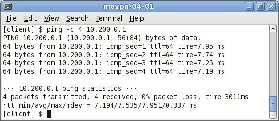

# Глава 4. Режим клиент/сервер с tun-устройствами

Наиболее часто используемая модель развертывания для OpenVPN - это один сервер с несколькими удаленными клиентами, способными маршрутизировать IP-трафик. Мы называем эту модель развертывания _режимом клиент/сервер с устройствами tun_.

В этой главе мы начнем с базовой настройки клиент/сервер. По мере продвижения мы добавим больше возможностей и некоторые продвинутые примеры того, как настроить OpenVPN в режиме клиент/сервер, приведены в конце этой главы. В следующей главе мы объясним, как интегрировать настройку клиент/сервер на основе tun в существующую настройку сети, включая такие темы, как общий доступ к файлам Windows и маршрутизация на основе политик.

В этой главе будут рассмотрены следующие темы:

* Настройка инфраструктуры публичных ключей
* Начальная настройка режима клиент/сервер
* Добавление дополнительной безопасности с помощью файлов конфигурации уровня производства
* Маршрутизация и маршрутизация на стороне сервера
* Специфичная для клиента конфигурация с использованием файлов CCD
* Клиентская маршрутизация
* Перенаправление шлюза по умолчанию
* Файл статуса OpenVPN
* Интерфейс управления OpenVPN
* Пересмотр ключа сеанса
* Использование IPv6
* Прокси ARP
* Раздача публичных IP-адресов

## Понимание режима клиент/сервер

Режим клиент/сервер был впервые представлен в OpenVPN 2.0. В этом режиме сервер представляет собой один процесс OpenVPN, к которому могут подключаться несколько клиентов. Каждому аутентифицированному и авторизованному клиенту назначается IP-адрес из пула адресов, которым управляет сервер OpenVPN. Клиенты не могут общаться напрямую друг с другом. Весь трафик проходит через сервер, что имеет как преимущества, так и недостатки.

Преимущества заключаются в следующем:

* Контроль. Администратор VPN-сервера может контролировать, какой трафик может передаваться между клиентами. По умолчанию трафик между клиентами не разрешен. Однако, используя либо опцию `client-to-client` OpenVPN, либо используя умный брандмауэр и правила маршрутизации, можно разрешить клиентам обмениваться данными друг с другом.
* Простота развертывания: гораздо проще настроить один сервер, к которому могут обращаться несколько разных клиентов, чем обеспечить связь между множеством клиентов, каждый из которых имеет собственную сеть и конфигурации брандмауэра.

Недостатки заключаются в следующем:

* Масштабируемость. Поскольку весь трафик передается от клиента к серверу (и наоборот), сервер может быстро стать узким местом в крупномасштабных установках VPN.
* Производительность: поскольку весь трафик между двумя клиентами (клиентами A и B) должен проходить от клиента A к серверу, а затем от сервера к клиенту B, производительность этого типа VPN всегда будет ниже по сравнению с прямым соединением клиент-клиент.

Наиболее распространенным сценарием развертывания для этого режима является корпоративный сервер OpenVPN, к которому подключаются различные клиенты VPN. Клиентами могут быть спутниковые службы, дорожные воины, люди, работающие дома, а также пользователи смартфонов и планшетов.

Эта модель развертывания покрывает 95 процентов типичных требований для VPN и предпочтительнее, чем более сложные установки с использованием расширенных функций, таких как мостовое соединение. Только если существуют конкретные требования для маршрутизации трафика, не относящегося к IP (например, устаревший трафик IPX), или если необходимо сформировать единый сетевой широковещательный домен, такой модели развертывания будет недостаточно.

## Настройка инфраструктуры открытых ключей

В режиме клиент/сервер OpenVPN настраивается с помощью открытых ключей инфраструктуры (PKI) с сертификатами X.509 и закрытых ключей. Прежде чем мы сможем настроить VPN клиент/сервер, нам нужно сначала настроить этот PKI. PKI состоит из CA, закрытых ключей и сертификатов (открытых ключей) как для клиента, так и для сервера. В [Главе 3](chapter-03.md), _PKI и сертификаты_, мы подробно обсудим, как настроить такую ​​PKI. Эта глава основана на сертификатах и ​​ключах, сгенерированных в той главе.

Сначала мы копируем сертификат и ключи в отдельное место. Как правило, рекомендуется хранить файлы PKI в отдельном месте, а если возможно даже на отдельном компьютере. Особое внимание следует уделить защите файла `ca.key`, поскольку вся безопасность вашей PKI зависит от этого файла. Если файл `ca.key` скомпрометирован каким-либо образом, вся PKI становится небезопасной и должна быть удалена. В следующих командах предполагается, что файлы PKI генерируются с использованием `ssladmin` и хранятся в каталоге `<PKI_DIR>`, где `<PKI_DIR>` представляет реальный каталог в системе. Выполните следующие команды, чтобы скопировать необходимые файлы PKI для сервера:

```
[root@server] # mkdir -p /etc/openvpn/movpn
[root@server] # chmod 700 /etc/openvpn/movpn
[root@server] # cd /etc/openvpn/movpn
[root@server] # PKI=<PKI_DIR>/ssladmin/active
[root@server] # cp -a $PKI/ca.crt movpn-ca.crt
[root@server] # cp -a $PKI/Mastering_OpenVPN_Server.crt server.crt
[root@server] # cp -a $PKI/Mastering_OpenVPN_Server.key server.key
```

Нам также необходимо создать файл параметров **Диффи-Хеллмана (DH)**, который необходим для ключей сеанса VPN. Ключи сеанса являются эфемерными или временными ключами и генерируются при первой настройке соединения между клиентом и сервером. Для обеспечения оптимальной безопасности эфемерные ключи регенерируются во время сеанса через фиксированные интервалы. Интервал ключей по умолчанию для OpenVPN составляет один час, но его можно настроить с помощью различных опций OpenVPN. Это будет объяснено позже в этой главе в разделе _Пересогласование ключей сеанса_.

Чтобы создать файл параметров DH, выполните следующие команды:

```
[root@server] # cd /etc/openvpn/movpn
[root@server] # openssl dhparam -out dh2048.pem 2048
Generating DH parameters, 2048 bit long safe prime, generator 2
This is going to take a long time
........+..........................................................
......
..................................................................+
......
```

В этом примере мы выбираем размер ключа DH в 2048 бит, что является рекомендуемым. Вы также можете использовать ключи DH большего размера, но это замедлит начальный процесс подключения для каждого клиента OpenVPN. Теперь мы готовы установить и запустить сервер OpenVPN.

## Начальная настройка режима клиент/сервер

Чтобы настроить базовый сервер OpenVPN, мы сначала создаем файл конфигурации сервера, используя следующие шаги:

1. Создайте следующий файл

```
proto udp
port 1194
dev tun
server 10.200.0.0 255.255.255.0
topology subnet
persist-key
persist-tun
keepalive 10 60

dh /etc/openvpn/movpn/dh2048.pem
ca /etc/openvpn/movpn/movpn-ca.crt
cert /etc/openvpn/movpn/server.crt
key /etc/openvpn/movpn/server.key

user nobody
group nobody # use ‘group nogroup’ on Debian/Ubuntu
verb 3
daemon
log-append /ar/log/openvpn.log
```

2.  Затем сохраните его как `movpn-04-01-server.conf`. Подробное объяснение каждой из строк конфигурации будет дано позже.
3. Запустите сервер OpenVPN:

```
[root@server]# openvpn --config movpn-04-01-server.conf
```

4.  Команда не выдаст никакого вывода в командной строке, так как весь вывод перенаправляется в файл журнала `/var/log/openvpn.log`. Проверьте этот файл для подробностей сообщения запуска OpenVPN:

```
OpenVPN 2.3.2 x86_64-redhat-linux-gnu [SSL (OpenSSL)] [LZO]
[EPOLL] [PKCS11] [eurephia] [MH] [IPv6] built on Sep 12 2013
Enter Private Key Password:
WARNING: this configuration may cache passwords in memory --
use the auth-nocache option to prevent this
TUN/TAP device tun0 opened
do_ifconfig, tt->ipv6=0, tt->did_ifconfig_ipv6_setup=0
/sbin/ip link set dev tun0 up mtu 1500
/sbin/ip addr add dev tun0 10.200.0.1/24 broadcast 10.200.0.255
GID set to nobody
UID set to nobody
UDPv4 link local (bound): [undef]
UDPv4 link remote: [undef]
Initialization Sequence Completed
```

5.  Обратите внимание, что обычно каждая запись в файле журнала начинается с отметки времени. Для ясности эта временная метка была удалена.
6. Затем создайте файл конфигурации клиента:

```
client
proto udp
remote openvpnserver.example.com
port 1194
dev tun
nobind
ca /etc/openvpn/movpn/movpn-ca.crt
cert /etc/openvpn/movpn/client1.crt
key /etc/openvpn/movpn/client1.key
```

Сохраните его как `movpn-04-01-client.conf`.

7.  Передайте файлы PKI клиенту, используя безопасный канал, например с помощью команды `scp`:

```
[root@client]# mkdir -p /etc/openvpn/movpn
[root@client]# chmod 700 /etc/openvpn/movpn
[root@client]# cd /etc/openvpn/movpn
[root@client]# PKI_HOST=openvpnserver.example.com
[root@client]# PKI=<PKI_DIR>/ssladmin/active
[root@client]# scp root@$PKI_HOST:$PKI/ca.crt movpn-ca.crt
[root@client]# scp root@$PKI_HOST:$PKI/client1.crt client1.crt
[root@client]# scp root@$PKI_HOST:$PKI/client1.key client1.key
```

8. Запустите клиент OpenVPN:

```
[root@client]# openvpn --config movpn-04-01-client.conf --
suppress-timestamps
OpenVPN 2.3.2 x86_64-redhat-linux-gnu [SSL (OpenSSL)] [LZO]
[EPOLL] [PKCS11] [eurephia] [MH] [IPv6] built on Sep 12 2013
WARNING: No server certificate verification method has been
enabled. See http://openvpn.net/howto.html#mitm for more info.
UDPv4 link local: [undef]
UDPv4 link remote: [AF_INET]openvpnserver:1194
[Mastering OpenVPN Server] Peer Connection Initiated with
[AF_INET]openvpnserver:1194
TUN/TAP device tun0 opened
do_ifconfig, tt->ipv6=0, tt->did_ifconfig_ipv6_setup=0
/sbin/ip link set dev tun0 up mtu 1500
/sbin/ip addr add dev tun0 10.200.0.2/24 broadcast 10.200.0.255
Initialization Sequence Completed
```

9.  Временные метки снова отсутствуют, но на этот раз они подавляются с помощью опции OpenVPN `suppress-timestamps`, как указано в командной строке.
10. После установления соединения проверьте следующее сообщение:

```
Initialization Sequence Completed
```

11.  Вы можете убедиться, что соединение работает правильно, проверив VPN-адрес сервера:


