# Глава 5. Расширенные сценарии развертывания в tun режиме

Базовая конфигурация VPN относительно проста, но интеграция этого VPN с остальной частью сети является гораздо более сложной задачей. В этой главе мы рассмотрим некоторые расширенные сценарии развертывания OpenVPN, выходящие за рамки базовой установки и настройки VPN. Некоторые из этих сценариев основаны на реальных вопросах пользователей из списков рассылки OpenVPN, форума и канала IRC. Мы рассмотрим следующие темы:

* Включение (Windows) общего доступа к файлам через VPN
* Интеграция с механизмами внутренней аутентификации, такими как PAM и LDAP
* Фильтрация VPN-трафика (межсетевой экран)
* Маршрутизация на основе политик для повышения безопасности
* Работа с общедоступными и частными сетевыми адаптерами в Windows 7
* Использование OpenVPN с прокси HTTP или SOCKS

Примеры, представленные в этой главе, основаны на примерах из предыдущей главы, [Глава 4](chapter-04.md), _Режим клиент/сервер с устройствами tun_. В частности, будут использоваться базовые файлы конфигурации производственного уровня и добавление дополнительных разделов безопасности.

## Включение общего доступа к файлам через VPN

Как указано в разделе _Маршрутизация и маршрутизация на стороне сервера_ в предыдущей главе, VPN действительно полезен только тогда, когда клиенты VPN имеют доступ к ресурсам на стороне сервера. Для доступа к этим серверным ресурсам необходима маршрутизация. Она обеспечивает правильный поток сетевого трафика между серверной локальной сетью и VPN.

Одним из наиболее распространенных вариантов использования VPN является предоставление удаленным работникам доступа к ресурсам в корпоративной сети. Файлы в корпоративной сети часто хранятся на файловом сервере под управлением Windows. Для просмотра общих файловых ресурсов Windows с использованием сетевых имен потребуется сервер WINS.

Опять же, очень распространенная схема доступа к ресурсам в сети на стороне сервера изображена здесь:

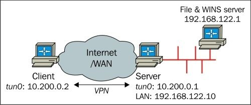

Локальная сеть на стороне сервера - **192.168.122.0/24**, и в этой подсети расположены ресурсы, к которым VPN-клиенты должны получить доступ.

Мы начнем с файла `basic-udp-server.conf` и добавим три строки:

```
proto udp
port 1194
dev tun
server 10.200.0.0 255.255.255.0
topology subnet
persist-key
persist-tunkeepalive 10 60

remote-cert-tls client
tls-auth  /etc/openvpn/movpn/ta.key 0
dh        /etc/openvpn/movpn/dh2048.pem
ca        /etc/openvpn/movpn/movpn-ca.crt
cert      /etc/openvpn/movpn/server.crt
key       /etc/openvpn/movpn/server.key

user nobody
group nobody # use 'group nogroup' on Debian/Ubuntu

verb 3
daemon
log-append /var/log/openvpn.log

push "route 192.168.122.0 255.255.255.0"
push "redirect-gateway"
push "dhcp-option WINS 192.168.122.1"
```

Сохраните этот файл как `movpn-05-01-server.conf`.

Первая дополнительная строка добавляет серверную локальную сеть в набор сетей, которые необходимо маршрутизировать через VPN. Вторая строка - перенаправляет весь сетевой трафик через VPN-туннель. Эта строка необходима, чтобы гарантировать, что адаптер OpenVPN TAP-Win считается _приватным_. Общий доступ к файлам возможен только при использовании _приватных_ сетевых адаптеров (в отличие от _общественных_ сетевых адаптеров). Последняя добавленная строка указывает серверу OpenVPN передать дополнительную опцию DHCP, содержащую IP-адрес сервера WINS, клиенту OpenVPN.

Мы запускаем сервер OpenVPN, используя этот файл конфигурации. Снова используем машину на базе Windows 7 Professional 64 бит в качестве клиента OpenVPN, на которой установлена версия OpenVPN 2.3.5-I001 X86_64.

Запустите приложение OpenVPN GUI, выберите конфигурацию **basic-udp-client** и нажмите **Connect**.

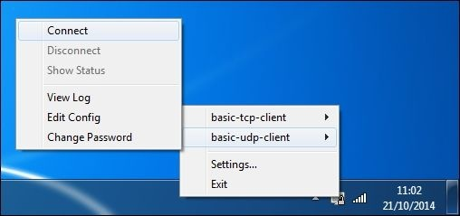

Как мы делали в примере из раздела _Маршрутизация и маршрутизация на стороне сервера_ в предыдущей главе, мы гарантируем, что сервер OpenVPN пересылает IP-трафик и что на шлюзе на стороне сервера добавлен дополнительный маршрут для правильной маршрутизации VPN-трафика обратно через VPN-сервер.

После того, как VPN-соединение было установлено мы переходим к **Центру управления сетями и общим доступом** чтобы убедиться что адаптер TAP (названный `vpn0` в следующем скриншоте) отмечен как необщественный и является частью либо **Домашней**, либо **Рабочей** сети/группы/места/. Если адаптер TAP помечен как **общественный** - это означает, что Windows не доверяет трафику, поступающему от этого адаптера и будет отказывать в обмене файлами через VPN. В разделе этой главы _Сетевые расположения Windows - общие и частные_, мы подробно рассмотрим эту тему.


Как мы видим, соединение OpenVPN `vpn0` является  частью **Рабочей** сети - это означает что общий доступ к файлам разрешен.

Первый способ проверить работает ли общий доступ к файлам - это перейти к файловому серверу, используя его IP-адрес. Вы можете сделать это, открыв окно командной строки и введя следующие строки:

```
C:> start \\192.168.122.1
```

На этом этапе появится диалоговое окно аутентификации.

Введите свои учетные данные для файлового сервера. Теперь откроется окно проводника Windows с содержимым удаленных общих ресурсов.

### Использование имен NetBIOS

Вместо просмотра файловых ресурсов по их IP-адресам гораздо удобнее использовать сетевое имя файлового сервера Windows. Для этого клиенту Windows необходим адрес сервера WINS. Строка `push "dhcp-option WINS 192.168.122.1"` передает этот адрес WINS для всех подключающихся клиентов OpenVPN. После того, как VPN-соединение установлено, мы можем проверить - используется ли соответствующий WINS-сервер, введя команду `ipconfig /all` в командной оболочке.

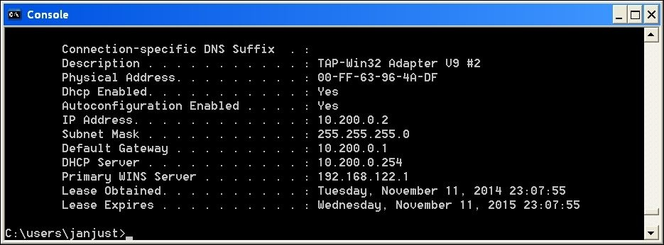

IP-адрес сервера WINS указан в строке **Primary WINS Server (Основной сервер WINS)**, которая указывает, что Windows будет использовать этот сервер для разрешения имен WINS.

Теперь, когда **Центр управления сетями и общим доступом** открыт - файловый сервер будет отображаться с именем NetBIOS (`FILESERVER`):

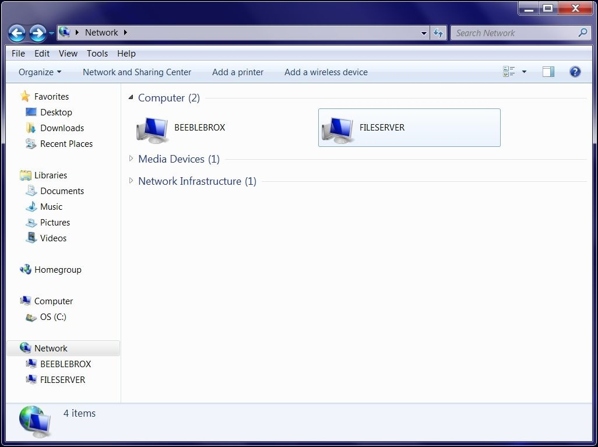

Когда мы нажмем на этот значок, то увидим доступные общие ресурсы на файловом сервере:

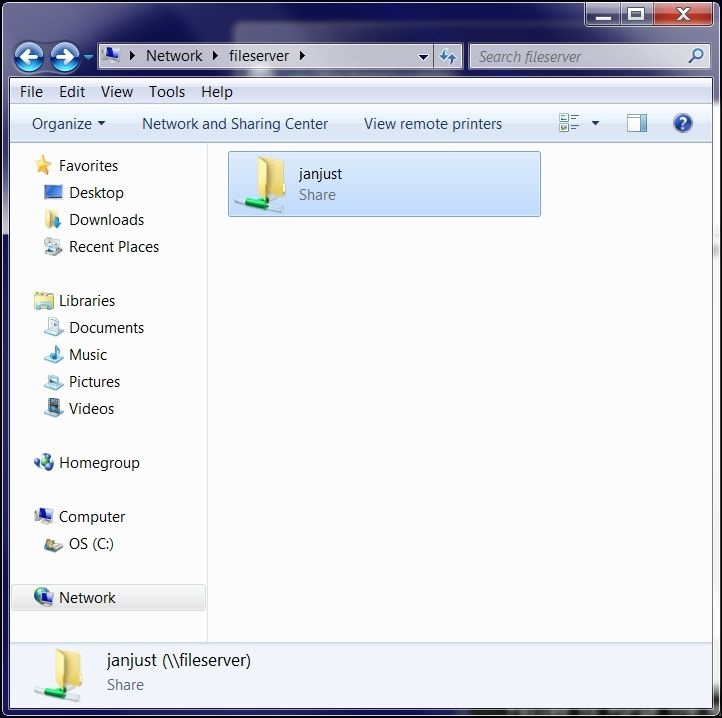

Когда мы снова нажмем на общий ресурс, появляется диалоговое окно аутентификации. Введите свои учетные данные для файлового сервера. Откроется окно проводника Windows с содержимым удаленного общего ресурса как при использовании IP-адреса.

### Использование nbtstat для устранения проблем с подключением

Средство командной строки Windows **nbtstat** очень полезно при устранении проблем с совместным использованием файлов Windows. Вы можете найти имя Windows NetBIOS и просмотреть доступные общие ресурсы или найти имя NetBIOS, которое соответствует определенному IP-адресу. В обоих случаях вывод будет примерно таким:

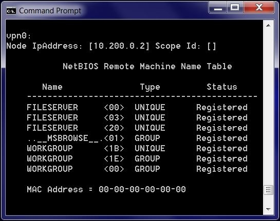

## Использование LDAP в качестве механизма внутренней аутентификации

Обычно безопасность VPN основана на паре сертификат/закрытый ключ X.509, которой должны обладать все пользователи VPN для получения доступа. Безопасность вашей VPN может быть еще более повышена, если пользователям также необходимо указать имя пользователя и пароль при подключении к серверу OpenVPN.

На стороне сервера проверка имени пользователя и пароля может быть выполнена с использованием нескольких механизмов:

* Использование файла паролей на стороне сервера, который содержит имя пользователя и его хешированные пароли.
* Использование **PAM** (сокращение от **Pluggable Authentication Module**), который обычно включен во все операционные системы Linux/UNIX.
* Использование центрального сервера каталогов на основе **легкорасширяемого протокола доступа к каталогам (Lightweight Directory Access Protocol - LDAP)**. Обратите внимание, что LDAP и Active Directory также могут использоваться с различными модулями PAM.

Также возможно выполнить аутентификацию в домене Windows Active Directory, поскольку это очень похоже на использование автономного сервера LDAP. В нашем примере мы покажем как аутентифицировать пользователей на сервере LDAP.

Самый простой способ поддержки внутренней аутентификации LDAP - использовать модуль `openvpn-plugin-ldap`. В большинстве дистрибутивов Linux этот модуль необходимо устанавливать отдельно. Например, в системах на основе RPM вы должны использовать следующую команду:

```
sudo yum install openvpn-auth-ldap
```

Мы начнем с файла `basic-udp-server.conf` и добавим одну строку:

```
proto udp
port 1194
dev tun
server 10.200.0.0 255.255.255.0
topology subnet
persist-key
persist-tun
keepalive 10 60

remote-cert-tls client
tls-auth  /etc/openvpn/movpn/ta.key 0
dh        /etc/openvpn/movpn/dh2048.pem
ca        /etc/openvpn/movpn/movpn-ca.crt
cert      /etc/openvpn/movpn/server.crt
key       /etc/openvpn/movpn/server.key

user nobody
group nobody # use 'group nogroup' on Debian/Ubuntu

verb 3
daemon
log-append /var/log/openvpn.log
plugin /usr/lib64/openvpn/plugin/lib/openvpn-authldap.so \
              "/etc/openvpn/movpn/movpn_ldap.conf"
```

Сохраните этот файл как `movpn-05-02-server.conf` и создайте файл `movpn_ldap.conf`:

```
<LDAP>
  URL             ldaps://ldap.example.org
  Timeout         15
  TLSEnable       no
  FollowReferrals yes
  TLSCACertFile   /etc/pki/tls/certs/ca-bundle.crt
  TLSCACertDir    /etc/pki/tls/certs
</LDAP>

<Authorization>
  BaseDN        "ou=LocalUsers,dc=example,dc=org"
  SearchFilter  "(&(uid=%u)(authorizedService=login))"
  RequireGroup  false
</Authorization>
```

Это очень простой файл конфигурации `authldap`, использующий защищенный сервер LDAP, который находится по адресу URI `ldaps://ldap.example.org`, порт `636` и фильтр поиска LDAP на основе идентификатора пользователя (`uid=%u`) и атрибута LDAP `authorizedService=login`. URI указывает на SSL-соединение с сервером с помощью службы `ldaps://`. Эти параметры сильно зависят от используемого сервера LDAP, но плагин `openvpn-ldap-auth` можно адаптировать практически к любой конфигурации. Например, в этой настройке для подключения к серверу LDAP не используется привязка. Тем не менее, этот, а также другие варианты подключения могут быть добавлены.

Далее мы добавляем в конфигурацию клиента `basic-udp-client.ovpn` строку:

```
auth-user-pass
```

Сохраните его как `movpn-05-02-client.ovpn` и запустите клиент. Сначала клиент устанавливает соединение с сервером, используя свой сертификат X.509 и файл приватного ключа, после чего пользователю предлагается ввести имя пользователя и пароль.

Если введены правильные учетные данные, то соединение будет установлено.

В противном случае сервер отказывает в доступе.

Вместо использования плагина `openvpn-ldap-auth`, мы также можем использовать плагин PAM. Затем OpenVPN запросит подсистему PAM для аутентификации. Если подсистема PAM правильно настроена для аутентификации пользователей по базе данных LDAP, то будут достигнуты те же функциональные возможности. Файл конфигурации сервера OpenVPN будет выглядеть следующим образом:

```
proto udp
port 1194
dev tun
server 10.200.0.0 255.255.255.0
topology subnet
persist-key
persist-tun
keepalive 10 60

remote-cert-tls client
tls-auth  /etc/openvpn/movpn/ta.key 0
dh        /etc/openvpn/movpn/dh2048.pem
ca        /etc/openvpn/movpn/movpn-ca.crt
cert      /etc/openvpn/movpn/server.crt
key       /etc/openvpn/movpn/server.key

user nobody
group nobody # use 'group nogroup' on Debian/Ubuntu

verb 3
daemon
log-append /var/log/openvpn.log

plugin /usr/lib64/openvpn/plugin/lib/openvpn-auth-pam.so "login login USERNAME password PASSWORD"
```

### Устранение неполадок в аутентификации LDAP

Устранение неполадок в подключаемом модуле аутентификации LDAP может быть непростым делом. Прежде всего, важно убедиться что VPN-сервер способен подключаться к LDAP-серверу и информация о пользователе может быть получена. Для этого очень удобен инструмент `ldapsearch`. Этот инструмент входит в пакет утилит клиента OpenLDAP.

Используя `BaseDN` и `SearchFilter` из файла `movpn_ldap.conf`, мы можем запросить сервер LDAP:

```
$ ldapsearch -x -H ldaps://ldap.example.org \
     -b ou=LocalUsers,dc=example,dc=org \
      "(&(uid=janjust)(authorizedService=login))"
```

Опция `-x` обозначает анонимную (неаутентифицированную) привязку к серверу, а опция `-H` указывает URI сервера. Обратите внимание, что URI отличается от имени хоста, так как он будет включать протокол (SSL или обычный текст), а также имя хоста. Вывод `ldapsearch` должен быть чем-то вроде этого:

```
# extended LDIF
#
# LDAPv3
# base <ou=LocalUsers,dc=example,dc=org> with scope subtree
# filter: (&(uid=janjust)(authorizedService=login))
# requesting: ALL
#

# janjust, LocalUsers, example.org
dn: uid=janjust,ou=LocalUsers,dc=example,dc=org
loginShell: /bin/bash
uid: janjust
cn: Jan Just Keijser
...
authorizedService: login

# search result
search: 2
result: 0 Success

# numResponses: 2
# numEntries: 1
```

Убедитесь что это работает, прежде чем пытаться подключить клиента OpenVPN. Если это работает, но клиент не может подключиться к серверу OpenVPN, то увеличте детальность на сервере и отслеживайте сообщения LDAP. Добавьте следующую строку в конец файла конфигурации и перезапустите сервер:

```
verb 5
```

Переподключите клиента и просмотрите журнал сервера на наличие сообщений аутентификации LDAP. В случае неудачной попытки подключения журналы сервера будут содержать такие строки:

```
LDAP bind failed: Invalid credentials

Incorrect password supplied for LDAP DN
"uid=janjust,ou=LocalUsers,dc=example,dc=org".

[...] PLUGIN_CALL: POST /usr/lib64/openvpn/plugin/lib/openvpn-auth-ldap.so/PLUGIN_AUTH_USER_PASS_VERIFY status=1

[...] PLUGIN_CALL: plugin function PLUGIN_AUTH_USER_PASS_VERIFY failed with status 1: /usr/lib64/openvpn/plugin/lib/openvpn-authldap.so

[...] TLS Auth Error: Auth Username/Password verification failed for peer

Whereas a successful connection attempt will show
[...] PLUGIN_CALL: POST /usr/lib64/openvpn/plugin/lib/openvpn-authldap.so/PLUGIN_AUTH_USER_PASS_VERIFY status=0

[...] TLS: Username/Password authentication succeeded for username 'janjust'
```

В этих сообщениях журнала детали, относящиеся к соединению, такие как IP-адрес клиента и номер порта UDP, были заменены на `[...]`.

## Фильтрация OpenVPN

Как и любой другой интерфейс в системе или на сервере, интерфейсы адаптера tun и tap могут быть отфильтрованы с помощью соответствующего программного обеспечения брандмауэра операционной системы. Во многих случаях, как для целей маршрутизации, так и для фильтрации, лучше всего логически разместить сервер OpenVPN в центральном сетевом расположении, например, на пограничном маршрутизаторе или рядом с ним. Для дома это будет кабельный или DSL-модем. В корпоративных сетях - как правило, фактический основной маршрутизатор, такой как периферийное устройство Cisco или Juniper.

В зависимости от платформы и ваших собственных или бизнес-предпочтений, брандмауэр может быть отдельным устройством между сервером OpenVPN и незащищенным Интернетом, или же может быть программным обеспечением, работающим в той же системе, что и ваш сервер OpenVPN. Большие установки могут даже иметь несколько брандмауэров.

Первое изображение показывает сеть с отдельным межсетевым экраном, установленным между cервером OpenVPN и пограничным маршрутизатором и интернетом:

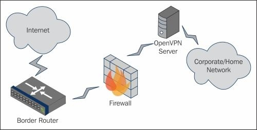

На следующем рисунке показано, как логически межсетевой экран и сервер OpenVPN могут находиться на одном компьютере:


Такие проекты, как pfSense (https://www.pfsense.org) и OpenWRT (https://openwrt.org) интегрировали интернет-соединения, локальные сети и VPN в единую систему. В этих системах используется программное обеспечение, предоставляющее простой графический интерфейс для управления беспроводными сетями, подключениями к Интернету, экземплярами VPN и набором правил брандмауэра для их защиты.

Для наших примеров мы собираемся разрешить только порты 80 и 443 от VPN-клиентов для остальной части сети.

### Пример FreeBSD

Во FreeBSD мы будем использовать `pf` для фильтрации трафика внутри и вне нашей VPN. Во FreeBSD интерфейс OpenVPN имеет значение `tun0`. Во-первых, `pf` должен быть включен в `rc.conf`:

```
pf_enable="YES"
```

Для начала создайте чрезвычайно простой набор правил в файле по умолчанию `/etc/pf.conf`:

```
pass all
```

Затем запустите `pf`:

```
root@server:~-> /etc/rc.d/pf start
Enabling pf
No ALTQ support in kernel
ALTQ related functions disabled
```

Используя `pfctl`, мы можем перечислить правила и их счетчики:

```
root@server:~-> pfctl -vvv -s rules
No ALTQ support in kernel
ALTQ related functions disabled
@0 pass all flags S/SA keep state
  [ Evaluations: 209      Packets: 13     Bytes: 624
States: 2     ]
  [ Inserted: uid 0 pid 71163 State Creations: 7 ]
```

На данный момент у нас есть простой набор правил, который просто пропускает все пакеты на всех интерфейсах. Поскольку это не книга по освоению `pf` - мы не будем вдаваться в подробности всей конфигурации. Вот пример фильтра, который разрешает весь трафик на всех интерфейсах, кроме `tun0`. Трафик на `tun0` будет отфильтрован как входящий, поэтому с VPN-клиентов можно устанавливать подключения к локальной сети только через порты `80` и `443`. Исходящий трафик на `tun0` будет разрешен.

```
# Mastering OpenVPN - FreeBSD Filtering Example
vpn_if="tun0"
out_if="xn0"
in_if="xn0"

lanv4="10.50.0.0/24"
lanv6="2001:db8:900::/64"
vpnv4="10.200.0.0/24"
vpnv6="2001:db8:100::/64"

pass on {$in_if, $out_if} all
pass out on $vpn_if all
block in on $vpn_if
pass in on $vpn_if inet proto tcp to $lanv4 port {http, https}
pass in on $vpn_if inet6 proto tcp to $lanv6 port {http, https}
```

---

**Подсказка**

И OpenVPN и FreeBSD имеют фильтр пакетов `pf`. В приведенном выше примере мы используем `pf`, поддерживаемый ядром, а не встроенный в OpenVPN.

---

### Пример Windows

Предполагая, что у вас уже есть сервер OpenVPN работающий на системе Windows 7 Professional, вы будете получать доступ к настройке брандмауэра через **Панель управления**. После того, как **Панель управления** открыта, введите `firewall` в поле поиска и нажмите на **Windows Firewall**. Из параметров, доступных на левой боковой панели окна, нажмите **Advanced Settings**. Это представит утилиту настройки брандмауэра.

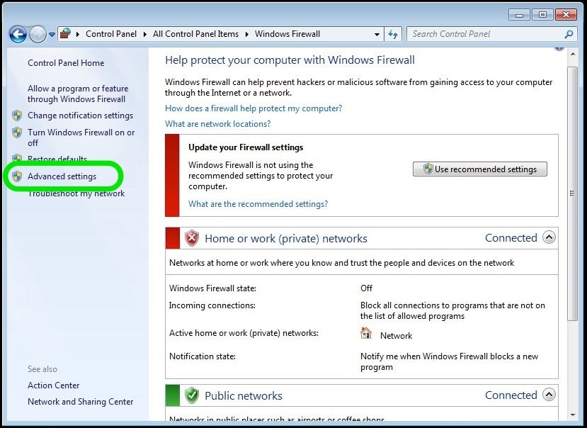

Нажмите **Advanced settings**, чтобы открыть программу **Windows Firewall with Advanced Security**, как показано на следующем рисунке:

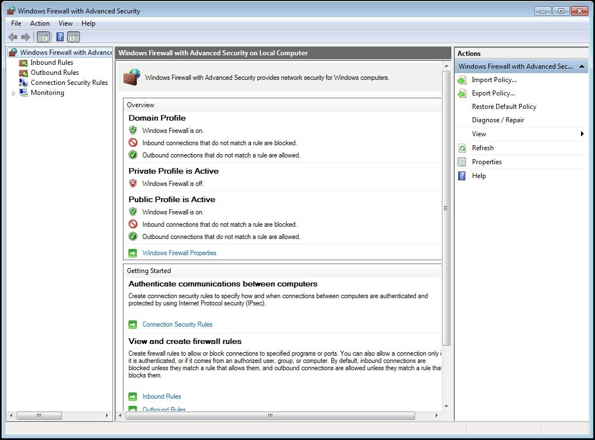

Попав в утилиту, нам нужно создать два входящих правила. Первое правило будет блокировать весь трафик от VPN, а второе - разрешит трафик через порты `80` и `443` от VPN.


После открытия **New Inbound Rule Wizard** выберите параметр для создания настраиваемого правила, как показано на следующем снимке экрана. Это позволяет нам определить все конкретные диапазоны входящих адресов и порты, необходимые для эффективности.


На второй странице выберите переключатель **Все программы**, чтобы применить это правило ко всем программам:

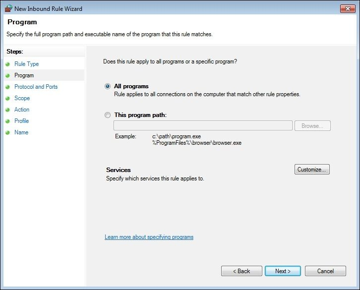

На третьем экране входящего правила укажите TCP-порты `80` и `443` для входящего правила и разрешите их со _всех_ удаленных портов. Это показано на следующем снимке экрана:

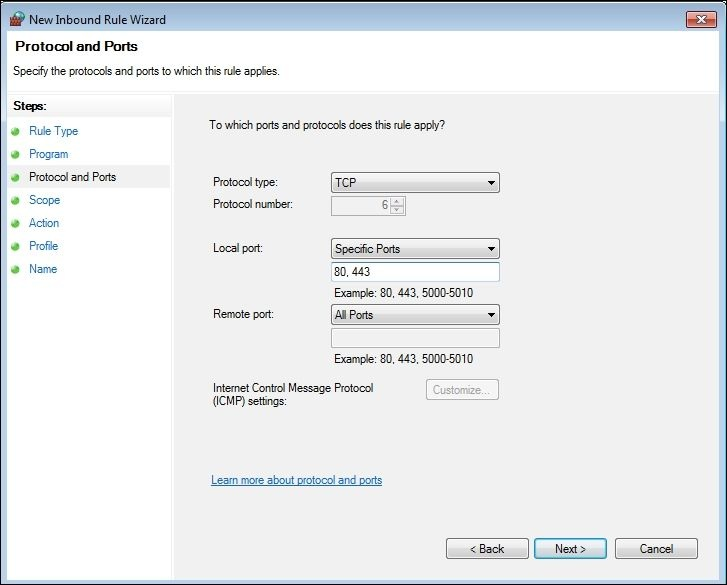

Для странице диапазона укажите локальные диапазоны IP-адресов VPN:

* `10.200.0.0/24` (IPv4)
* `2001:db8:100::/64` (IPv6)

Затем разрешите все удаленные IP-адреса, выбрав **Any IP address** (это значение по умолчанию). Позже, при создании правила блокировки, вы оставите значения по умолчанию - оба для **Все порты** на этой странице.

---

**Подсказка**

Вы также можете применить это к диапазонам IP-адресов VPN, чтобы разрешить только адресам хостов VPN связываться с ресурсами VPN. Отказ от этого ограничения разрешает доступ другим удаленным подсетям, которые вы, возможно, захотите направить (например, с помощью `--iroute`).

---

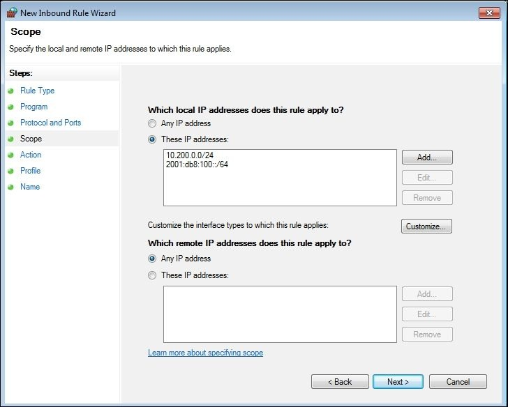

Далее выберите **Allow the connection** из списка действий. Позже, при создании правила блокировки, вам нужно будет выбрать **Block the connection** на этой странице.

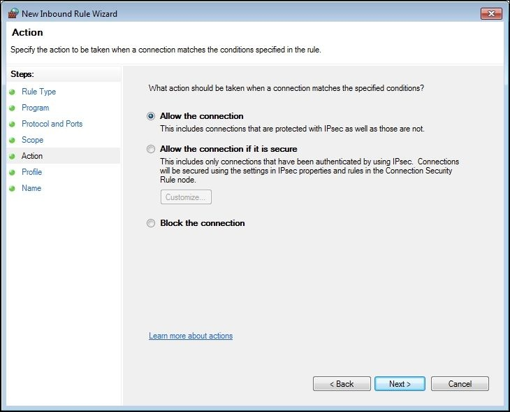

Отметьте все три поля на странице мастера **Profile**. Это позволит правилу функционировать независимо от назначенного профиля интерфейса (**Public**, **Private** или **Domain**). Мы обсудим это позже.

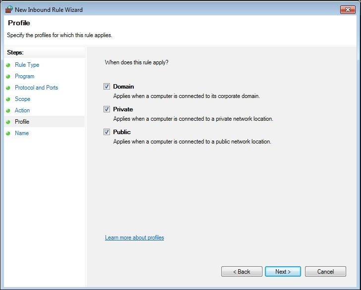

Последняя страница мастера входящих правил позволяет вам задать имя. Введите какое-нибудь описание, которое позволит администратору быстро определить правило и то, как оно применяется. В нашем случае мы устанавливаем имя `VPN – Allow 80, 443` для правила разрешения.

Теперь, когда правило разрешения создано - снова выполните эти шаги и создайте правило блокировки. Это правило блокирует весь трафик от VPN. В сочетании с правилом разрешения, которое мы уже создали, это позволит нашим VPN-клиентам подключаться только через VPN через порты `80` и `443`.

Используйте следующие настройки для вашего правила блокировки на каждой странице мастера:

* **Rule Type** должен быть **Custom**
* Для параметра **Program** выберите **All programs**
* Выберите **All Ports** для локальных и удаленных портов
* **Scope** должна быть **Any IP address** (для локальных и удаленных)
* **Action** должно быть **Block the connection**
* Выберите **Select all profiles** в **Profile**
* Установить **Name** как `VPN – Block All`

После сохранения у вас будет пара правил VPN в верхней части списка.

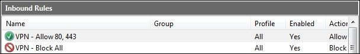

Брандмауэр Windows в режиме повышенной безопасности - это первый тип брандмауэра. Он означает, что как только правило брандмауэра соответствует данному сетевому пакету, обработка набора правил прекращается и применяется указанное действие в этом правиле. Фильтр пакетов `iptables` в Linux - это еще один фильтр первого соответствия. Другие фильтры пакетов, такие как `pf` в OpenBSD, соответствуют последним, что означает, что правила продолжают обрабатываться до конца.

**Подсказка**

OpenVPN имеет встроенную возможность фильтрации, но его код не затрагивался в течение ряда лет и требует дополнительных плагинов для работы. Разработчики не думают, что код является жизнеспособным в настоящее время, но эта функция может быть возвращена в будущем.

Для выполнения многих задач типа «сервер» в настольной версии Windows обычно требуется, чтобы администратор пошел по проторенному пути. Например, Windows Server 2008 имеет лучшие инструменты редактирования брандмауэра, чем Windows 7 Professional, которая используется в приведенном выше примере.

### Маршрутизация на основе политик

Маршрутизация на основе политик использует брандмауэр или другой фильтр пакетов для маршрутизации трафика на основе не только IP-адресов источника и назначения, но также портов источника и назначения. Одним из распространенных способов использования маршрутизации на основе политик является отправка всего незащищенного трафика порта `80` через VPN, но при этом другой трафик, такой как SSL-трафик через порт `443` может проходить через общий Интернет.

Маршрутизация на основе политик - это то, что нужно сделать в источнике. В большинстве случаев это означает, что он будет применяться на клиенте OpenVPN. В некоторых случаях это может быть расширено на сервере OpenVPN, но гибкость значительно снижена.

Каждый брандмауэр или программное обеспечение для фильтрации пакетов обрабатывает политику маршрутизации по-своему. Нам не удалось настроить брандмауэр Windows 7 для маршрутизации на основе портов источника или назначения и даже фильтр пакетов OpenBSD `pf` имеет определенные предостережения.

На следующем рисунке показано простое решение о маршрутизации политики порта `80` или `443`, соответствующее нашему примеру сценария из предыдущего раздела:

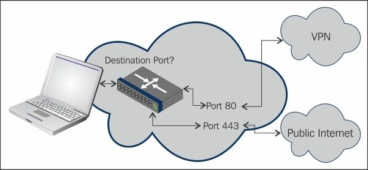

## Сетевые расположения Windows - общедоступные или частные

Постоянный вопрос в списках рассылки OpenVPN состоит в том, как изменить сетевое расположение виртуального сетевого адаптера TAP-Win OpenVPN с общедоступного на частное. Этот вопрос возник с появлением Windows Vista. Ответ на него, к сожалению, довольно длинный. В этом разделе мы рассмотрим различные методы, которые позволяют нам изменять сетевое расположение адаптера TAP-Win на клиентах Windows.

### Фон

Начиная с Windows Vista, Microsoft представила концепцию сетевых расположений. В Windows 7 есть три сетевых расположения: **Домашнее**, **Рабочее** и **Общедоступное**. Эти сетевые расположения применяются ко всем сетевым адаптерам: проводным, беспроводным, а также виртуальным сетевым адаптерам TAP-Win от OpenVPN.

**Домашнее** сетевое расположение предназначено для домашней сети и обеспечивает высокий уровень доверия. Оно также включает функцию **Домашняя группа**, благодаря которой компьютер может легко подключаться ко всем другим устройствам дома. Точно так же расположение **Рабочей** сети обеспечивает высокий уровень доверия на работе, позволяя компьютеру обмениваться файлами, подключаться к принтерам и т.д. В Windows 8 **домашняя** и **рабочая** сетевые папки объединяются в **частную** сеть.

Расположение в **общедоступной** сети не является доверенным и доступ к сетевым ресурсам, как входящим так и исходящим, строго ограничен Windows, даже если брандмауэр Windows отключен.

Когда брандмауэр Windows включен - профиль **частного** брандмауэра применяется ко всем сетевым адаптерам в **домашней** и **рабочей** сети, а профиль **общего** брандмауэра применяется ко всем сетевым адаптерам в **общедоступной** сети.

Чтобы доверять сетевому адаптеру, он должен объявить шлюз по умолчанию или сетевой адаптер должен быть частью домена Windows. Есть некоторая документация об этом онлайн: http://blogs.technet.com/b/networking/archive/2009/02/20/why-is-my-networkdetected-as-unknown-by-windows-vista-or-windows-server-2008.aspx

Когда Windows не может определить _местоположение_ сети - автоматически выбирается расположение как **общедоступной** сети. К сожалению, невозможно изменить состояние, если сетевой адаптер классифицирован как **общедоступный**.

### Изменение местоположения адаптера TAP-Win с помощью redirect-gateway

OpenVPN может установить шлюз по умолчанию на удаленном адаптере TAP-Win с помощью директивы конфигурации:

```
redirect-gateway
```

Обычно рекомендуется добавить параметр `def1` к этой опции. Опция `def1` заставляет OpenVPN не добавлять новый шлюз по умолчанию (в терминах сети - маршрут 0.0.0.0/0.0.0.0), а вместо этого добавлять два маршрута с маской сети `128.0.0.0` как объяснено в предыдущей главе. Недостатком опции `def1` является то, что Windows не распознает адаптер TAP-Win как имеющий шлюз по умолчанию. Для получения дополнительной информации о различных альтернативах опции `redirect-gateway` см. [Главу 4](chapter-04.md), _Режим клиент/сервер с устройствами tun_.

Чтобы протестировать эту опцию, мы добавляем строку в файл `basic-udp-server.conf`:

```
proto udp
port 1194
dev tun
server 10.200.0.0 255.255.255.0
topology subnet
persist-key
persist-tun
keepalive 10 60

remote-cert-tls client
tls-auth  /etc/openvpn/movpn/ta.key 0
dh        /etc/openvpn/movpn/dh2048.pem
ca        /etc/openvpn/movpn/movpn-ca.crt
cert      /etc/openvpn/movpn/server.crt
key       /etc/openvpn/movpn/server.key

user nobody
group nobody # use 'group nogroup' on Debian/Ubuntu

verb 3
daemon
log-append /var/log/openvpn.log

push "redirect-gateway"
```

Теперь сохраните его как `movpn-05-03-server.conf`. Запустите сервер OpenVPN, используя этот файл конфигурации и подключите клиент Windows 7, используя конфигурацию по умолчанию `basic-udp-client.ovpn`.

На этот раз, после успешного подключения клиента, Windows спросит, в каком месте _разместить_ новую сеть:

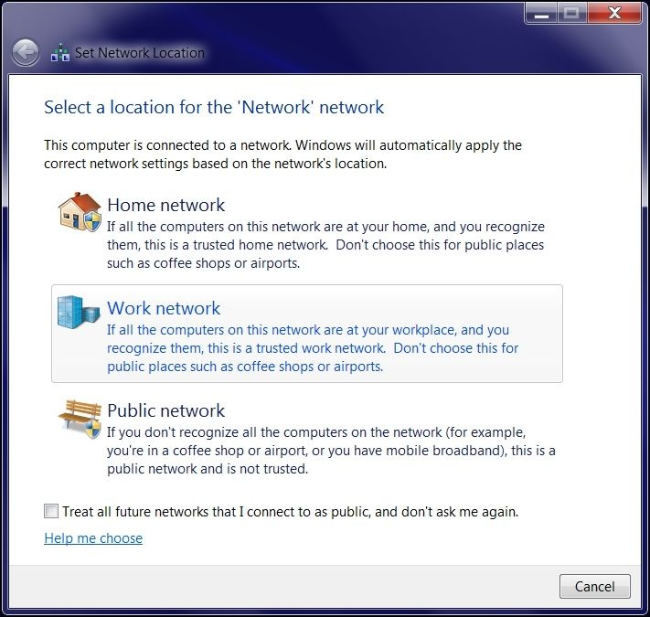

Выберите **рабочую** сеть, после чего Windows позволит вам выбрать собственное имя и значок для сети VPN:

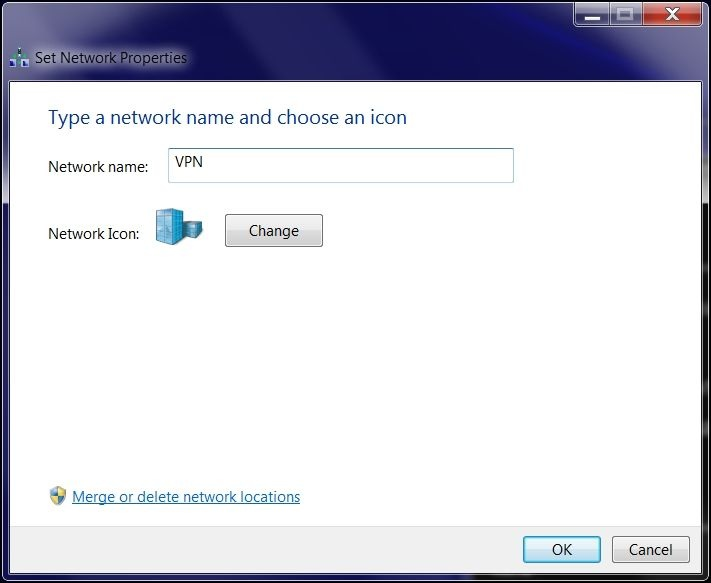

Мы выбрали имя `VPN`, выберите другой значок и нажмите **ОК**.

Адаптер TAP-Win теперь является доверенным и в этой сети разрешен общий доступ к файлам Windows, а также другим доверенным протоколам.

Одним из недостатков использования _redirect-gateway_ является то, что адаптер VPN теперь является единственным адаптером со шлюзом по умолчанию и, следовательно, является доверенным. Адаптер беспроводной сети, подключенный к `eduroam` сети Wi-Fi , теперь не имеет маршрута по умолчанию и внезапно становится частью _неопознанной сети_ и больше не является доверенным. Это можно увидеть на следующем снимке экрана **Центра управления сетями и общим доступом** Windows 7:

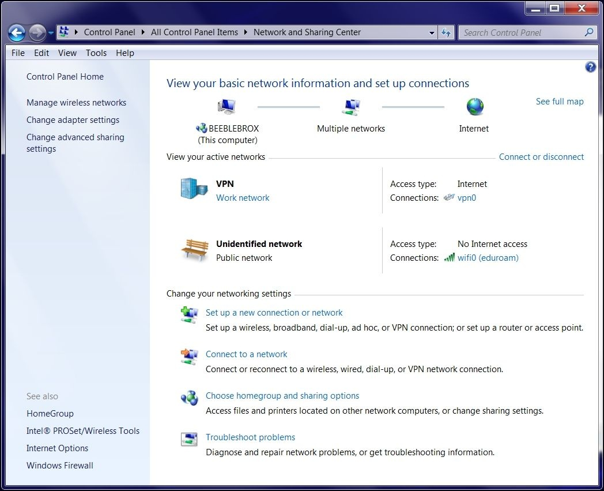

Самый большой недостаток использования redirect-gateway без `def1` становится очевидным когда VPN-соединение останавливается или прерывается. Поскольку шлюз по умолчанию на клиенте Windows OpenVPN был заменен, больше невозможно надежно восстановить шлюз по умолчанию, который существовал до запуска VPN и потери всех подключений к Интернету. В большинстве случаев (беспроводное) подключение к локальной сети необходимо перезапустить для восстановления шлюза.

#### Использование редактора групповой политики, чтобы заставить адаптер быть частным

Второй подход к изменению местоположения адаптера TAP-Win заключается в использовании редактора групповой политики Windows. Используя этот инструмент, можно заставить адаптер TAP-Win (или любой неопознанный адаптер) быть либо частным, либо общедоступным:

1. Откройте **командную строку** и запустите **редактор групповой политики**:

```
gpoledit.msc
```

* Выберите **Политики диспетчера списка сетей** и дважды щелкните **Неопознанные сети** на правой панели, как показано на следующем снимке экрана:

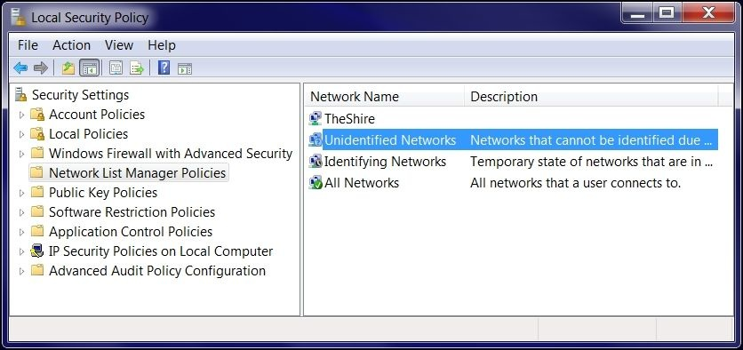

* Откроется новое окно **Свойства неопознанных сетей**. Установите **Тип расположения** на **Частный** и нажмите **OK**, как показано на следующем скриншоте:

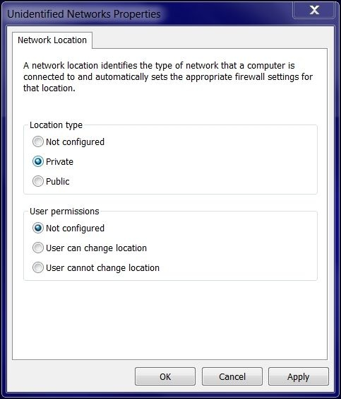

Перезапустите клиент OpenVPN без флага _redirect-gateway_.

Теперь Windows автоматически пометит адаптер как **Частный** и снова спросит в какую сеть следует установить адаптер: **Дом** или **Работа**. Однако на этот раз значок и имя выбранного типа сети изменить нельзя.

---

**Подсказка**

В предыдущих инструкциях все неопознанные сети будут настроены как частные и, возможно, могут предустановить другие негативные побочные эффекты безопасности. Убедитесь, что вы понимаете все последствия этого изменения прежде чем устанавливать его.

---

#### Изменение местоположения адаптера TAP-Win с использованием дополнительных шлюзов

Более элегантный подход к изменению местоположения адаптера заключается в добавлении дополнительного адреса шлюза в конфигурацию сервера:

```
push "route 0.0.0.0 0.0.0.0"
```

Когда клиент OpenVPN подключается, он добавляет дополнительный маршрут по умолчанию в системные таблицы маршрутизации. Этот маршрут всегда будет иметь более высокую метрику, чем обычный шлюз по умолчанию, но адаптер теперь является доверенным.

В Windows 7 метрика адаптера обычно рассчитывается автоматически как сумма метрики шлюза и метрики интерфейса. Метрики интерфейса основаны на типе и скорости адаптера. Поскольку TAP-Win адаптер OpenVPN зарегистрирован как адаптер 10 Мбит/с, он всегда будет иметь более высокую метрику (то есть будет менее предпочтительным), чем проводные или беспроводные адаптеры, которые имеют более высокие скорости.

Эти метрики могут быть показаны с помощью команды `netsh int ip show config`:

```
C:\>netsh int ip show config
Configuration for interface "vpn0"
DHCP enabled: Yes
IP Address: 10.200.0.2
Subnet Prefix: 10.200.0.0/24 (...)
Default Gateway: 10.200.0.1
Gateway Metric: 70
InterfaceMetric: 30
DNS servers configured through DHCP: 192.0.2.12
Register with which suffix: Primary only
WINS servers configured through DHCP: 192.0.2.60
Configuration for interface "wifi0"
DHCP enabled: Yes
IP Address: 192.0.2.233
Subnet Prefix: 192.0.2.0/24 (...)
Default Gateway: 192.0.2.254
Gateway Metric: 0
InterfaceMetric: 20
DNS servers configured through DHCP: 192.0.2.17
192.0.2.12
Register with which suffix: None
WINS servers configured through DHCP: 192.0.2.121
192.0.2.20
```

Можно отключить автоматический расчет метрики и вернуться к поведению более старых версий Windows. Для этого перейдите в диалоговое окно «Дополнительные параметры TCP/IP» пункта «Свойства TCP/IPv4» сетевого адаптера:

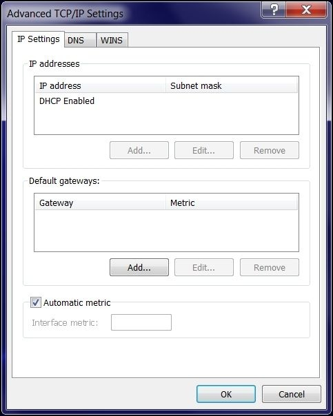

В этом случае метрика, указанная в окне **Свойства TCP/IPv4**, будет определять маршрут по умолчанию в системе. Если показатель адаптера TAP-Win выше, чем у адаптера без VPN, то фактически весь трафик направляется через VPN!

Преимущество этого подхода заключается в том, что _старый_ шлюз по умолчанию остается нетронутым, что позволяет избежать проблемы утерянного шлюза по умолчанию при падении или остановке VPN-подключения.

#### Перенаправление всего трафика в сочетании с дополнительными шлюзами

В качестве последнего примера того, как можно повлиять на местоположение в сети с помощью параметров конфигурации OpenVPN, мы добавим дополнительный шлюз и перенаправим шлюз по умолчанию с помощью `def1`:

```
proto udp
port 1194
dev tun
server 10.200.0.0 255.255.255.0
topology subnet
persist-key
persist-tun
keepalive 10 60

remote-cert-tls client
tls-auth  /etc/openvpn/movpn/ta.key 0
dh        /etc/openvpn/movpn/dh2048.pem
ca        /etc/openvpn/movpn/movpn-ca.crt
cert      /etc/openvpn/movpn/server.crt
key       /etc/openvpn/movpn/server.key

user nobody
group nobody # use 'group nogroup' on Debian/Ubuntu

verb 3
daemon
log-append /var/log/openvpn.log

push "route 0.0.0.0 0.0.0.0"
push "redirect-gateway def1"
```

Сохраните файл как `movpn-05-04-server.conf`. Запустите сервер OpenVPN, используя этот файл конфигурации, и подключите клиент Windows 7, используя конфигурацию по умолчанию `basic-udp-client.ovpn`.

После переподключения клиента OpenVPN таблица маршрутизации IPv4 теперь содержит следующие записи:

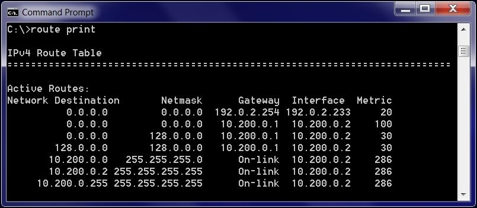

Первый маршрут - это оригинальный шлюз. Второй маршрут - это дополнительный маршрут `0.0.0.0/0` для адаптера TAP-Win. Он заставляет Windows доверять адаптеру. Третий и четвертый маршруты устанавливаются командой `redirect-gateway def1` путем добавления маршрутов `0.0.0.0/1` и `128.0.0.0`.

OpenVPN предоставляет два новых маршрута, которые являются более конкретными, чем маршрут по умолчанию `0.0.0.0/0`. Маршрутизация TCP/IP указывает что всегда следует выбирать более конкретный маршрут, независимо от метрики интерфейса. Поэтому весь трафик перенаправляется через VPN-туннель.

В окне **Центр управления сетями и общим доступом** теперь сети LAN так и VPN отображаются как доверенные:

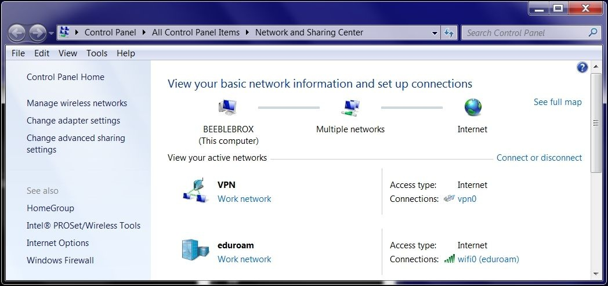

Преимущества этого подхода заключаются в следующем:

* Как исходная сеть (Wi-Fi `eduroam` в предыдущем примере) так и сеть VPN являются доверенными. Это означает, что общий доступ к файлам и принтерам доступен в обеих сетях.
* Весь сетевой трафик правильно перенаправляется через VPN, независимо от метрики интерфейса.
* Когда соединение VPN обрывается или останавливается, исходный шлюз по умолчанию корректно восстанавливается.

Быстрая проверка ссылки https://www.whatismyip.com покажет, что весь трафик теперь маршрутизируется через VPN. Еще один способ убедиться в этом - использовать `tracert` в командной оболочке Windows:

```
c:\>tracert -4 -d www

Трассировка маршрута к www.nikhef.nl [192.16.199.160]
с максимальным числом прыжков 30:

  1    95 ms    119 ms    83 ms   10.200.0.1
  3   103 ms    119 ms    83 ms   192.0.2.133
  4   115 ms    101 ms   101 ms   192.16.199.160

Трассировка завершена.
```

**Подсказка**

В Mac OS X клиент Tunnelblick для OpenVPN имеет возможность проверить, изменился ли внешний IP после подключения к VPN, а затем уведомить пользователя, если этот IP не изменится.

Первый переход в выводе `traceroute` - это адрес VPN-сервера, который доказывает, что шлюзом по умолчанию в системе теперь действительно является VPN-адаптер.

## Использование OpenVPN с прокси HTTP или SOCKS

OpenVPN поддерживает работу через прокси HTTP или SOCKS без аутентификации, с базовой аутентификацией и с аутентификацией NTLM. Мы рассмотрим как прокси-серверы HTTP, так и SOCKS, как с аутентификацией, так и без нее.

### HTTP прокси

HTTP прокси требуют использования TCP для туннельного транспорта OpenVPN. Если вы в настоящее время используете UDP, необходимо обновить аргумент протокола как на сервере, так и в конфигурации клиента:

```
proto tcp
```

После настройки добавьте поддержку прокси для клиента, добавив директиву конфигурации `--http-proxy`. В качестве примера, давайте предположим, что вашей локальной сети требуется анонимный прокси-сервер для исходящих соединений и этот сервер находится на `192.168.4.4` на порту по умолчанию `1080`. Ваша конфигурация будет выглядеть примерно так:

```
http-proxy 192.168.4.4 1080 none
```

Это позволит вашему клиентскому соединению OpenVPN подключаться к удаленному серверу OpenVPN через прокси-сервер в вашей локальной сети. Аутентифицированный HTTP-прокси не сильно отличается, просто замените `none` в предыдущей команде на информацию аутентификации:

```
http-proxy 192.168.4.4 1080 stdin basic
```

Предыдущая команда подключается к тому же прокси-серверу и порту, что и раньше, но запрашивает стандартный ввод для имени пользователя и пароля, которые используются для базовой аутентификации HTTP. Кроме того, поддерживаемые методы проверки подлинности включают в себя файл аутентификации, который похож на основной файл паролей OpenVPN - просто имя пользователя и пароль в виде открытого текста в двух отдельных строках:

```
someuser
somepass
```

Путь к файлу аутентификации и имя файла передаются вместо ключевого слова `stdin` в предыдущем примере. Настройка `auto` позволяет OpenVPN определять, откуда запрашивать учетные данные, в том числе через консоль управления.

Некоторые прокси-серверы HTTP могут ограничивать доступ или аутентификацию на основе переданного агента пользователя HTTP или других параметров HTTP. Они могут быть определены с помощью аргумента конфигурации `http-proxy-option` для почти любой произвольной опции HTTP. Типичными примерами являются строка агента пользователя и строка версии HTTP:

```
http-proxy-option VERSION 1.1
http-proxy-option AGENT "Definitely NOT OpenVPN"
```

Все эти параметры могут быть определены в стандартной конфигурации клиента OpenVPN или в командной строке во время выполнения.

Если вы хотите, чтобы OpenVPN повторял соединения с прокси-сервером HTTP, укажите параметр `--http-proxy-retry`. Это приведет к тому, что OpenVPN будет имитировать сброс SIGUSR1 в процессе OpenVPN, вызывая переподключение туннеля.

### SOCKS прокси

В дополнение к HTTP-прокси, OpenVPN поддерживает SOCKS-прокси. Если вы хотите больше узнать о различиях между прокси-серверами HTTP и SOCKS, в Википедии есть хорошее сравнение по адресу http://en.wikipedia.org/wiki/SOCKS, или вы можете просмотреть **Рабочее предложение (RFC)** для конкретного протокола по следующим URL:

* SOCKS5: https://www.ietf.org/rfc/rfc1928.txt
* HTTP: https://www.ietf.org/rfc/rfc2616.txt

Для наших примеров мы снова предположим, что прокси-сервер `192.168.4.4` использует порт по умолчанию `1080`. Но на этот раз это будет SOCKS5 прокси. В отличие от примера прокси-сервера HTTP, разрешено использовать UDP или TCP для туннельного транспорта со стандартным прокси-сервером SOCKS5. Однако есть предостережения по этому поводу.

Добавьте следующую строку в конфигурацию клиента OpenVPN, чтобы указать его для нашего примера прокси-сервера:

```
socks-proxy-server 1080 socks_auth.txt
```

Как и в случае с другими файлами аутентификации, достаточно простого текстового файла с именем пользователя и паролем в отдельных строках:

```
socks5user
socks5pass
```

Как и раньше, `stdin` работает вместо пути и имени файла для файла аутентификации. Кроме того, если требуется переподключение/повторная попытка в случае потери соединения или сбоя прокси-сервера, укажите параметр `--socks-proxy-retry`, чтобы позволить OpenVPN имитировать SIGUSR1 для перезапуска VPN.

**Подсказка**

Вы можете использовать протокол SSH для создания локального сервера SOCKS5 и туннелирования OpenVPN через этот туннель. Одно из ограничений заключается в том, что для прокси-сервера SSH SOCKS5 требуются только TCP-соединения. Ваш трафик в OpenVPN может быть TCP/UDP, но сам туннель OpenVPN должен быть `--proto tcp`.

## Резюме

В этой главе вы узнали, как интегрировать OpenVPN в существующую сеть и компьютерную инфраструктуру. Это относится к серверной части. Мы также увидели, как использовать LDAP в качестве бэкэнд-системы аутентификации и как использовать маршрутизацию на основе политик для плавной интеграции VPN, предлагаемой OpenVPN, в обычную сеть. На стороне клиента мы рассмотрели интеграцию OpenVPN в операционную систему Windows, а также сценарий, при котором с сервером OpenVPN нельзя связаться напрямую.

Это, конечно, лишь несколько примеров расширенных сценариев развертывания и мы были ограничены только режимом настройки. Это было сделано специально, чтобы мы могли показать, что режим tun подходит для большинства развертываний OpenVPN. Существуют сценарии развертывания, для которых требуется режим tap или даже мостовое соединение и они рассматриваются в следующей главе.
