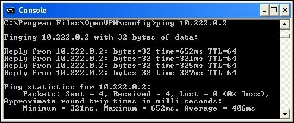

# Глава 6. "Режим клиент/сервер" с tap-устройствами

_Другая_ модель развертывания для OpenVPN является один сервер с несколькими удаленными клиентами, способных к маршрутизации трафика Ethernet. Мы называем эту модель развертывания _режимом клиент/сервер с tap-устройствами_.

Основное различие между режимами tun и tap заключается в типе используемого адаптера. tap-адаптер обеспечивает полностью виртуальный интерфейс Ethernet (уровень 2), в то время как адаптер tun рассматривается большинством операционных систем как двухточечный (уровень 3).

Компьютеры, подключенные с использованием (виртуальных) адаптеров Ethernet, могут образовывать единый широковещательный домен, который необходим для определенных приложений. С двухточечными адаптерами это невозможно. Также обратите внимание, что не все операционные системы поддерживают tap-адаптеры. Например, iOS и Android поддерживают только tun-устройства.

В этой главе мы начнем с базовой настройки клиент/сервер, которая очень похожа на базовую настройку, описанную в Главе 4, Режим клиент/сервер с настройкими устройствами. Однако существуют тонкие различия, которые будут обсуждаться на нескольких примерах. Кроме того, режим tap включает настройку мостового соединения, при котором обычный сетевой адаптер соединяется с виртуальным tap-адаптером. Эта тема будет подробно обсуждаться как для операционных систем Linux, так и для Windows.

В этой главе будут рассмотрены следующие темы:

* Базовая настройка
* Включение клиент-клиентского трафика с использованием `pf`
* Bridging
* Соединение в Linux
* Соединение в Windows
* Использование внешнего DHCP-сервера
* Проверка широковещательного и не IP-трафика
* Сравнение режима Tun с режимом Tap

## Базовая настройка

Базовая настройка OpenVPN в режиме tap практически такая же, как и в режиме tun. В режиме tap мы используем следующую строку в файле конфигурации сервера:

```
dev tap
```

В режиме tun мы используем следующие строки:

```
dev tun
topology subnet
```

Опция `topology subnet` не требуется, но предоставляет схему сетевой адресации, которая является более разумной и будет использоваться по умолчанию в будущей версии OpenVPN.

Для полноты картины сначала создадим файл конфигурации сервера:

```
proto udp
port 1194
dev tap
server 10.222.0.0 255.255.255.0

persist-key
persist-tun
keepalive 10 60

remote-cert-tls client
tls-auth  /etc/openvpn/movpn/ta.key 0
dh        /etc/openvpn/movpn/dh2048.pem
ca        /etc/openvpn/movpn/movpn-ca.crt
cert      /etc/openvpn/movpn/server.crt
key       /etc/openvpn/movpn/server.key

user nobody
group nobody

verb 3
daemon
log-append /var/log/openvpn.log
```

Мы будем использовать этот основной файл конфигурации сервера в режиме tap в этой главе и других. Сохраните его как `tap-udp-server.conf`, чтобы мы могли использовать его позже.

---

**Заметка**

Параметр `topology subnet` был удален, поскольку параметр `topology` является параметром конфигурации, специфичным для tun. В режиме tap сервер всегда раздает каждому клиенту по одному IP-адресу с соответствующей маской сети.

---

Точно так же мы создаем файл конфигурации клиента, который снова почти идентичен файлу `basic-udp-client.conf` из [главы 4], _Режим клиент/сервер с устройствами tun_:

```
proto udp
port 1194
dev tap

client
remote openvpnserver.example.com
nobind

remote-cert-tls server
tls-auth  /etc/openvpn/movpn/ta.key 1
ca   /etc/openvpn/movpn/movpn-ca.crt
cert /etc/openvpn/movpn/client1.crt
key  /etc/openvpn/movpn/client1.key
```

Сохраните этот файл как `tap-udp-client.conf`. Аналогично, для клиентов Windows создайте файл конфигурации `tap-udp-client.ovpn`.

Запустите сервер OpenVPN и подключите клиент, используя эти файлы конфигурации. Журнал соединений на стороне сервера показывает некоторые тонкие различия по сравнению с настройкой на основе tun, которые выделены в следующем разделе:

```
OpenVPN 2.3.6 x86_64-redhat-linux-gnu [SSL (OpenSSL)] [LZO] [EPOLL]
[PKCS11] [MH] [IPv6] built on Dec 2 2014
library versions: OpenSSL 1.0.1e-fips 11 Feb 2013, LZO 2.03
[…]
TUN/TAP device tap0 opened
TUN/TAP TX queue length set to 100
do_ifconfig, tt->ipv6=0, tt->did_ifconfig_ipv6_setup=0
sbinip link set dev tap0 up mtu 1500
sbinip addr add dev tap0 10.222.0.1/24 broadcast 10.222.0.255
GID set to nobody
UID set to nobody
UDPv4 link local (bound): [undef]
UDPv4 link remote: [undef]

MULTI: multi_init called, r=256 v=256
IFCONFIG POOL: base=10.222.0.2 size=253, ipv6=0
Initialization Sequence Completed
CLIENT_IP:60728 TLS: Initial packet from [AF_INET]CLIENT_IP:60728,
sid=d4d7f1fd 988e4ff3
[…]
client1/CLIENT_IP:60728 PUSH: Received control message:
'PUSH_REQUEST'
client1/CLIENT_IP:60728 SENT CONTROL [client1]: 'PUSH_REPLY,routegateway 10.222.0.1,ping 10,ping-restart 60,ifconfig 10.222.0.2
255.255.255.0' (status=1)
client1/CLIENT_IP:60728 MULTI: Learn: 8e:66:e4:43:35:a1 ->
client1/CLIENT_IP:60728
```

Последняя строка журнала подключений к серверу на самом деле самая интересная: строка `MULTI: Learn` показывает, что сервер теперь использует MAC-адрес удаленного клиента, чтобы отличать его от других клиентов, тогда как в режиме tun он может полагаться исключительно на IP-адрес, назначенный клиенту. Это необходимо, так как клиент на основе tap может также отправлять не-IP трафик, в котором не используется IP-адрес.

## Включение клиент-клиентского трафика

Когда к серверу подключено несколько клиентов виртуальной частной сети (VPN) - им не разрешается обмениваться трафиком. Это верно как для режима tap, так и для режима tun. Чтобы включить трафик между клиентами, есть два варианта:

* Использование параметра конфигурации `client-to-client`. Это позволяет OpenVPN обрабатывать трафик клиент-клиент внутри системы, минуя таблицы системной маршрутизации, а также правила системного брандмауэра/iptables.
* Использование системной таблицы маршрутизации и правил брандмауэра/iptables для отправки трафика от одного клиента другому и обратно.

Первый вариант - самый быстрый как с точки зрения конфигурации, так и с точки зрения производительности. Если нет ограничений на трафик между VPN-клиентами, добавьте строку `client-to-client` в файл конфигурации `tap-udp-server.conf`, сохраните его как `movpn-06-01-server.conf` и перезапустите сервер OpenVPN, используя этот файл конфигурации:

```
$ openvpn --config movpn-06-01-server.conf
```

Переподключите VPN-клиентов. Первому клиенту назначен IP-адрес 10.222.0.2, а второму клиенту 10.222.0.3. Теперь клиенты могут связаться друг с другом:



Высокая задержка (то есть время проверки связи более 300 мс) на предыдущем снимке экрана немедленно показывает один из недостатков использования трафика клиент-клиент по VPN. Весь трафик проходит через сервер OpenVPN, таким образом, пинг от client1 к client2 занимает больше времени:

1.  Сообщение запроса ping отправляется с `client1` на сервер OpenVPN.
2.  Сервер OpenVPN пересылает сообщение на `client2`.
3.  `client2` отправляет обратно ответное сообщение ping, снова на сервер.
4.  Сервер OpenVPN пересылает ответ ping обратно на `client1`.

Если клиенты VPN подключены через сеть с высокой задержкой, то использование VPN модели клиент/сервер увеличит задержку при отправке трафика между клиентами. OpenVPN - это такая модель VPN клиент-сервер, как и большинство доступных коммерческих решений VPN. Существуют некоторые одноранговые VPN-решения, но они выходят за рамки этой книги.

### Фильтрация трафика между клиентами

Недостатком опции `client-to-client` является отсутствие фильтрации. Когда эта опция добавлена, _весь_ трафик между _всеми_ клиентами разрешен в обход правил системного брандмауэра/iptables.

Вторым способом обеспечения прохождения трафика между клиентами является использование таблиц маршрутизации системы. В режиме tun это сделать довольно просто, но это немного сложнее при использовании режима tap. Когда `client1` желает связаться с `client2`, он сначала должен знать MAC (аппаратный) адрес `client2` . Запрос ARP отправляется через адаптер tap клиента и достигает сервера OpenVPN. Серверный процесс OpenVPN перенаправляет ARP-запрос из своего собственного tap-адаптера и ожидает ответа. Однако ответ должен прийти от другого VPN-клиента, который подключен к тому же адаптеру. Таким образом, ARP-запрос должен быть отправлен обратно всем подключенным клиентам сервера OpenVPN. Обычно повторная выдача ARP-запроса не выполняется, и трафик клиент-клиент терпит неудачу.

В современных ядрах Linux (2.6.34+ или в ядрах с опциями обратного переноса) для каждого интерфейса может быть установлен специальный флаг `proxy_arp_pvlan`. Этот флаг указывает ядру Linux повторно отправить ARP-запрос обратно из того же интерфейса, откуда он поступил. Именно этот флаг необходим для работы трафика клиент-клиент. Таким образом, мы включаем трафик клиент-клиент в режиме tap, не используя опцию `client-to-client`, устанавливая этот флаг:

```
# echo 1 > /proc/sys/net/ipv4/conf/tap0/proxy_arp_pvlan
```

---

**Заметка**

Этот системный флаг можно установить только после настройки адаптера tap0. Адаптер tap может быть создан до запуска OpenVPN (см. Раздел _Мостовое соединение в Linux_) или флаг может быть установлен после запуска OpenVPN. В этом случае, он может быть установлен автоматически с использованием до скрипта, как описано в [Главе 7], _Скрипты и плагины_.

Когда `client1` хочет достичь `client2`, поток сетевого трафика с этим установленным флагом выглядит следующим образом:

1. `client1` отправляет запрос ARP из своего tap-адаптера.
2. Сервер OpenVPN получает ARP-запрос и перенаправляет его из собственного адаптера tap0.
3. ARP-запрос проходит через системную маршрутизацию и таблицу пересылки iptables.
4. Если запрос разрешен, запрос отправляется всем сетевым интерфейсам на сервере OpenVPN, включая адаптер tap0, где он возник. Последнее вызвано флагом `proxy_arp_pvlan`.
5. OpenVPN получает ARP-запрос и перенаправляет его всем подключенным клиентам OpenVPN.
6. `client2` получает запрос и отвечает. ARP-ответ теперь отправляется обратно на сервер OpenVPN.
7. Сервер OpenVPN пересылает ARP-ответ `client1`.
8. `client1` теперь знает, где найти `client2` и может отправлять сетевой трафик `client2`.

Второй шаг позволяет нам отфильтровать трафик между разными клиентами. Правила фильтрации (например, с использованием `iptables`) могут быть добавлены для разрешения только определенных типов трафика или только трафика между специальными клиентами. Например, следующее правило `iptables` блокирует трафик между первым и вторым клиентом OpenVPN:

```
# iptables -I FORWARD -i tap0 -o tap0 \
-s 10.222.0.2 -d 10.222.0.3 -j DROP
```

Обратите внимание, что блокируя трафик в одном направлении, оба клиента не смогут связаться друг с другом. Для однонаправленной блокировки требуются более продвинутые правила `iptables`.

---

**Заметка**

Кажется, нет эквивалента для флага `proxy_arp_pvlan` в операционных системах Windows или Mac OS.

---

#### Недостаток метода proxy_arp_pvlan

Основным недостатком использования этого специального флага ядра является то, что он не превращает VPN в один широковещательный домен Ethernet. С флагом `proxy_arp_pvlan` клиенты VPN могут связываться друг с другом с помощью ARP-сообщений. Однако они не будут получать широковещательный трафик, приходящий от других клиентов. Когда используется опция `client-to-client` - все подключенные VPN-клиенты автоматически получают широковещательные сообщения друг друга, но фильтрация трафика сложнее (как мы увидим в следующем разделе).

#### Фильтрация трафика с использованием фильтра OpenVPN pf

Второй метод фильтрации трафика от клиентов OpenVPN - это использование встроенного фильтра OpenVPN `pf`. Этот фильтр также полностью поддерживается в OpenVPN Access Server - коммерческом предложении от OpenVPN Technologies Inc. Поддержка фильтра `pf` является элементарной по сравнению с большинством брандмауэров, но она полностью функциональна и поддерживается на всех платформах. Теперь мы пройдемся по шагам, чтобы использовать этот фильтр в версии OpenVPN с открытым исходным кодом. Этот пример приведен только в качестве доказательства концепции; станет ясно, что для обслуживания на уровне продкашена необходим другой подход и/или инструмент.

Чтобы использовать фильтр `pf`, должен использоваться интерфейс управления OpenVPN. Это достигается с помощью следующего файла конфигурации:

```
proto udp
port 1194
dev tap
server 10.222.0.0 255.255.255.0

persist-key
persist-tun
keepalive 10 60

remote-cert-tls client
tls-auth  /etc/openvpn/movpn/ta.key 0
dh        /etc/openvpn/movpn/dh2048.pem
ca        /etc/openvpn/movpn/movpn-ca.crt
cert      /etc/openvpn/movpn/server.crt
key       /etc/openvpn/movpn/server.key

user nobody
group nobody

verb 3
daemon
log-append /var/log/openvpn.log

client-to-client
management 127.0.0.1 12000 stdin
management-client-auth
management-client-pf
```

Сохраните этот файл как `movpn-06-02-server.conf` и запустите сервер OpenVPN. Сервер OpenVPN запросит (новый) пароль управления. Этот пароль будет использоваться для аутентификации всех соединений с интерфейсом управления; VPN-клиенты аутентифицируются отдельно. Параметр `management-client-pf` требует, чтобы также был установлен параметр `management-client-auth`. Недостатком этого является то, что теперь каждый клиент должен предоставить (поддельные) имя пользователя и пароль и что каждому клиенту должен быть предоставлен доступ на стороне сервера с использованием интерфейса управления.

Файл конфигурации клиента теперь становится:

```
proto udp
port 1194
dev tap

client
remote openvpnserver.example.com
nobind

remote-cert-tls server
tls-auth  /etc/openvpn/movpn/ta.key 1
ca        /etc/openvpn/movpn/movpn-ca.crt
cert      /etc/openvpn/movpn/client1.crt
key       /etc/openvpn/movpn/client1.key

auth-user-pass
```

Сохраните его как `movpn-06-02-client.conf` (или `movpn-06-02-client.ovpn` для Windows).

На стороне сервера сначала запустите интерфейс управления, используя `telnet`:

```
# telnet 127.0.0.1 12000
Trying 127.0.0.1...
Connected to 127.0.0.1.
Escape character is '^]'.
ENTER PASSWORD:
SUCCESS: password is correct
>INFO:OpenVPN Management Interface Version 1 -- type 'help' for more info
```

Затем запустите клиент OpenVPN. Соединение с сервером не будет завершено пока клиенту не будет предоставлен доступ через интерфейс управления. В интерфейсе управления вы увидите это:

```
>CLIENT:CONNECT,0,0
>CLIENT:ENV,n_clients=0
>CLIENT:ENV,IV_VER=2.3.6
>CLIENT:ENV,IV_PLAT=linux
>CLIENT:ENV,IV_PROTO=2
[…]
```

После получения всех строк `>CLIENT` авторизуйте клиента для подключения. Для этого требуются **идентификатор клиента (CID)** и **идентификатор ключа (KID)**. Это параметры в самых первых строках `>CLIENT`, когда клиент OpenVPN подключается. В этом примере и CID, и KID равны `0`. Чтобы предоставить этот клиентский доступ, команда `client-auth-nt CID KID` должна быть введена в интерфейсе управления:

```
client-auth-nt 0 0
SUCCESS: client-auth command succeeded
>CLIENT:ESTABLISHED,0CLIENT:CONNECT,0,0
```

Первый клиент OpenVPN теперь имеет доступ. Теперь мы можем применить правила контроля доступа к этому клиенту, используя команду `client-pf CID`. Это многострочная команда. После первой строки мы сначала указываем подсети, к которым этому клиенту разрешен доступ:

```
[SUBNETS ACCEPT]
-10.0.0.0/8
```

Мы предоставляем клиенту доступ ко всем подсетям, _кроме_ 10.0.0.0/8.

Далее мы указываем, к каким клиентам этот клиент может обратиться:

```
[CLIENTS ACCEPT]
-client3
```

Мы разрешаем клиенту связываться со всеми другими клиентами VPN, _кроме_ клиента с именем сертификата `/CN = client3`. С помощью двух операторов `END`, одного с квадратными скобками и одного без, мы закрываем команду `client-pf`:

```
client-pf 0
[SUBNETS ACCEPT]
-10.0.0.0/8
[CLIENTS ACCEPT]
-client3
[END]
END
SUCCESS: client-pf command succeeded
```

Этот клиент OpenVPN теперь сможет обращаться ко всем подсетям на стороне сервера, кроме 10.0.0.0/8, и может связываться со всеми другими клиентами OpenVPN, кроме `client3`.

У этого подхода много недостатков, но он работает на всех платформах. Основными недостатками являются следующие:

* Каждый клиент должен предоставить поддельное имя_пользователя/пароль
* Каждый клиент должен быть аутентифицирован с использованием интерфейса управления
* Для каждого клиента должен быть установлен фильтр `pf`
* Интерфейс управления в настоящее время не имеет команд для просмотра текущих фильтров

В настоящее время для версии OpenVPN с открытым исходным кодом нет инструмента для отправки этих команд в интерфейс управления. Однако коммерческое программное обеспечение OpenVPN Access Server обеспечивает необходимый механизм для применения правил фильтрации.
