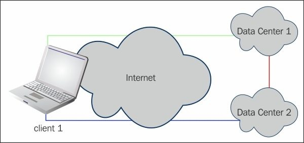

# Глава 7. Скрипты и плагины

После развертывания персональная или корпоративная VPN может стать мощным инструментом как с точки зрения безопасности, так и с точки зрения функциональности. Хорошо спроектированная VPN позволит пользователям безопасно подключаться к удаленным ресурсам. Иногда, однако, просто иметь VPN недостаточно. Данное приложение может требовать более строгих стандартов безопасности или требовать лучшего мониторинга и контроля.

Интеграция плагинов и сценариев с OpenVPN может решить многие из этих организационных или функциональных потребностей. В этой главе будет продемонстрировано как плагины можно использовать для улучшения аутентификации и как скрипты могут отслеживать соединения, генерировать таблицы маршрутизации и многое другое.

## Скриптинг

Скрипты, вероятно, один из лучших инструментов, доступных для администратора OpenVPN. Имея возможность назначать как клиентские, так и серверные скрипты, OpenVPN может инициировать другие ответы системы, открывая брандмауэры, запуская приложения или даже отправляя сообщение администратору.

Одним важным предупреждением при написании скриптов является время, необходимое для завершения сценария. OpenVPN - это однопоточный процесс, что означает, что во время работы скрипта вся VPN блокируется для всех подключенных или подключающихся клиентов. Скрипт медленной аутентификации может нанести вред хорошо работающему VPN. Плагины меньше подвержены этому влиянию, так как работают в отдельном потоке.

Начиная с версии 2.3.6 OpenVPN поддерживает 13 параметров скриптов на стороне сервера и 10 параметров на стороне клиента. Команды со звездочками являются параметрами настройки и позволяют следующим параметрам выполнять определенные действия. Серверные скрипты выглядят следующим образом (в порядке выполнения):

* `--setenv*`
* `--setenv-safe*`
* `--script-security*`
* `--up-restart*`
* `--up`
* `--route-up`
* `--tls-verify`
* `--auth-user-pass-verify`
* `--client-connect`
* `--learn-address`
* `--client-disconnect`
* `--route-pre-down`
* `--down`

На стороне клиента сценарии выглядят следующим образом (в порядке выполнения):

* `--setenv*`
* `--script-security*`
* `--up-restart*`
* `--tls-verify`
* `--ipchange`
* `--setenv-safe*`
* `--up`
* `--route-up`
* `--route-pre-down`
* `--down`

Теперь мы кратко рассмотрим все эти параметры, объяснив их функции как на стороне сервера, так и на стороне клиента. Далее в этой главе мы предоставим подробный пример и обсудим поведение и тонкости каждого из этих сценариев.

### Серверные скрипты

Давайте посмотрим на сценарии, используемые на стороне сервера.

#### --setenv и --setenv-safe

Параметры `setenv` и `setenv-safe` используются для установки переменных среды, которые могут использоваться как скриптами, так и плагинами. Опция `setenv` позволяет нам устанавливать практически любые переменные окружения, но эту опцию нельзя "передать" клиентам. Опция `setenv-safe` добавляет к каждой переменной среды префикс `OPENVPN_` , избегая конфликтов с системными переменными среды, такими как `PATH` и `LD_LIBRARY_PATH`. Эта опция может быть передана клиентам, что обеспечивает большую гибкость.

#### --script-security

Опция `script-security` определяет какие типы приложений или скриптов могут быть выполнены из конфигурации OpenVPN. Существует четыре варианта уровней безопасности:

* **0** : означает, что никакие внешние скрипты или программы не разрешены. На компьютере с Linux/Unix это приводит к тому, что OpenVPN не работает, поскольку OpenVPN всегда нужно запускать некоторые внешние команды для установки IP-адреса. На клиентах Windows, однако, допускается работа OpenVPN в этом режиме, при условии, что шлюз по умолчанию не изменен. Для этого необходимо вызвать внешнее приложение.
* **1** : означает, что разрешены определенные встроенные исполняемые файлы, например, `ip`, `route`, `ifconfig` и другие. Это по умолчанию.
* **2** : наиболее часто требуемый уровень безопасности. Он позволяет использовать не только встроенные команды, подобные перечисленным в предыдущем пункте, но и пользовательские сценарии.
* **3** : позволяет паролям передаваться в вызываемые скрипты через переменные окружения. Это может быть небезопасно, но полезно для определенных сценариев аутентификации или даже операций смены пароля.

#### --up-restart

Опция `up-restart` - это просто флаг, который можно установить. Если этот флаг установлен, то при перезапуске OpenVPN вызываются оба сценария: `down` и `up` (в указанном порядке).

#### --up

Сценарий `up` - это первый скрипт, выполняемый после того, как OpenVPN выполнил свою первоначальную инициализацию. Обычно этот сценарий запускается сразу после того, как OpenVPN привязал себя к настроенному сетевому порту и коснулся открытия устройства TUN или TAP. На данный момент в процессе запуска ни один клиент не подключен к серверу и авторизация еще не состоялась. Некоторые люди используют сценарии `up` для инициализации прокси-серверов и/или правил брандмауэра.

#### --route-up

После того, как устройство TUN или TAP было открыто, выполняется скрипт маршрутизации для настройки любых системных маршрутов на стороне сервера.

#### --tls-verify

Всякий раз, когда клиент подключается к серверу, первым сценарием, который будет выполняться как на клиенте, так и на сервере, является сценарий `tls-verify`. Этот сценарий вызывается несколько раз, по одному разу для каждого сертификата, который клиент предоставляет серверу. На этом этапе удаленный узел все еще считается ненадежным. Это можно использовать для проверки информации о сертификате клиента или сервера до проверки подлинности. Если скрипт `tls-verify` возвращает ненулевой код выхода, клиентское соединение отклоняется.

#### --auth-user-pass-verify

Помимо относительно простой аутентификации клиентского SSL-сертификата, OpenVPN поддерживает довольно надежный набор инструментов для аутентификации по имени пользователя и паролю. Этот аргумент принимает два аргумента: команду и ее метод. Метод определяет, как OpenVPN передает учетные данные аутентификации команде. Метод может быть как `via-env`, так и `via-file`. Чтобы использовать опцию `via-env` для поддержки скрипта необходимо установить третий (3) параметр безопасности скрипта. Если скрипт `auth-user-pass-verify` возвращает ненулевой код завершения, клиентское соединение отклоняется.

Важно знать, что сценарий `auth-user-pass-verify` также выполняется всякий раз, когда клиент перезапускается или ему необходимо пересмотреть параметры безопасности с сервером. Повторное согласование ключей безопасности обычно происходит каждый час, но им можно управлять с помощью параметров `reneg-sec`, `reneg-pkts` и `reneg-bytes`.

#### --client-connect

Выполняется после аутентификации клиента на VPN-сервере. Большинство сценариев чаще всего запускаются здесь. Скрипт `client-connect` передает один аргумент, который является именем временного файла. После завершения сценария файл обрабатывается OpenVPN и все содержимое анализируется как дополнительные параметры конфигурации. Это позволяет администратору добавлять специальные настройки для конкретного клиента, обеспечивая большую гибкость, чем файл CCD. Один из наших примеров в этой главе использует сценарий подключения клиента для обновления базы данных, используемой для отслеживания и направления статистики VPN-подключений.

#### --learn-address

Сценарий `learn-Address` позволяет OpenVPN помогать определять правила брандмауэра и другие специфичные для адреса опции. Он выполняется всякий раз, когда новый клиент добавляется, обновляется или удаляется из внутренних таблиц адресов OpenVPN. Более подробная информация доступна на странице руководства. Эта опция поддерживает как IPv4, так и IPv6. Сценарий изучения адреса фактически вызывается отдельно для адресов IPv4 и IPv6 один раз с адресом IPv4 в качестве основного параметра и один раз с адресом IPv6.

#### --client-disconnect

Как и в случае сценария `client-connect` в предыдущем разделе, сценарий `client-disconnect` является вторым наиболее часто используемым сценарием соединения. Как упоминалось ранее, в одном из примеров в этой главе `client-disconnect` клиента будет использоваться для обновления записей базы данных статистикой использования и другой информацией.

#### --route-pre-down

Когда началось отключение туннеля, запускается сценарий `route-pre-down`. Его можно использовать для автоматизации отключения удаленных прокси-серверов и закрытия дыр в брандмауэре, которые были открыты/установлены ранее в сценарии `--up`.

#### --down

В противоположность опции `up`, опция `down` запускает команду после закрытия устройства TUN/TAP. Эта опция принимает команду или скрипт в качестве аргумента, а дополнительные аргументы передаются скрипту или команде. Если вам нужно выполнить команду до закрытия устройства TUN/TAP - вы можете использовать опцию `down-pre`.

---

**Заметка**

Нет способа запустить скрипт как до, так и после закрытия устройства TUN/TAP.

---

### Клиентские скрипты

Мы обсудим клиентские скрипты в этом разделе.

#### --setenv и --setenv-safe

Действуют точно так же, как в предыдущем разделе _Серверные скрипты_.

#### --script-security

Действует точно так же, как в предыдущем разделе _Серверные скрипты_.

#### --up-restart

Опция `up-restart` - это просто флаг, который можно установить. Если этот флаг установлен, то при перезапуске OpenVPN вызываются оба сценария: `down` и `up` (в указанном порядке).

#### --tls-verify

Всякий раз, когда клиент подключается к серверу, первым сценарием, который будет выполняться как на клиенте, так и на сервере, является сценарий `tls-verify`. Этот сценарий вызывается несколько раз, по одному разу для каждого сертификата, который сервер представляет клиенту. На этом этапе удаленный узел все еще считается ненадежным. Его можно использовать для проверки информации о сертификате клиента или сервера до проверки подлинности. Если скрипт `tls-verify` возвращает ненулевой код выхода, клиентское соединение отклоняется.

#### --ipchange

На стороне клиента `ipchange` после выполнения скрипта `tls-verify`, а также при любом изменении удаленного (также известного как доверенный) IP-адреса. Его можно использовать для обновления правил брандмауэра или прокси-сервера перед открытием адаптера TUN/TAP.

#### --up

Сценарий `up` является первым сценарием, который выполняется после завершения аутентификации клиента. После того как сервер успешно аутентифицировал клиента, клиенту отправляется набор параметров конфигурации. Эти параметры включают IP-адрес VPN для использования, а также любые другие параметры, которые передаются клиенту. Некоторые люди используют сценарии `up` для инициализации прокси-серверов и/или правил брандмауэра.

#### --route-up

После проверки подлинности и установления маршрутов выполняется сценарий `route-up`. При желании этот сценарий может быть задержан на определенное количество секунд с помощью опции `route-delay`.

#### --route-pre-down

Когда началось отключение туннеля, запускается сценарий `route-pre-down`. Он может быть использован для закрытия соединений с удаленными прокси-серверами, другими туннелями (SSH) или исправления записей DNS-сервера.

#### --down

В противоположность опции `up`, опция `down` запускает команду после закрытия устройства TUN/TAP. Эта опция принимает команду или скрипт в качестве аргумента, а дополнительные аргументы передаются скрипту или команде. Если вам нужно выполнить команду до закрытия устройства TUN/TAP, вы можете использовать опцию `down-pre`.

---

**Заметка**

Нет способа запустить скрипт как до, так и после закрытия устройства TUN/TAP.

---

### Примеры серверных скриптов

Сценарии сервера могут быть использованы для значительного расширения развертывания OpenVPN. Скрипты могут использоваться для аутентификации, авторизации, регистрации и многого другого. В сочетании с опциями `client-config`, сценарии могут быть далее использованы для генерации директив конфигурации клиента на лету. Например, аутентификация может происходить через LDAP, а правила авторизации могут быть динамическими через тот же каталог LDAP. Правила межсетевого экрана могут быть сгенерированы и применены и маршруты могут быть переданы клиенту. В этом разделе будут продемонстрированы некоторые из этих вещей, чтобы помочь вам в применении этих методов.

Наиболее распространенными серверными сценариями являются сценарии `--client-connect` и `--client-disconnect`. Эти сценарии могут использоваться для многих целей, включая открытие наборов правил брандмауэра, монтирование файловых систем и даже создание файлов конфигурации клиента на лету.

В сочетании с планировщиком задач другие сценарии могут быть запущены вне прямого контекста OpenVPN, но могут по-прежнему работать с подключенными клиентами через интерфейс управления OpenVPN. Например, администратор может предоставить выделенное время конечным пользователям и отключить пользователей после того, как это выделенное время было исчерпано.

#### Сценарии подключения клиента

Давайте теперь посмотрим на сценарии подключения клиента.

##### Аутентификация клиента

Аутентификация - это определение того, кто может подключиться. Это не определяет что могут делать эти пользователи, просто им разрешено подключаться к VPN или нет. На самом базовом уровне вполне возможно разрешить пользователю подключаться, но не позволять этому пользователю фактически что-либо делать. Одним из применений для этого может быть сценарий мониторинга, который просто хочет убедиться, что ваш VPN-сервер работает и аутентифицирует пользователей. Этот псевдопользователь не должен иметь возможность маршрутизировать трафик, поскольку в этом нет необходимости.

Многие переменные и права доступа можно проверить с помощью сценариев аутентификации, включая смарт-карты, серверы LDAP или RADIUS, информацию о сертификатах, списках отзыва сертификатов и многом другом. Если вы читали эту книгу с самого начала, в [Главе 5](chapter-05.md), _Расширенные сценарии развертывания в туннельном режиме_, вы должны иметь встроенные конфигурации сервера VPN, который уже использует LDAP и другие
движки. С помощью сценариев вы можете расширить поддержку этих бекендов без текущего плагина или запросить дополнительные источники.

Наиболее распространенным сценарием на стороне сервера, вероятно, является сценарий `--client-connect`. Этот скрипт выполняется после того, как вся проверка TLS прошла. В тех случаях, когда сценарий подключения к клиенту имеет много общего, это идеально для предотвращения атаки типа **Denial of Server (DoS)**, вызванной вашими собственными сценариями. Перед запуском этого сценария клиент был проверен на наличие надлежащего ключа `tls-auth` и действительного сертификата. Сценарий `client-connect` может использоваться как своего рода предварительная аутентификация, поскольку он выполняется перед сценарием `--auth-user-pass-verify`. Он также может быть использован для динамического создания конфигурации клиента.

При использовании сценария убедитесь, что для параметра `--script-security` установлено значение 2 или 3 (см. определения ранее в этой главе). Если не указать эту опцию, клиенту будет возвращено сообщение `AUTH_FAIL`. В качестве примера мы создали очень простой скрипт, который печатает среду оболочки и завершает работу с нулем (`0`), что указывает на успех запуска демона OpenVPN. В нашей конфигурации сервера мы добавили следующие две директивы:

```
script-security 2
client-connect /usr/local/etc/openvpn/cc.sh
```

---

**Заметка**

Существует переменная окружения `script_type`, которая определяет тип вызываемого скрипта. Используя эту переменную, можно иметь один монолитный скрипт для обработки всех вызовов скриптов OpenVPN.

---

Вот наш пример скрипта `client-connect`:

```
#!/bin/sh
printenv > /tmp/movpn
exit 0
```

Код выхода важен, поскольку все, кроме нуля (`0`), приведет к отключению клиента. С помощью предыдущего скрипта и конфигурации, когда появится новое клиентское соединение, наш скрипт будет выполнен. Этот скрипт разрешает соединение, но печатает среду оболочки во временный файл. Содержимое этого файла интересно и будет применяться ко всем остальным скриптам:

```
daemon_start_time=1425344172
daemon_pid=4004
local_1=SERVER_IP
trusted_ip=CLIENT_IP
redirect_gateway=0
untrusted_port=1194
tun_mtu=1500
X509_0_ST=Enlightenment
X509_0_CN=client1
X509_0_emailAddress=root@example.org
time_ascii=Mon Mar 2 18:56:17 2015
proto_1=udp
X509_1_emailAddress=root@example.org
tls_id_0=C=ZA, ST=Enlightenment, O=Mastering OpenVPN, CN=client1,
emailAddress=root@example.org
tls_id_1=C=ZA, ST=Enlightenment, L=Overall, O=Mastering OpenVPN,
CN=Mastering OpenVPN, emailAddress=root@example.org
ifconfig_ipv6_local=2001:db8:100::1
untrusted_ip=CLIENT_IP
daemon=1
tls_serial_hex_0=02
trusted_port=1194
dev_type=tun
tls_serial_hex_1=d2:93:32:f0:8e:bc:58:ee
X509_1_ST=Enlightenment
X509_1_CN=Mastering OpenVPN
script_context=init
tls_serial_0=2
PWD=usrlocaletcopenvpn
daemon_log_redirect=1
tls_serial_1=15173527578309581038
ifconfig_local=10.200.0.1
dev=tun0
local_port_1=1194
time_unix=1425344177
link_mtu=1541
remote_port_1=1194
X509_0_C=ZA
tls_digest_0=1b:27:a6:b4:5f:7a:9c:3f:17:fb:ff:33:05:61:3f:2a:56:89:
16:d3
tls_digest_1=e4:f1:43:37:34:51:de:99:7a:dc:e3:6d:f2:4c:5b:84:34:4b:
f3:64
script_type=client-connect
X509_1_C=ZA
ifconfig_broadcast=10.200.0.255
ifconfig_pool_remote_ip=10.200.0.2
ifconfig_ipv6_remote=2001:db8:100::2
ifconfig_ipv6_netbits=64
ifconfig_netmask=255.255.255.0
config=usrlocaletcopenvpn/openvpn.conf
ifconfig_pool_netmask=255.255.255.0
X509_0_O=Mastering OpenVPN
X509_1_L=Overall
verb=4
common_name=client1
X509_1_O=Mastering OpenVPN
```

Используя эти переменные среды, опытный администратор OpenVPN может настроить конфигурацию в на первый взгляд простой настройке сервера.

##### Авторизация клиента

Авторизация может происходить в нескольких местах, включая файл `client-config-dir` или дополнения могут быть сделаны через скрипт `client-connect`.

---

**Заметка**

Аутентификация доказывает, кто вы есть. Авторизация определяет, что вам разрешено делать.

---

Первым аргументом, передаваемым сценарию `client-connect` - будет путь к временному файлу, который скрипт может использовать для передачи параметров конфигурации подключающегося клиента демону OpenVPN. Этот скрипт проверяет переменную среды `common_name` и, если это `client1` - устанавливает отключене в конфигурации клиента:

```
#!/bin/sh
if [ "$common_name" = "client1" ];
then
        echo "disable" >> $1
fi

exit 0
```

Когда `client1` подключается, опция отключения будет передана на сервер, предотвращая продолжение соединения. Могут быть переданы другие параметры, такие как `ifconfig` для статических IP-адресов, передача различных маршрутов и многое другое.

##### Пример 1 - выбранные клиентом маршруты

Рассмотрим сетевого администратора с двумя центрами обработки данных, каждый со своей парой серверов OpenVPN. Был случай, когда необходимо было работать с одним центром обработки данных, при этом гарантируя, что если другой стал недоступен, службы и системы все еще были бы доступны в работающем центре обработки данных.

Чтобы помочь в тестировании, мы создали несколько сценариев (`client-connect` и `auth-user-pass-verify`), чтобы выбрать, какие маршруты были переданы клиенту.

Следующая диаграмма должна дать приблизительное представление о концепции. У VPN-клиента есть три варианта конфигурации: полные маршруты (полные), маршруты для **Data Center 1** (`dc1`) и маршруты для **Data Center 2** (`dc2`). Кроме того, клиент может подключиться к любому центру обработки данных и получить только необходимые маршруты для любого из этих трех.



В нашей схеме `client1` подключается к центру обработки данных и запрашивает их имя пользователя и пароль. В действительности мы игнорируем пароль и читаем имя пользователя, чтобы определить желаемые маршруты.

Чтобы зафиксировать выбор маршрута, мы использовали скрипт `auth-user-pass-verify`. OpenVPN принимает два аргумента: путь к сценарию и `via-file` или `via-env`, чтобы определить как передавать учетные данные в скрипт. В этом примере мы выбрали `via-file`.

Сценарий считывает учетные данные из скрипта и переписывает его в файл, который будет доступен сценарию подключения клиента:

```
#!/bin/sh
echo 'head -n1 $1' > \
/tmp/openvpn-${untrusted_ip}-${untrusted_port}.tmp
exit 0
```

Затем запускается наш скрипт подключения к клиенту, который читает созданный ранее файл `.tmp`. На основе прочитанного аргумента он записывает выбор маршрута в файл, переданный `client-connect` для аргументов конфигурации:

```
#!/bin/sh
creds="tmpopenvpn-${untrusted_ip}-${untrusted_port}.tmp"
if [ -f "$creds" ];
then
  selected='head -n1 $creds'
  if [ "$selected" = "dc1" ];
  then
    cat >> $1 <<- EOF
      push "route 10.10.0.0 255.255.255.0"
      push "route 10.10.1.0 255.255.255.0"
    EOF
  elif [ "$selected" = "dc2" ];
then
  cat >> $1 <<- EOF
    push "route 10.20.0.0 255.255.255.0"
    push "route 10.20.1.0 255.255.255.0"
  EOF
else
  cat >> $1 <<- EOF
      push "route 10.10.0.0 255.255.255.0"
      push "route 10.10.1.0 255.255.255.0"
      push "route 10.20.0.0 255.255.255.0"
      push "route 10.20.1.0 255.255.255.0"
    EOF
  fi
fi
exit 0
```

Хотя это и не идеально и на это можно нападать разными способами, это позволило нам создать одну конфигурацию OpenVPN для каждого из системных администраторов и обеспечить им некоторый уровень динамической маршрутизации в зависимости от их задач.

##### Пример 2 - отслеживать статистику клиентских подключений

Используя скрипты `client-connect` и `client-disconnect` возможно создавать клиентские записи статистики подключения к базе данных или в другом месте. В этом примере мы просто хотим отслеживать, когда пользователи подключаются и сколько времени они проводят, подключившись к VPN-серверу.

Мы предполагаем, что вы, по крайней мере, знакомы с SQL и поэтому не будем фокусироваться на семантике. SQLite 3 используется в следующем примере для хранения информации о сеансе. Схема для нашего примера базы данных выглядит следующим образом:

```
CREATE TABLE vpn_session (
session_id integer primary key autoincrement not null,
cn test not null,
connect_time timestamp default CURRENT_TIMESTAMP,
disconnect_time timestamp default null,
vpn_ip4 char(15),
vpn_ip6 char(40),
remote_ip4 char(40),
connection_time integer default 0
);
```

Схема может быть загружена в базу данных с помощью следующей команды:

```
ecrist@example:~-> sqlite3 movpn.sqlite3 < file.schema
```

---

**Подсказка**

Каталог и файл, который вы используете для SQLite, должны быть доступны для чтения и записи пользователю OpenVPN. Если в вашем файле конфигурации определены `--user` или `--group` этому пользователю понадобится этот доступ. Без него, ваши скрипты `client-connect` и `client-disconnect` не смогут обновить базу данных.

На этот раз, мы собираемся создать скрипт, который будет вызываться как для `client-connect`, так и для `client-disconnect`. Мы будем обнаруживать и обрабатывать тип сценария в коде. Для типа `client-connect` мы собираемся вставить новую запись для нового сеанса. В случае отключения клиента мы обновим эту запись, чтобы обеспечить дальнейший учет.

Код выглядит следующим образом:

```
#!/bin/sh
DBFILE="varopenvpn/movpn.sqlite3"
DBBUFFER="varopenvpn/buffer.sql"
db_query (){
SQL="$1"
usrlocal/bin/sqlite3 $DBFILE "$SQL"
if [ $? -ne 0 ];
then
# There was an error, write the SQL out to a buffer file
echo "$SQL" | tr -d "\t" | tr -d "\n" | tee -a $DBBUFFER
echo ";" | tee -a $DBBUFFER
fi
} l
ogger "OpenVPN Type: $script_type"
case "$script_type" in
client-connect)
# do record insert
logger "OpenVPN: client-connect"
SQL="
INSERT INTO vpn_session (
cn, connect_time, vpn_ip4,
vpn_ip6, remote_ip4
) VALUES (
'$common_name', '$time_unix',
'$ifconfig_pool_remote_ip',
'$ipconfig_ipv6_remote',
'$untrusted_ip'
)"
db_query "$SQL"
;;
client-disconnect)
# update the record, if it's found
logger "OpenVPN: client-disconnect"
SQL="
UPDATE
vpn_session
SET
disconnect_time = '$time_unix'
WHERE
cn = '$common_name'
AND disconnect_time IS NULL
AND session_id = (
SELECT MAX(session_id)
FROM vpn_session
WHERE cn = '$common_name'
)
"d
b_query "$SQL"
;;
esac
exit 0
```

<!---

Этот скрипт использует функцию переключения регистра, чтобы определить тип сценария и вести себя соответственно. При новом клиентском соединении он обновит таблицу базы данных с информацией о соединении и обновит эту запись базы данных, когда клиент отключится. Схема, которую мы здесь использовали, довольно проста и может быть легко расширена для поддержки отслеживания использования полосы пропускания и нескольких клиентских подключений.

Используя команду sqlite3 , мы можем получить три самые последние записи в базе данных:

ecrist @ пример: локальный usr и т. д. openvpn-> sqlite3

var openvpn / movpn.sqlite3 "SELECT * FROM vpn_session ORDER BY

session_id DESC LIMIT 3 "

10 | client1 | 1426430834 || 10.200.0.2 || CLIENT_IP |

9 | client1 | 1426430759 | 1426430759 | 10.200.0.2 || CLIENT_IP | 0

8 | client1 | 1426429888 | 1426429888 | 10.200.0.2 || CLIENT_IP | 0

Пример 3 - отключить пользователя через X минут

Есть несколько способов справиться с этим сценарием. Если вы предоставляете пользователям короткий доступ, скажем, 30 минут за раз, сценарий подключения клиента с простым режимом ожидания может выполнить отключение и блокировку учетной записи. Допустим, вы продаете короткие одноразовые сеансы VPN продолжительностью до 30 минут. В этом случае после того, как пользователь достиг 30 минут использования, задание cron отключит пользователя и заблокирует его учетную запись, используя запись в каталоге CCD .

Этот пример будет основываться на предыдущем примере с использованием базы данных SQLite, которую мы создали для отслеживания используемого времени. Наш скрипт будет иметь несколько задач:

 Рассчитать время подключения VPN

 Блокировка пользователя по истечении выделенного времени подключения
 Отключить клиент, если в данный момент подключен

Для выполнения предыдущих задач мы напишем небольшой скрипт оболочки, который будет вызываться демоном cron . Здесь мы проверим информацию о соединении, запросив порт управления и базу данных, которую мы создали в предыдущем примере. Альтернативой запросу порта управления может быть опрос файла журнала состояния OpenVPN и работа с этими данными в режиме реального времени. Один серьезный недостаток для опроса интерфейса управления заключается в том, что он является однопоточным и допускает только одно соединение за раз. Если скрипт зависает или кто-то подключен к интерфейсу, последовательные опросы также будут зависать. Код выглядит следующим образом:

#! / Bin / ш

#

# Определяет, был ли пользователь ($ 1) подключен более $ 2 секунд

if [$ # -lt 2];

тогда

echo "использование: $ 0 <пользователь> <time_in_seconds>"

выход 1

фи

USER = $ 1

TO = $ 2

# БД секунд

SQL = "ВЫБЕРИТЕ СУММУ (время соединения) ОТ vpn_session ГДЕ cn = '$ USER'" DBTIME = " usr local / bin / sqlite3 var openvpn / movpn.sqlite3" $ SQL "'

if ["$ DBTIME" = ""];

тогда

DBTIME = 0

фи

# Проверьте порт управления

CTIME = 'echo "status 2" | nc -N localhost 1194 | grep -E "CLIENT_LIST. * $ USER" | cut -f8 -d, 'if ["$ CTIME"! = ""];

тогда

 у нас есть активное соединение D = 'date + "% s"'

CTIME = 'expr "$ D - $ CTIME"'

еще

CTIME = 0

фи

UTIME = 'expr $ DBTIME + $ CTIME'

if [$ UTIME -gt $ TO];

тогда

logger «Отключение $ USER, время активности превышено ($ UTIME / $ TO)».

echo "отключить" >> usr local etc openvpn / ccd / $ USER cho "kill $ USER" | nc localhost 1194

фи

Теперь, когда у нас есть скрипт, мы можем назвать его:

root @ example: ~ -> timeout.sh client1 1800
Это подсчитает, сколько секунд client1 был подключен к VPN. Если время превышает 1800 (или любое другое число, которое вы там указали), оно отключит эту конфигурацию через директорию client-config-directory и уничтожит все активные сеансы, используя интерфейс управления.

Чаевые

Интерфейс управления OpenVPN допускает только одно соединение за раз.

Убедитесь, что ваш скрипт правильно обрабатывает это ограничение.
